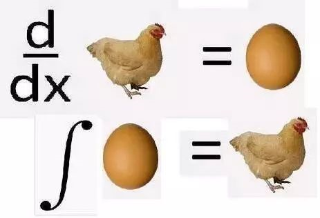
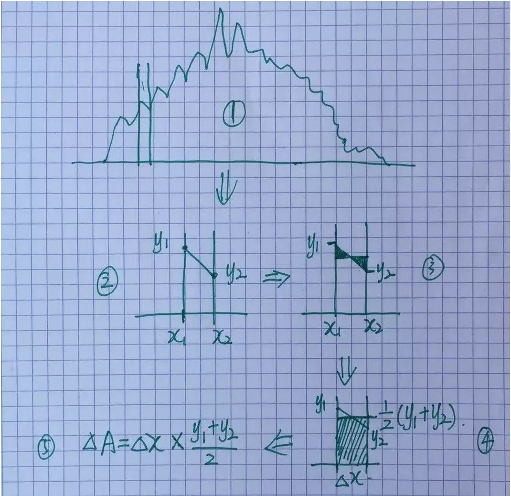
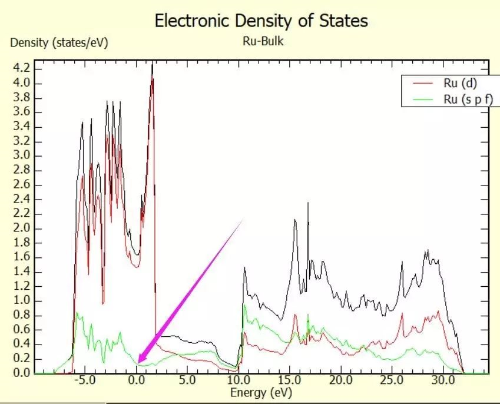
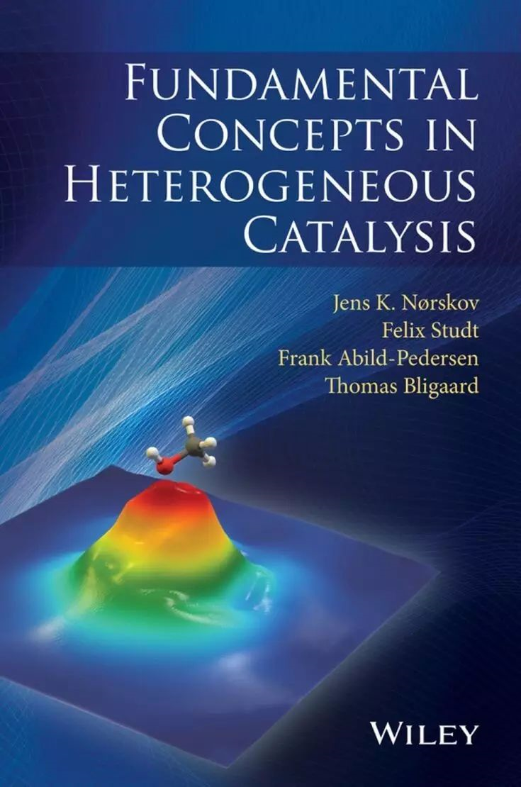
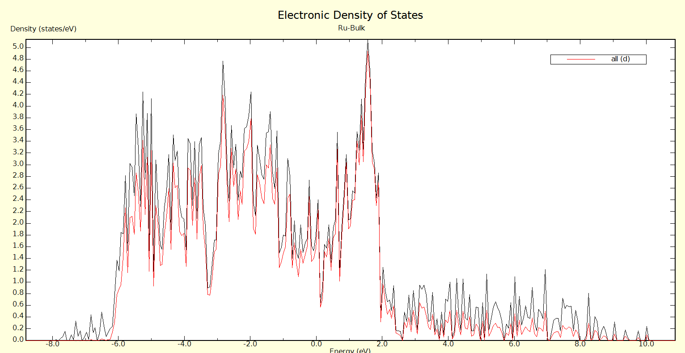
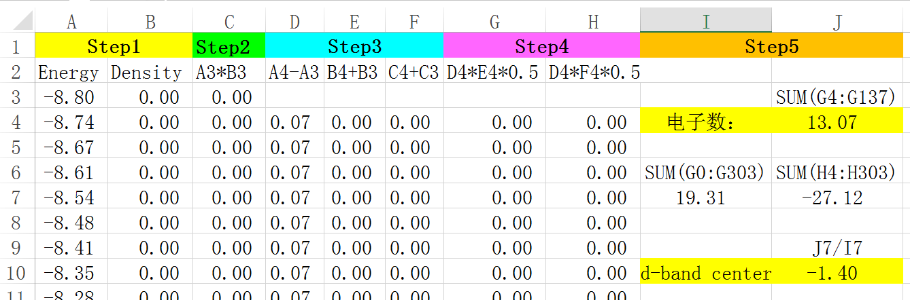
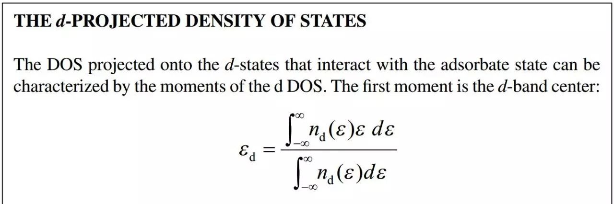

#                                              Ex-DOS4 DOS** 计算（四）

​                                                                                 DOS积分的原理

 

积分公式相信大学的时候，大家已经掌握了，现在还有可能忘记了。不过没关系，虽然本节将积分，高等数学里面的暂时还用不到。对于DOS图来说，通过求积分可以得到相应的电子数。积分也就是求DOS曲线下的面积。但DOS图并不能通过一个函数的积分来获得，因为所对应的区域毫无规则可言。那么我们该怎么样积分呢？

 

**1** **积分的原理**

 

积分的原理就是把区域分成N个小块，计算每一块的面积，然后求和。如下图：

 

大师兄.....

 

 

好吧，言归正传，大师兄亲自画了一幅图，讲解积分的原理，如下：

 

1)将每一个小区间近似看成一个小的梯形，

2) 梯形的上底和下底为：y2 和y1，高为：x2-x1。

3, 4)  也可以看成一个高为：（y1+y2）/2， 底为x2-x1 的长方形。

5）面积为两者的乘积：ΔA =（x2-x1）* （y1+y2）/2。

6）将所有的小区间面积求和便得到了曲线所覆盖的面积，也就得到了我们所想要的电子数：A =sum（ΔA）

------

注意：

1）电子数的积分区间是从负无穷到费米能级；

2）p4vasp的图中的0点就是费米能级，已经扣除过了。

3）科学网的一个参考链接：<<<http://blog.sciencenet.cn/blog-567091-736149.html>/>>

注意： 图中的DOS，如果你计算了，发现和大师兄的不一样，不用担心，大师兄本人把这个例子再运行了一遍，跟上面的图也不一样。（原因正在调查中）

------

##                                                                                2 d-band center 的公式

 

在这里：

ε为前面的我们提到的x， nd(ε)为y。在DOS图中，ε为能量，nd(ε)为电子的密度。

注意： 积分区间是从 **负无穷** 到 **正无穷**

参考书籍： Fundamental Concepts in Heterogeneous Catalysis，Jens K. Nørskov, Felix Studt, Frank Abild-Pedersen, Thomas Bligaard， John Wiley & Sons, Inc.

!

 

QQ群文件的Books文件夹中下载 

 

百度网盘下载链接：<http://pan.baidu.com/s/1bWS2Gu>

****

d 带穿过了费米能级，说明Ru是金属。（废话，等于白说！）

d带的积分从最左面到最右面。

 

关于d band 的介绍：知乎有个专栏，有兴趣的可以浏览一下：

<https://zhuanlan.zhihu.com/p/26230183> 

------

**3 Excel手动求积分：**

对应的公式都写在第二行里面了，excel中计算完第一个数值，直接选中然后往下拽就可以得到后面的数据了。计算文件以及Excel表格已经上传到QQ群和百度网盘，大家可以下载仔细观看练习，掌握该技能。

计算下载链接：<http://pan.baidu.com/s/1kVqWFQn> 

 

Step1: p4vasp 的 d band 数据！

Step2：A,B两列的乘积，也就是能量和密度的乘积：对应d band center公式中的**分子**：

 

Step3：

1）A4-A3:  小区间的能量间隔，也就是 dε，或者 dx，Δx， x2-x1;

2）B4+B3: 小区间的两个起点和终点的高度：也就是对应的小区间两端的能量密度：y2+y1

3）C4+C3：小区间两端能量和密度乘积的加和： x1*y1 + x2*y2 

4）Step4：求小区间的面积：

​      D4*E4*0.5：(x2-x1) * (y2+y1)/2

​      D4*F4*0.5:  (x2-x1) * (x1*y1 + x2*y2)/2

5）Step5: 将所有小区间的面积求和：

电子数：sum( (x2-x1) * (y2+y1)/2 ) ，从G4到G137(G137对应的是费米能级的那个点！！！)求和。

**再次强调：电子数目是从负无穷积分到费米能级！**

d带中心公式中的分子：从H4到H303求和

d带中心公式中的分母：和电子数的积分一样，但积分区间不同，这里从G4到G303求加和。

**再次强调：d带中心积分区间，按照公式，从负无穷积分到正无穷！**

*d*带中心公式中的分子：从H4到H303求和

*d*带中心公式中的分母：和电子数的积分一样，但积分区间不同，这里从G4到G303求加和。

 

以上将公式分开写，是为了方便大家理解，实际操作中，直接使用导出来的数据，将所有的公式合并在一起就可以了。

------

**4 扩展练习：**

 

4.1 亲自上手操作，重现本节的结果；

4.2 尝试使用其他软件，方法求积分；

4.3 有好程序的，好脚本的分享给大家。

------

**5** **总结：**

学习完本节，大家对DOS积分的数学知识应该可以掌握了，后面不管用什么软件或者脚本，都是将这个积分的原理写成机器语言来执行。知道了原理和通过excel自己操作一遍之后，基本上DOS积分的东西就懂了。下一节，QQ群里的小书童给大家演示一下Origin的积分操作。

 

------

