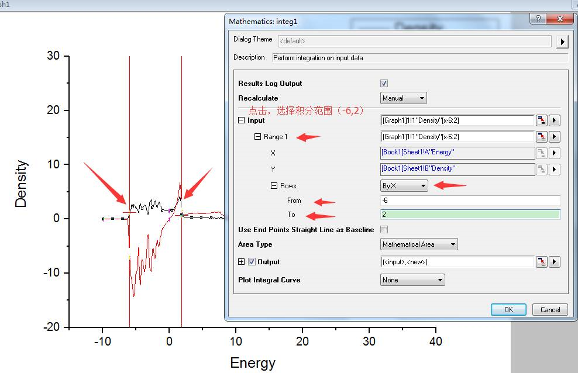

前面我们讲解了手动求积分的原理，本节由QQ群中的小书童给大家演示一遍Origin求积分的操作，加深一下对积分原理的印象，也借此机会掌握另一项Origin的技能。Origin的 .opj文件和Excel数据已经打包上传到QQ群中，也可以百度网盘下载：http://pan.baidu.com/s/1bpvmXY3

## **1 求d带中心**

1.1 复制粘贴能量、态密度、能量*态密度这三列数据到Origin中，数据见前一节练习：

下面我们取了`d band` 的一小部分区间作为示例进行讲解，大家学习完之后自己主动练习，获取最终的`d band center`.

 

 

1.2 选中数据并作图：

 

 

**plot --> Line --> Line**

 

 

 

1.3 求积分，先选中一条曲线，右键，`Ungroup`（将曲线从组中分离，便于选择）。

 

1.4 打开积分对话框：

 

 

1.5 再选择一条曲线进行积分，下图选择的是黑线。

 

 

点击OK，截图中的area就是我们要的积分，这一面积对应下图公式中的分母部分。

 

`d band center` 的积分区间为整个d带：即从负无穷到正无穷。本例我们用区间 [-6, 2]作为例子！有时候大家会对积分的区间产生疑问。一般来说积分区间是从负无穷到正无穷，但是：

- 1）如上图，[-9,-8]这个区间Density为0，积分从[-9,4.0] 和[-8,4.0]结果没什么区别。

- 2）如果我们关心的是[-6,4.0]这一部分的性质，倘若4.0以后的部分会产生很大的噪音，那么我们也可以只从-6积分到4.0。

- 所以，积分区间也不是很绝对，大家要根据自己的体系合理选择。

   

1.6 同理，选中另一条红线（能量和密度乘积），进行积分计算（上图中的分子部分） 

 

 结果如下:

 

最终，我们计算的d带区间[-6,2]的中心果为：-34.035/ 17.428 = -1.953

 

------

## **2** **求电子数目**

电子数目的积分是从负无穷到费米能级。本例中是从-10到0（费米能级）进行积分， 选择黑线，重复前面的操作：

  

 

计算结果如下，电子数为13.00

  

------

**3** **扩展练习：**

3.1 熟练Get本节Origin求积分的技巧；

3.2 阅读前面几节DOS计算的练习章节；熟练掌握DOS的提取，导出，作图和积分；

3.3 `d band center` 是对整个区间求积分，电子数目的积分区间是从负无穷到费米能级。

 

------

**4** **总结：**

截止到本节，DOS的计算就暂时告一段落了，实际计算中，DOS的分析远远不止我们讲述的这么简单，而且网上DOS分析的脚本很多。大师兄了解到的有VTST的DOS处理脚本和vaspkit等，大家可以尝试练习使用下。如果你在科研工作中对DOS分析有自己的心得，DOS分析脚本的使用经验等，欢迎补充，分享给大家。
