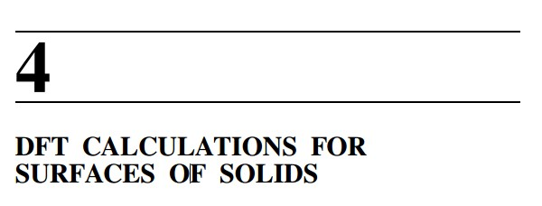
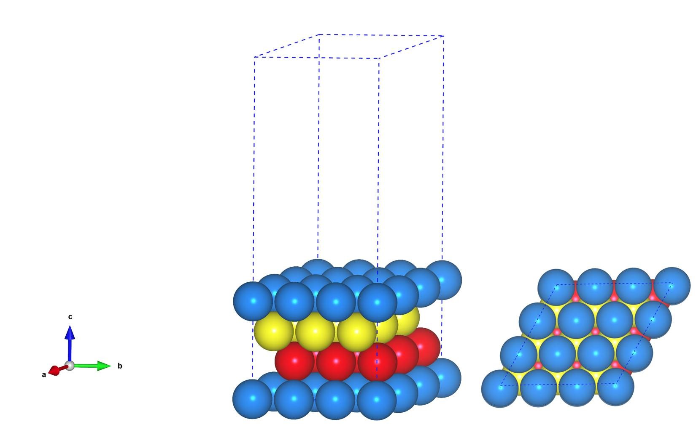

前面我们学习了Bulk计算的一些基本的计算，拟合以及优化晶格常数，DOS计算。在材料计算方面，还有能带，声子谱的计算等等，但由于本人方向不在这一块（主要是做表面反应机理研究的），就不能详细给大家解释了。如果有同学在这方面很擅长，可以把自己的计算心得写进本书，将不胜感激。说到表面反应的机理研究，我们首先要做的就是搭建模型。先理一下思路：

1）计算Bulk的结构，获取稳定的晶格常数
2）在此基础上，搭建Slab模型。

## 1 什么是Slab 模型？
这个问题，我们看一下参考书的第四章：Density Functional Theory: A Practical Introduction （注意：本书有中文版的，本人强烈不建议！请静下心来看原版的，也恳请不要在群里求中文的pdf版本！）

多相催化中，反应发生在催化剂表面上，也就是气（液）固两相的交界处。为了模拟固体的表面，我们需要一个在二维方向上具有周期性的结构来模拟固体的表面，第三维方向则不具有周期性，用来模拟气相或者液相。但是，更常用的则是在第三维方向上加上周期性，周期性的结构之间用一个什么都没有的空间（free space）来分割，也就是真空层。在这里我们需要注意的是要避免第三维方向上两个周期性结构的相互影响，也就是一个周期的电子密度沿着真空层方向要趋于零，这样才不会对相邻的结构产生影响。此时，我们需要做的就是：

1）增大真空层的厚度，厚度要适中，太小肯定不行，太大也不合适。想一想我们前面讲到的影响计算速度的一个因素，真空层太厚，也就意味着我们的模型尺寸变大，从而导致计算变慢。一般来说，对于表面反应的计算，15$\AA$的真空层厚度足够了。但是，对于功函数这一类对真空层敏感的计算来说，我们需要注意。

2）VASP中还需要加入：`LDIPOL = .TRUE.`和`IDIPOL = 3 `(3指的是在z方向上)这两个参数来消除上下不对称的slab表面导致的偶极矩影响。https://cms.mpi.univie.ac.at/wiki/index.php/LDIPOL

对于表面结构，有以下几个需要注意的:
1）xy 方向上表面的大小;
A）这个影响表面吸附物种的覆盖度;
B）影响体系的尺寸大小和计算时间;
C）不同的大小需要选取对应的K点；回想一下我们前面提到的经验规则。

2）不同的晶面，(111)， (100)，(110);
A) 这取决于你研究的方向;
B) 不同晶面的表面能;
C) 不同晶面的表面结构，反应活性等。

3）表面结构的层数
A）层数多了，原子变多，体系在 z 方向的尺寸增加，也会影响计算速度；
B）计算中需要弛豫的层数；
C）不同层数对你要计算的性质会产生影响，比如表面能；
D）不同晶面需要的层数也不尽相同，一般开放的表面需要更多的层数；
E）根据自己感兴趣的性质，选择合适的层数，也就是需要你去测试一番。

4）Slab模型有两种，一种是上下表面对称的，一种是非对称的。对称性结构往往需要很多层，体系较大。 非对称的结构体系较小，但存在偶极矩的影响，要注意加LDIPOL 和IDIPOL这两个参数来消除，后面我们会介绍到。

注意，为了更加顺利的进行下面的学习，参考书第4章的内容务必认真阅读。这会为你今后的表面研究打下坚实的基础

## 2 表面模型的搭建：

主要使用Material Studio进行切面操作，这一部分，本人不想做过多的解释，因为各大培训班，网上各种博客都有操作说明。本节大师兄通过Cu(111)面的例子给大家简单演示一下。

**2.1 块体计算**
1) 搭建Cu单胞模型，用VESTA导出VASP计算使用的POSCAR文件，这部分不清楚的筒子们可以复习前面bulk计算的相关内容。

2)  INCAR文件的准备
A) Cu是金属，ISMEAR=1， SIGMA=0.1
B) ENCUT=700， Cu单胞含有的原子数很少，可以把ENCUT设置大一点
C) EDIFF和EDIFFG控制电子步收敛和离子弛豫的精度
D) PREC=High  

```fortran
SYSTEM = Cu-Bulk calculation RELAX
ISTART = 0
ICHARG = 2
ENCUT = 700
EDIFF = 1e-6
IBRION = 1
NSW = 200
EDIFFG = -0.01
ISIF = 3
POTIM = 0.1
ISMEAR = 1
SIGMA = 0.1
PREC = H
LREAL = Auto
ALGO = Fast
NCORE = 4
```


E）这里LREAL设置为Auto，是为了和后面表面能计算统一。计算时要根据原子数的多少，以及后续的计算选择LREAL的值。不能拿LREAL=.FALSE.和LREAL=ON/.TRUE.计算的结果进行能量比较。看下面

F) 注意：块体材料计算时，为了后续计算其他性质，常常要求整个计算中使用相同的ENCUT，ENAUG， PREC， LREAL， ROPT，这部分大家可以看看手册 8.3 What kind of “technical” errors do exist， overview


3) KPOINTS
a=b=c=3.6147 $\AA$， 根据前面的经验，这里设置为$13\times13\times13$的KPOINTS(Gamma  Centered).

4) 准备POTCAR文件进行计算：见前面讲的相关脚本—Ex30 进阶前的准备（三）

5) 最后计算完的Cu的晶格常数为 3.6370 $\AA$，实验值为3.615 $\AA$。大家可以去计算下。（计算例子可以QQ群中下载，也可通过该链接：http://pan.baidu.com/s/1dE84fhn 密码：nvwa）

**2.2 结构优化的注意事项：**

关于结构优化，大家在计算时要注意下面的部分，7.6.2 Accurate bulk relaxations with internal parameters (one)一定要详细的读。


**2.3 小结**
主要以金属Cu为例讲了块体材料的计算，以及块体材料计算时的一些注意事项：

* 体材料计算时首先要对要了解材料的性质，根据材料是金属、非金属，还是半导体，选择不同的ISMEAR和SIGMA；
* 计算时要根据原子数的多少，以及后续的计算选择LREAL的值，这方面不熟悉的朋友可以看看手册；
* 精确进行块体计算的过程以及注意事项；
* 回顾Ex36 Bulk的优化。

## 3   MS建立slab模型

**3.1 具体步骤**

* `VESTA`将`CONTCAR`转成`cif`格式，

* MS导入cif文件，

* `build`→`surface`→`cleave surface`， 如下图所示，在`cleave plane(hkl) `可以输入要切的晶面，如（111）面，

* 在`Surface Mesh`→`surface vectors`可以改变slab模型的vectors，之后选择Cleave进行切面，本例为（111）。这个时候也可以通过调节`Surface Box`→`top`和`thickness`，选择slab模型的表面终端和厚度。     

*  确定好表面终端和slab厚度之后，加真空层。
  `Build`→`Crystals`→`Build vacuum slab`，`Vacuum orientation`选择C指定真空层加在z方向上。可以通过改变`Vacuum thickness`设置真空层的厚度10 $\AA$，15 $\AA$或者更大。这可以参照之前的计算。最后选择Build完成slab模型的建立。
  

* 可以通过`Lattice parameters`→`Advanced`→`Re-orient to standard`把真空层设置沿Z轴。   


  ## 4  总结：
  从本节开始，大家开始步入表面相关的计算学习。请务必认真阅读参考书，重复计算示例。本节主要简单介绍了一下Slab模型以及基本的注意事项。通过Cu的计算复习了一下`Bulk`的计算以及展示了一下通过`Material Studio`进行Cu(111)表面的搭建过程。