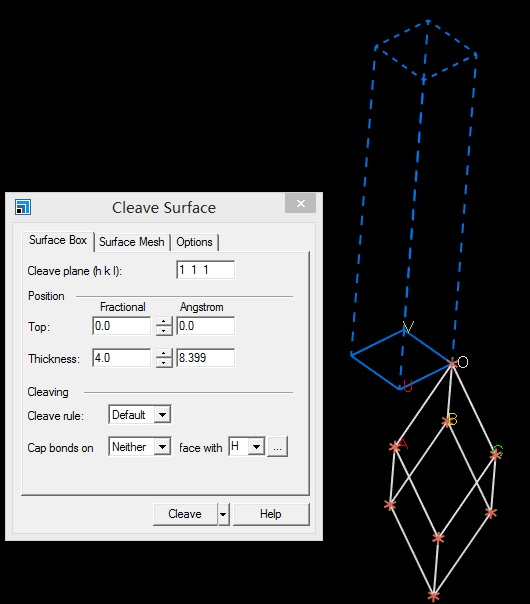
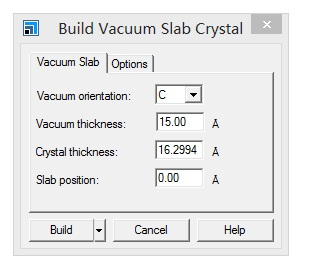
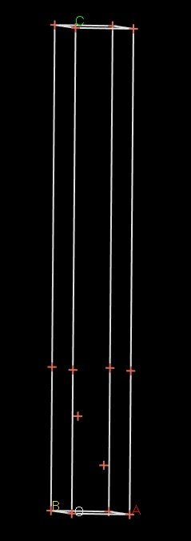

上一节的内容主要简单介绍了一下Slab模型，具体的大家去看推荐的参考书！计算部分我们做了以下几个方面的操作：

* Cu的Bulk计算，获取了稳定体相结构，晶胞参数；
* 将结果导入Material Studio， 并切(111)面
* 将切出来的Cu(111) 面转换成POSCAR格式。

因此，VASP的四个输入文件，我们已经有了POSCAR和POTCAR，下面我们复习下POSCAR，INCAR和KPOINTS的准备工作， 然后进行单点计算。

## 1  搭建slab模型

Cu(111) slab 模型（POSCAR）的制作流程（复习一下）。**注意：**前面我们用的是Conventional cell，下面用的是Primitive Cell。 一般来说用`Conventional cell`， FCC的金属可以用`Primitive Cell` 但对于其他体系，通过`Primitive Cell`切出来表面模型有问题。

A）Bulk计算结束后，将CONTCAR用VESTA转换为cif文件，然后MS导入。
B）Build→Symmetry→primitive cell
C）Build→surfaces→cleave surface

D）Build→Crystals→Build Vaccum Slab 真空层选择15Å

E）导出为cif，通过VESTA转化为POSCAR格式，如下：



```
Cu\(1\1\1)
1.0
        2.5717000961         0.0000000000         0.0000000000
       -1.2858500481         2.2271576142         0.0000000000
        0.0000000000         0.0000000000        21.2994003296
   Cu
    4
Direct
     0.000000000         0.000000000         0.000000000
     0.333330005         0.666670024         0.098590001
     0.000000000         0.000000000         0.295760006
     0.666670024         0.333330005         0.197170004
```

前面的操作，我们生成 `p(1x1)` 的Cu(111)面，p是`Primitive`的简称，如果你不了解p(1x1)， 去学习一下`Wood  Notation`。当然，在此基础上，你也可以将p(1x1) 在晶胞a 和b方向上扩展，生成`p(2x2)`，` p(3x3)`， `p(2x1)`等不同大小的Cu(111)表面。本节，我们就用p(1x1)做为例子。

## 2  KPOINTS

`POSCAR`中，slab在平面方向上a 和 b 的大小为2.5717 Å，根据前面的经验规则，我们可以在两个方向上K点取值为：$13\times13$，z 方向上取值为1，最终KPOINTS如下图，脚本使用命令为：` kpoints.sh 13 13 1` （不知道脚本的请往前翻）

```fortran
qli@bigbro:~/test/cu$  kpoints.sh 13 13 1 
qli@bigbro:~/test/cu$  cat KPOINTS
K-POINTS
 0
Gamma
  13 13 1
  0 0 0
```

为什么在z方向上只用1个K点？查找参考书（DFT：A Practical Introduction， Page 88）的说明：
If the vacuum region is large enough， the electron density tails off to zero a short distance from the edge of the slab. It turns out that this means that accurate results are possible using just one k point in the b3 direction.

## 3  INCAR

在贴出来INCAR之前，大家首先回顾一下单点计算需要注意的几个方面：
1）`System = Cu(111)` 可有可无
2）Cu 是金属，可以使用`ISMEAR = 1;SIGMA = 0.1`
3）`ALGO = FAST` 或者使用默认值
4）纯净的Cu(111)体系中，Cu没有磁性，ISPIN 不用设置
注意：CuO中Cu具有磁性，如果你算的是Cu的氧化物，就需要考虑ISPIN了
5）单点计算：`NSW = 0` 也可以不设置，因为默认值就是0
6）截断能： `ENCUT = 450` 很多人喜欢测试这个参数，450直接用是一个很好的选择
7）`EDIFF = 1E-5` 电子步的收敛标准
8）偶极矫正：` LDIPOL = .TRUE. ; IDIPOL = 3 ` Slab模型一般都需要加上这个参数
9）控制OUTCAR和其他文件的输出：` NWRITE = 0 ; LWAVE  = .FALSE.;LCHARG = .FALSE.`
10）也可以加上`NCORE `这个参数来加快计算步骤。一般来说，不同的机子大家需要自己测试下NCORE参数对计算的影响，个人经验：如果你的机器一个节点有12个核，设置`NCORE = 6`； 一个节点有24核，设置`NCORE = 12`。也就是节点中核数的一半。由于这个计算很快，本操作就不考虑了。最终INCAR 如下:

```fortran
System = Cu111

ISMEAR = 1
SIGMA = 0.1
ALGO = FAST
ENCUT = 450
EDIFF = 1E-5

LDIPOL = .TRUE.
IDIPOL = 3

NWRITE = 0
LWAVE = .FALSE.
LCHARG = .FALSE.
```


## 4 准备任务脚本，提交任务

计算完成后， `grep '  without' OUTCAR`  （without前面有2个空格）或者` grep E0 OSZICAR | tail-n 1 `，得到单点能为：` -13.96918440 eV`

## 5   扩展练习

5.1 计算的例子下载链接：链接: https://pan.baidu.com/s/1cHY-9g2Iswl5zV9bijBG7Q 提取码: ctxc
5.2 重复本节所有的练习
5.3 VASP官网查找本节中不了解的参数，然后学习
5.4 思考一下：我们得到的单点能量可以干吗用？

## 6 总结：

刚刚步入slab的计算，我们速度稍微慢一些，本节只讲单点计算，希望大家能够跟上步骤，亲自进行操作练习，如果出错了，请认真改正，直至得到和上传的结果一样为止。再次强调，大家平时一定要多浏览VASP官网，请把VASP手册下载放到桌面上，没事的时候就翻一翻。不要去网上找一些乱七八糟的教程，拿过来就直接照着练，官网才是最正宗的。