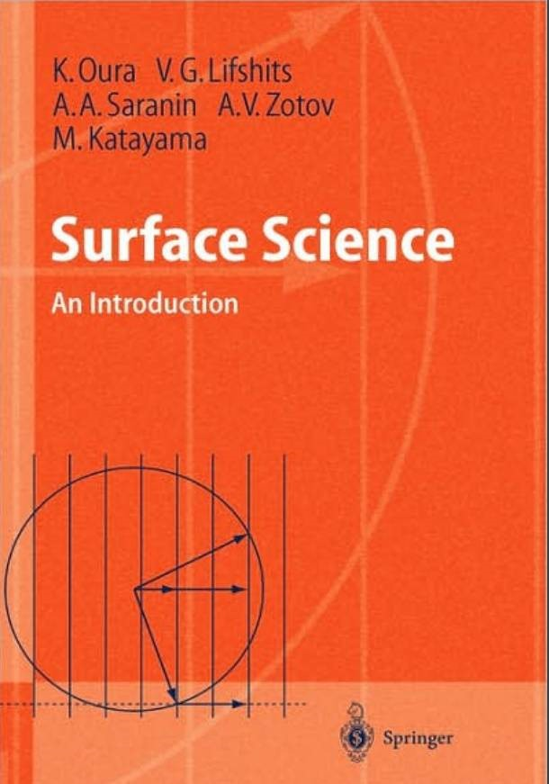
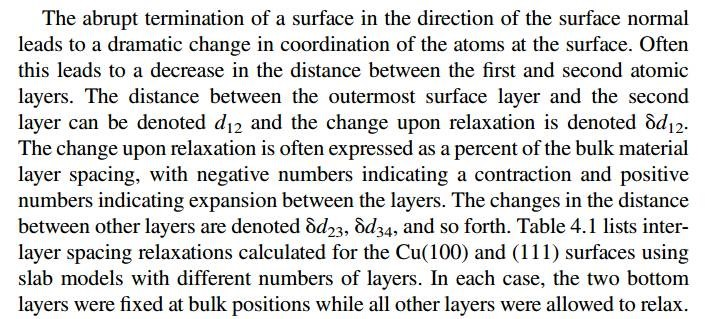

## 答辩心得

顺利完成博士答辩，现在我们开始继续前面的章节。
首先，想跟大家分享下自己答辩的体会：基础知识太不扎实，前瞻性又太不够。导致回答问题的环节，被大牛们问的就想找个缝钻进去了。这对于我的启事就是，以后写这本书的时候，每个练习尽量分成4个部分:
1)  第一部分讲基础知识，
2)  第二部分讲计算过程的细节部分，
3) 第三部分讨论计算结果和基础知识;
4) 相关发表的文章中的计算。
这对大家的要求就是:
1)  有什么任何有疑问的地方，自己要记下来，主动查阅资料，然后反馈给我;
2)  有什么欠妥的地方，恳请批评指正;
3)  如果你有相关发表的文章，可以放在前面提到的第四部分供大家研究，欢迎分享;
4)  这本书的作者不是我自己一个人，更是我们大家的心血，希望我们一起努力;
5)  本人只接受邮件咨询或者批评: lqcata@gmail.com 因为群里讨论的很多宝贵的经验总是没法及时完整的保留下来，以至于造成了很多损失。

## 表面弛豫

我们先想想一下，有一块金属，我们从中间切开后，新生成的两个表面上的原子和体相中的有什么区别?
首先，表面上的原子配位数比体相中的少了，即表层原子具有悬键。因为切开的过程就等同于把两个表面的原子键切开了。其次，配位数的减少使得表面层与内部的相互作用会更强，与体相中有所不同。这就体现在层间距(键长)上面。

**1 维基百科的解释**

理想情况下的晶体向各方向无限延伸，其中任一原子的平衡位置由晶体中其他所有原子对其作用力的总和决定。因此，每个原子所在的位置在理想晶体中是等价的，生成的晶体结构是周期性的。现实情况下的晶体大小有限，这就导致了靠近晶体表层的原子受到的作用力不同于晶体内部的原子，从而造成晶体表面原子排列方式不同于晶体内部的结果。晶体表层原子的这种行为可被分为弛豫(relaxation)和重构(reconstruction)两种情况。
弛豫指表面的原子层整体相对于内部的本体(bulk)的位置变化。较为常见的情况是垂直方向上的上下位移，即法向弛豫(normalrelaxation)。大部分金属表面上的弛豫都是这种类型。某些材料的表面也可能在发生法向弛豫的同时有切向的弛豫。

**2 Surface Science: An Introduction 这本书的解释**

**3  参考书的解释:**
Density Functional Theory: A Practical Introduction， 第94页，第四章，第4.5节 SURFACE RELAXATION 这一部分(请务必认真看完这一部分)

## 4 扩展练习:

1)  了解表面弛豫的相关内容;
2)  查找相关书籍;
3)  认真阅读参考书4.5节的内容，并重复4.5 节的练习
4)下载本节的两本参考书：QQ群共享或者百度网盘链接：http://pan.baidu.com/s/1eSB2Nx4

## 5 总结

表面弛豫相信大家都很了解了，借此机会供大家复习一下。关于表面化学的经典书籍，如果你有特别喜欢的，也请推荐给大家。 