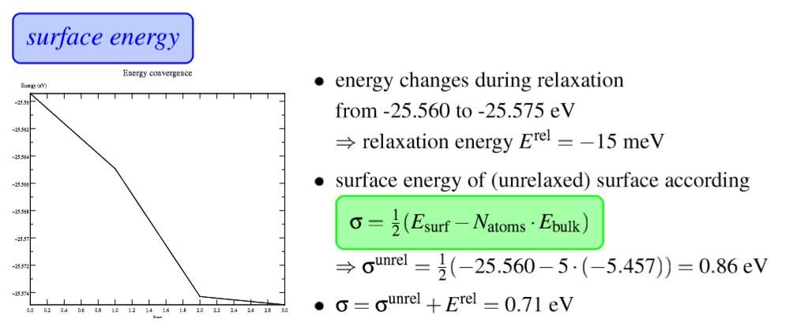
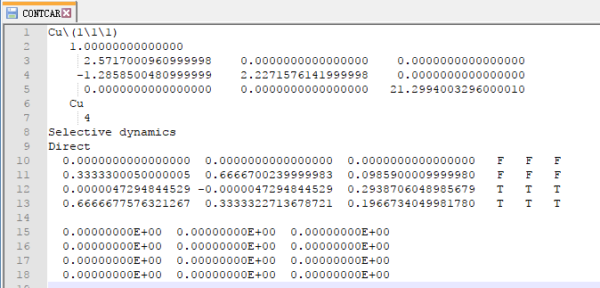
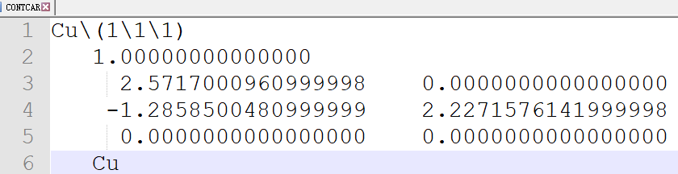
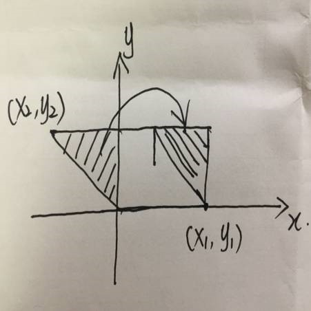
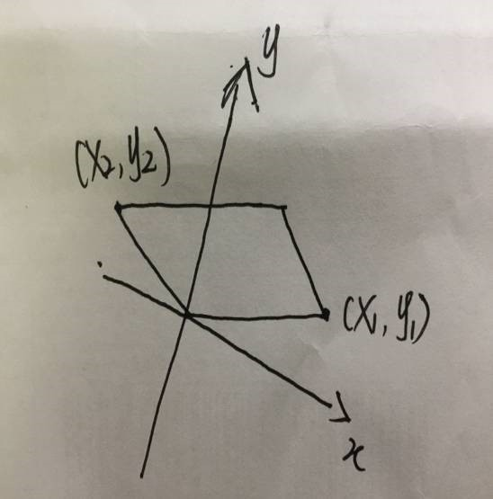
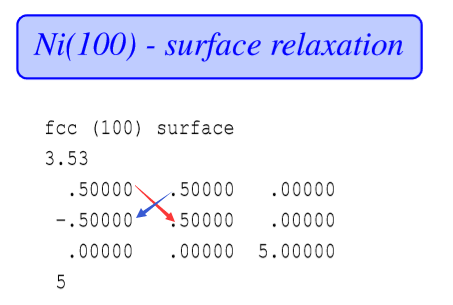
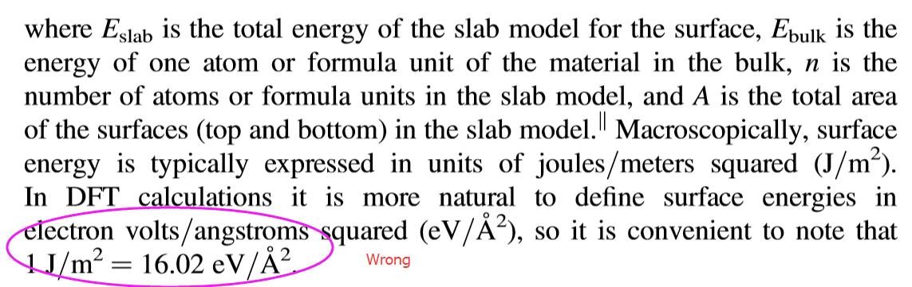
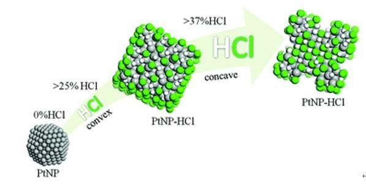
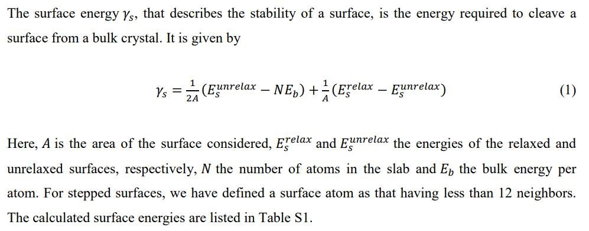

继续前面的计算，这一节我们主要讲一下表面能的计算过程。

### 1 表面能定义

首先，我们先介绍一下表面能的定义。为了偷懒，本人直接摘抄的[维基百科](https://en.wikipedia.org/wiki/Surface_energy)的解释，如下：

表面能是创造物质表面时，破坏分子间化学键所需消耗的能量。在固体物理理论中，表面原子比物质内部的原子具有更多的能量，因此，根据能量最低原理，原子会自发的趋于物质内部而不是表面。表面能的另一种定义是，材料表面相对于材料内部所多出的能量。把一个固体材料分解成小块需要破坏它内部的化学键，所以需要消耗能量。如果这个分解的过程是可逆的，那么把材料分解成小块所需要的能量就和小块材料表面所增加的能量相等。但事实上，只有在真空中刚刚形成的表面才符合上述能量守恒。因为新形成的表面是非常不稳定的，它们通过表面原子重组和相互间的反应，或者对周围其他分子或原子的吸附，从而使表面能量降低。

### 2 VASP计算

具体到VASP的计算中，表面能是怎么算出来的呢？ 下面我们看一下VASP官网的表面能的计算过程。

公式先大体浏览一遍，我们分析下里面的各项所表示的内容：

* Erel： Relaxation energy， 即弛豫能量。这个前面一节我们已经讲过了，从刚刚切好的表面优化到稳定的表面所释放的热量。图中的第一个点就是刚刚切好表面的能量，最后一个点就是优化完成之后的能量。这个相信大家现在都能理解了。
* σ： 在handonsession-III里面，这个用来表示表面能。
* Esurf： 优化完毕后的 slab 能量。
* Natoms： Slab 中的原子数目
* Ebulk： Bulk结构中单个原子的能量。

**注意1：**

前面说的最后一点。Ebulk， 这个不是指的体相的能量，而是体相中单个原子能量。即体相的能量除以原子数目。我们顺便回顾一下前面单胞的优化：

  1. 获取稳定的晶格常数，两个方法：

    * ISIF + Large ENCUT
    * 通过计算不同的晶格常数的晶胞能量，用BM方程拟合
  2. 得到稳定的晶格常数之后，如果用的 ISIF= 3 这个方法，则将 CONTCAR 复制成 POSCAR ，然后在 INCAR 中设置： ISIF = 2 + 正常的 ENCUT ，做个单算，算下计算晶胞的能量。
  3. 用晶胞的能量除以晶胞中的原子数目，就得到了这里的 Ebulk。比如前面 Cu 的单胞中有4个原子，我们则用计算后体系的能量除以4。

**注意2：**

Handonsession-III 里面的表面能，严格来说，这个定义其实是不对的。因为表面能，从字面上理解，它的单位应该是： 能量/面积。而图中只有能量，没有面积。所以，图中的表面能指的是纯能量。

  1. σunrel： 将块体直接切开所用的功，因为是切成了2份，公式中除以2。  

    注意，在这个计算里面，暂且不考虑表面的弛豫，单纯从体相切成2个表面的过程。
    能量是刚刚切出来的slab的能量： -25.560

  2. 从体相到切开表面直至达到稳定状态，总的能量变化为：
     $$
     \sigma = \sigma^{unrel + E^{rel}}
     $$

**注意3：**

Erel 这里没有除以2。为什么呢？ 这是因为我们只放开了上面的两层原子。也就是只优化了一个表面。
至此，从体相切成表面，然后直至表面稳定，这一个过程的能量就算完了。
既然前面说了，表面能里面有面积，那么面积指的是什么面积？怎么求面积呢？

  1. 面积就是你计算的slab的那一层表面积，很多人问我这个问题，我也是无语了！
  2. 怎么求呢? 我们先看一下Slab模型(Notepad++这个软件打开的！没有的话赶紧去安装一个)

前面几行放大一下，看看晶格尺寸。

如果面积用A来表示， 则： 

A = 2.57170 * 2.22716 – 0.000 * (-1.28585) 

**注意4：**

这里的单位是 Å2
原理如下图：(自画自拍，不喜勿喷!)

菱形的面积等于： x1 * y2
如果坐标系不是那么正儿八经对在一起的时候，如下图：

则面积等于：x1 * y2 – y1 * x2 
Handonsession-III 中 Ni(100) 表面的面积为：

A = (0.5*0.5– 0.5 * (-0.5)) = 0.5 Å2
这里我们还忘了乘以前面的缩放系数：所以，
A = 0.5 * 3.53 * 3.53 = 6.23045 Å2
最终表面能为： 0.71 eV / 6.23045 Å2 = 0.114 eV/Å2
一般来说表面能的单位为： J/m2
换算系数为： 1 eV/Å2 = 16.02 J/m2
换算完毕后，表面能为： σ = 0.114 * 16.02 J/m2 = 1.826 J/m2 。
**注意**： 我们的参考书中(第97页中)给弄反了。

这是因为：
1 eV = 1.602176487*10-19 J
1 Å2 = (1*10-10)* (1*10-10) m2
大家自己算算就知道了。讲到这里，相信金属表面能，大家都可以照着去算一遍了。

### 3 下面我们看一下这篇参考文献中的计算介绍：

Shapecontrol in concave metal nanoparticles by etching 
Nanoscale, 2017,9, 13089-13094 

这是本人博士期间的一个工作，主要讨论了不同盐酸浓度下Pt纳米颗粒的成长，腐蚀过程以及形貌的预测。有兴趣的可以看看，当然啦，本人也希望大家多多引用。对于表面能的计算，大家可以参考支持信息中的公式1，如下图： 

相信到这里，大家可以完全明白这段话的意思，以及计算的整个流程了。

### 4 扩展练习：

1. 重复一下 Hand on Session -III 中 Ni(100)  表面能的计算;
2. 计算下我们前面的 Cu(111) 表面能的计算;
3. 计算下 Cu(100), Cu(110) 的表面能。
4. 对比 Cu(111), Cu(110) 和 Cu(100) 的表面能，分析下规律。
5. 思考1：表面能的计算有什么需要注意的， 请公众号留言回答！
6. 思考2：表面能能用来干什么？请公众号留言回答！

### 5 总结：

本节，我们主要讲了表面能的计算，参考的资料有：

  1. VASP 官网的 Hand on session (如果你自己下载不到，请认真反思自己！)
  2. 我们的参考书： Density Functional Theory: A Practical Inroduction
  3. 以及本人发表的文章一篇。 
  4. 希望大家可以认真学习，不要急躁！！！

本书中只要是用到的，提到的资料，本人都已经明确说明出处，获取方式以及下载链接了，请认真浏览，不要再浪费时间找我索要！
