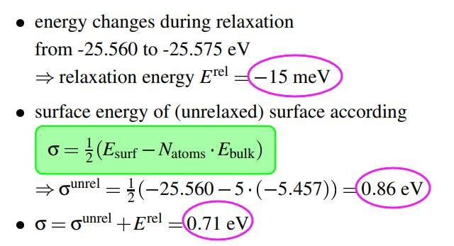
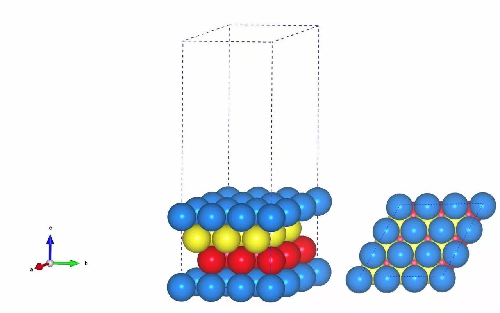
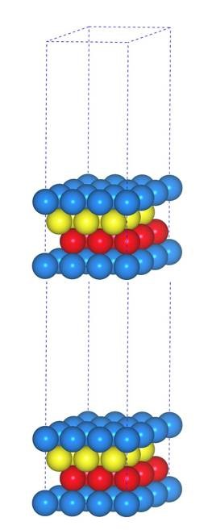
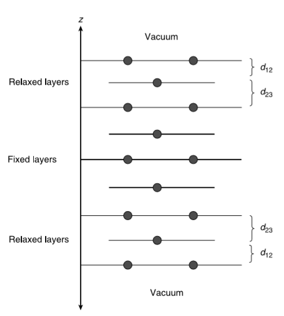
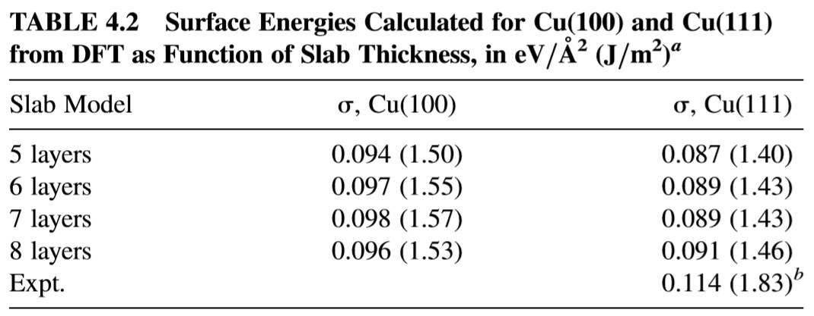
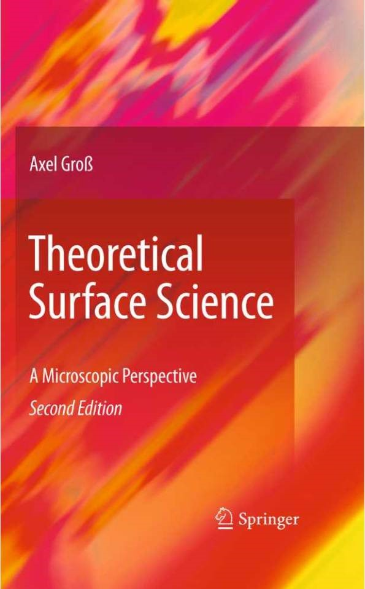
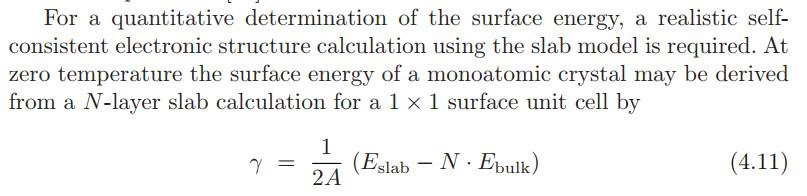
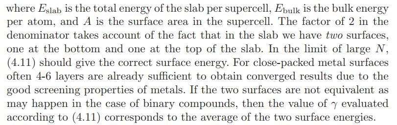

前面一节，我们讲解了一下 VASP 官网 Hand-On-Session-III 中表面能的计算。 

### 1 首先我们要指出一点 VASP 官网的错误

最后的表面能应该是： 0.86 - 0.015 = 0.845 eV 而不是 0.71 eV。

### 2  为什么要除以 2？

很多人困惑为什么我们在计算的时候，上图中要除以 2。这是因为我们的单点计算中包含有 2 个面。前一节解释说是因为把 Bulk 切成了两半，以至于把大家给弄糊涂了。为什么我们的计算中会有两个面呢？首先我们看下 Slab 模型：

问题： 上图的结构中有几个表面呢？

答案是 2 个，因为我们的 slab 模型在 z 方向上也具有周期性，虽然我们把底部的两层原子固定来模拟体相，但实际上它们还是表面。如下图：

那么，为什么 Erel 没有除以 2 呢？

这是因为我们只优化了一个表面啊。

如果我们两个表面都要优化的时候，是不是 Erel 也除以 2 了呢？

答：是的。

如果你喜欢上下两个面都优化的话，那么这将引申出 slab 模型的两种情况，对称性和非对称性模型。前面我们讲的都是非对称的 slab 模型。那么什么是对称的 slab 模型呢？ 如下图：

在这个模型中，中间的三层原子被固定用来模拟体相，上下三层的原子放开用来模拟表面。此时，如果你计算表面能的时候，Erel 的数值就要除以 2 了。计算公式可以简化为：

$$ \begin{align*}
\sigma &=\frac{1}{2A}(E_{surf}-N_{atoms}\times E_{bulk}+E^{rel})\\
&=\frac{1}{2A}(E_{surf}^{rel} -N_{atoms}\times E_{bulk})\\
\end{align*} $$

其中： $E_{surf}^{rel}$ 直接就是我们优化完毕之后的对称slab模型的能量。

单个表面的面积 A， slab 模型中的原子数 $N_{atoms}$ 和 $E_{bulk}$ 这些能量的获取和前面一节讲的内容一致。

注意： 将这个公式和参考书 96 页底部的公式对比一下。然后仔细阅读参考书 97 页的公式各项的说明。

### 3 对称和非对称slab模型的区别：

1. 对称 slab 明显具有更多的原子数，在 z 方向更长，需要更多的真空层(上下两层)，这就不可避免地出现了计算量大的缺点，尤其是对于机时捉襟见肘的筒子们来说，这个模型就不用考虑啦；
2. 非对称模型由于其非对称性，在计算过程中会产生偶极矩，注意这个偶极矩是由于模型引入的，并非我们常说的分子中的偶极矩。尤其是当我们要计算一些表面吸附或者反应的时候，两个 slab 之间偶极矩的相互作用会对我们的结果产生影响。但这不是什么大问题，很多计算软件都可以通过控制计算参数来消除或者将这一影响减至最小。
3. VASP 中可以通过设置：
   1. `LDIPOL=.TRUE. `(打开偶极校正)
   2. `IDIPOL = 1-4 `来解决。 1，2，3分表代表在x，y和z 方向上进行校正。4代表在所有方向上。

注意：1 和 2 必须同时加在 INCAR 里面。详见VASP官网的解释： [LDIPOL](https://cms.mpi.univie.ac.at/wiki/index.php/LDIPOL) 和 [IDIPOL](https://cms.mpi.univie.ac.at/wiki/index.php/IDIPOL)

### 4 表面能计算的参数影响：

从公式中可以看出 Slab 的能量和 Bulk 的能量是主要因素： 

1. Slab 能量：

   * Slab的层数：如参考书中的结果。

   

   * slab 表面的大小，一般来说 p(1x1) 的即可。当然啦，你可也比较下 p(1x1) 和 p(2x2) 的区别： 这里要注意的是： 改变表面的大小，KPOINTS 也要发生相应的变化，只有这样，两个计算的结果才具有可比性。 
   * 真空层的厚度 这些大家都可以测试一下。

2. Bulk 的能量前面一节我们已经讲过 Bulk 的能量计算了。前面有同学问到： Bulk 计算的时候，模型中应该包含多少个原子？
     个人认为：单胞或者原胞的计算均可，当然你也可以扩一下晶胞。但需要注意的是如果你要比较这些不同大小模型中单个原子的能量时，一定要注意 K 点的选择。如果 K 点密度不一致，导致单个原子的能量之间存在细小的差别，这会令你不知所措。有兴趣的可以测试一下。 

3. 此外，大师兄还要推荐一本进阶版的参考书：Theoretical Surface Science: A Microscopic Perspective，作者是 Axel Groβ。课题组主页：https://www.uni-ulm.de/en/nawi/institute-of-theoretical-chemistry/

​	

本书关于表面能的介绍在第68页，具体内容大家认真阅读，必定受益匪浅。

### 5 扩展练习：

1. 请务必认真阅读参考书中表面能， slab 模型的相关介绍；
2. 认真测试，重复 Cu(111), Cu(110) 和 Cu(100) 面的计算；
3. 仔细阅读 Theoretical Surface Science: A Microscopic Perspective 这本书中关于表面能的内容；
4. 结合计算结果和参考书中的解释，自己参悟一下。

### 6 总结：

本节主要回复了一下大家提问的比较多的问题，简单介绍了一下对称和非对称 slab 模型以及一些影响表面能计算的因素。学习 VASP 没有捷径，大家多练习，多出错，多总结分析，时间长了就会慢慢理解了。
