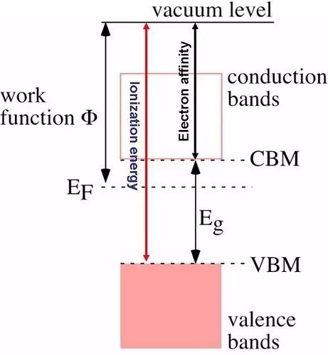
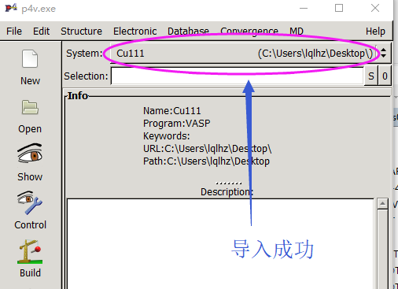

前面我们讲完了表面的计算，后面两节我们主要讨论一下功函数的计算。


###  1 功函数的定义

首先，我们先看一下**[维基百科](https://en.wikipedia.org/wiki/Work_function)**的解释：

**功函数**(又称功函、逸出功)是指要使一粒电子立即从固体表面中逸出，所必须提供的最小能量(通常以电子伏特为单位)。这里“立即”一词表示最终电子位置从原子尺度上远离表面但从宏观尺度上依然靠近固体。功函数不是材料体相的本征性质，更准确的说法应为材料表面的性质(比如表面暴露晶面情况和受污染程度)功函数是金属的重要属性。功函数的大小通常大概是金属自由原子电离能的二分之一。

The work function W for a given surface is defined by the difference

W = - eϕ - E<sub>F</sub>

where −e is the charge of an electron, ϕ is the electrostatic potential in the vacuum nearby the surface, and E<sub>F</sub> is the Fermi level (electrochemical potential of electrons) inside the material. The term −eϕ is the energy of an electron at rest in the vacuum nearby the surface. In words, the work function is thus defined as the thermodynamic work required to remove an electron from the material to a state at rest in the vacuum nearby the surface.



我们再看下 [IUPAC](https://goldbook.iupac.org/html/E/E02015.html) 官网的解释：

The minimum work needed to extract electrons from the Fermi level of a metal M across a surface carrying no net charge. It is equal to the sum of the potential energy and the kinetic Fermi energy taken with the reverse sign:

$$\phi^{M} = -(V_{e}+\varepsilon_e^ F)$$

where $V_{e}$ is the potential energy for electrons in metals and  $\varepsilon_e^ F$ is the kinetic energy of electrons at the Fermi level.


### 2 VASP 计算功函数的过程

从前面的定义中可以看出，计算功函数我们只需要得到体系的费米能级和电子所处的静电势能，然后求差即可。

#### 2.1 费米能级的计算：

VASP 计算结束之后，通过命令：

grep E-fermi OUTCAR 即可提取出来。

#### 2.2 静电势能的计算：

通过在 INCAR 中添加： `LVHAR =.TRUE.` 这个参数。

加入这个参数，计算结束后，VASP 会输出一个文件： LOCPOT 文件。我们可以通过脚本，或者程序对这个文件后处理来获取静电势能，怎么处理后面会讲的很清楚，大家先不要着急心慌。

#### 2.3 VASP的计算流程：

1. 优化获取稳定的结构

2. 将 CONTCAR 复制成 POSCAR

3. 在 INCAR 中设置单点计算：

   方法1：设置 `NSW=1 或者 0`

   方法2：设置 `IBRION = -1`

   方法3：直接删除 INCAR 中 NSW 这一行，采用默认值

4. 提交任务

   注意：

   1. 如果第一步计算中有保存 WAVECAR，则静态计算的时候可以设置：ISTART = 2 读取一下，以便节省计算时间;
   2. 如果没有保存，直接算即可。不要在读不读 WAVECAR 这个问题上瞎操心；
   3. 电子步数的默认值是 40，如果你的体系不容易收敛，计算的时候请设置一个较大的 NELM 值，比如 NELM = 500。


### 3 Cu(111) 表面的功函数计算

#### 3.1 准备计算文件：

新建一个 workfunction 的文件夹，将前面优化计算的： INCAR KPOINTS POTCAR CONTCAR 和提交任务的脚本复制到这个文件夹中。

#### 3.2 修改 INCAR 改为静态（单点）计算

#### 3.3 修改 INCAR，添加 LVHAR = .TRUE. 这一行

```
System = Cull
ISMEAR = 1 
SIMGA = 0.1
ALGO = FAST
ENCUT = 450
EDIFF = 1E-5

IDIPOL =.TRUE.
IDIPOL = 3

NWRITE = 0
LWAVE = .FALSE.
LCHARG = .FALSE.
IBRION = 2
POTIM = 0
EDIFFG = -0.01
NSW = 1 

LVHAR = .TRUE.
```

#### 3.4 将 CONTCAR 重命名为 POSCAR

#### 3.5 提交任务，等待结束。


### 4 后处理方法-1：p4vasp

p4vasp 一直是本人强烈推荐的VASP计算相关的建模，可视化，查看结构，结果的软件。本节我们讲解一下如何通过 p4vasp 对功函数的计算结果可视化。

#### 4.1 导入数据

1. Linux 系统下面，进入计算的目录直接敲命令： p4v & 即可 (我们稍微等下 Windows 用户的操作，后面可视化过程是一样的)

2. Windows 下面，首先要将计算生成的 LOCPOT 文件保存到本地电脑上。

   注意：有时候这个文件可能会很大，下载的时候比较蛋疼，不想下载的话等待下节的讲解。

3. 打开 p4vasp 并导入 LOCPOT 文件：file --> loadsystem，然后找到 LOCPOT 所在的目录，点解导入，效果如下

   

#### 4.2 开始可视化 (Linux, Windows 都一样了)

Electronic –> Local potential


效果如下：


WOC，这是什么东东？ 是不是算错啦？

别急，看下面：

点击下图中的 `Show`，会出现三个方向让你选择，一般都是沿着 z 方向的，按照红色箭头点下即可。


效果如下：


Wow, Wonderful!!! 是不是很有成就感？

But， 怎么才能获取静电势能的数值呢？ 图中的纵坐标范围太大了，目测取值的话，误差应该在 0.5 eV 左右，太大了，不行。 那么我们只能导出数据，慢慢分析了。

#### 4.3 导出数据

还记得前面我们讲的 DOS 的计算吗？我们求 `d band center`，电子数目积分的时候将数据导出来了。同样，图中组成曲线的点的坐标我们也可以导出来。
点击： `Graph`-->`Export`


选择保存的目录，并给保存的文件一个名字。然后点击，`Export`， 图中的 cu.dat 就会保存你指定的目录下了。


**注意：**

1. 名字后面一定要有尾缀` .dat `或者 `.data`， 否则会导出失败；
2. 如果按照我说的步骤做的话，还不会弄，请自行查看前面关于 DOS 的计算，已经讲的很清楚了，不要再问我这个问题了。

#### 4.4 分析数据

有了数据，我们就底气十足，什么都不怕了。用 Notepad ++  打开 cu.dat 文件。

**注意**： 这里大师兄说的是用 Notepad++，别问我从哪里下载这个神奇的软件。百度会告诉你的。

打开之后，我们会发现，和 DOS 计算导出来的结果有几分神似。数据共有三部分，每两部分之间由空行分开。


这三部分的顺序，如下图，


我们从图中可以看出，基本上在 10-18 的这个区间范围，三条线的数据差不多是一样的。静电势能的话，可以通过红线( Average 那条线)，也就是第二部分来获取。可以查看下 14-15 $\AA$ 时红色曲线的数值，如下图：


#### 4.5 获取费米能级


套公式，功函数为： 4.84-0.03 = 4.81 eV

对比下维基百科中的数值：


注意：虽然维基百科给了功函数的一些数值，在发表文章的时候，你不能直接放 wiki 的链接到论文里面，这显得有些不专业。建议大家去参考 CRC handbook 里面的数值，然后引用。别问我 CRC handbook 是啥玩意，前面我也讲过了。 


### 5 扩展练习：

1. 重复本节的计算；
2. 重复 VASP 官网 [Ni(111) 表面](https://cms.mpi.univie.ac.at/wiki/index.php/Ni_111_surface_high_precision) 的计算。


### 6 总结：

本节我们主要

1. 介绍了下功函数的定义(从别的地方拷过来的)；

2. 介绍了下 VASP 怎么计算功函数；

3. 怎么用 p4vasp 可视化，导出数据，并获取静电势能；

4. 怎么获取 fermi level；

5. 举例介绍了p(1x1)Cu(111) slab 的功函数计算流程，计算结果下载：

   链接：<https://pan.baidu.com/s/1c2m52UG>   密码：kfse
