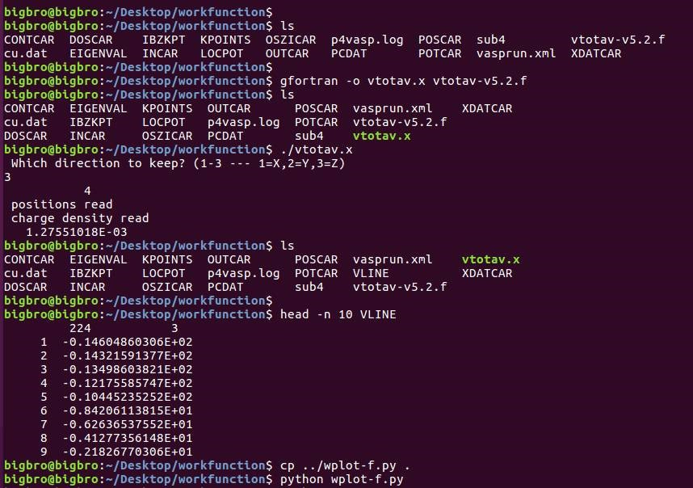

前面一节我们介绍了计算功函数的具体流程，以及用p4vasp获取真空能级的方法。

本节我们介绍另外两个方法，从本质上来说，这些方法是一样的，都是基于对 LOCPOT 中数据的处理。

### 1 使用 vtotav-v5.2f 脚本

操作流程如下：



**注意：**

1. `gfortran -o vtotav.x vtotav-5.2f`

   这个命令将 `vtotav-5.2f` 这 个脚本编译成可执行文件 `vtotav.x`。

   gfortran 不管用的话可以试试` ifort -o vtotav.xvtotav-5.2f `这个命令。

2. ./vtotav.x 在当前目录下运行这个可执行文件;会让你选择计算的方向，这里我们 slab 的真空层是在 z 方向，所以我们输入 3  (回想一下，上一节，我们在 p4vasp 中选择z方向的鼠标操作，它们是一样的)，都是讲 LOCPOT 文件处理，然后生成z方向的相关数据。

3. 运行完毕后，当前目录下会多出来一个 VLINE 文件。这个文件就是 p4vasp 中选择 z 方向之后所显示的红线数据，(不过横坐标有些不同)。

4. 我们看一下 VLINE 文件的数据内容，第一行中 224 代表有 224 个点，3 代表 z 方向。

5. VLINE 文件中横坐标为当前点的序号，从 1-224，而 p4vasp 中导出来的文件，横坐标为 z 方向的坐标，不过这个不影响我们对真空能级的计算。


上图中最后的两行命令，

1. 从上一级目录下拷贝了一个 python 脚本，名为：`wplot-f.py`；
2. 运行这个 python 脚本，效果如下：


我们又得到了前面一节的功函数的图像。真空能级，大家从 150 前后取个值即可，也可以在一段直线的区间范围内求个平均数。


对比下前面一节和本节中的数据：


左图为本节的，右图为上节的。


Python 脚本这么神奇，是怎么写出来的呢？脚本内容如下：

```python
#!/usr/bin/env python
# Written By Qiang for workfunction Visualization from VLINE file

import matplotlib.pyplot as plt

x = []
y = []
with open("VLINE", mode='r') as f:
    next(f)
    for line in f:
        xy=line.rstrip().split()
        x.append(float(xy[0]))
        y.append(float(xy[1]))

plt.plot(x,y) 
plt.savefig('workfunction' + '.pdf', dpi=400)
plt.show()
```

思路如下：

1. 读取 VLINE 文件；
2. 第一行画图的时候用不着，需要跳过，next(f)；
3. 将剩下的那些行中，第一个数存到 x 列表里面，第二个数存到 y 列表里面；
4. 使用 matplotlib 中的 pyplot 读取 x， y 列表中的数据，进行画图： plt.plot(x,y)；
5. 将生成的图保存成 workfunction.pdf 文件，分辨率 dpi 为 400。

**注意：**

1. 如果你想保存成 eps, png, jpg,只需将 .pdf 改成 .eps, .png, .jpg 即可；
2.  如果想要分辨率更高，可以修改400这个数值；
3. 如果只想保存成 pdf 文件，不想弹出图片的查看窗口，把 plt.show() 这一行注释掉就可以了， # plt.show()；
4. 如果只想看一下图，不想保存 pdf 文件，将第 16 行注释掉就可以了。


### 2 使用 vtotav.py 脚本

第一个脚本就讲到这里了，这个脚本不错，唯一的缺点就是横坐标不是 z 方向的数值，那么我们看一下第二个脚本的操作。


**注意：**

1. 这里用到的脚本名字为：`vtotav.py`；

2. vtotav.py LOCPOT z  这个命令意思是，用 vtotav.py 读取 LOCPOT 文件，并处理生成 z 方向的数据；

3. 脚本运行完毕后，目录中多了一个 LOCPOT_Z 文件，这个文件内容如下：

   

4. 图中最后两行，

   1. 大师兄又从前面的目录下拷贝了一个脚本： wplot.py；
   2. 然后运行这个 python 脚本， 效果如下：


这个脚本中，横坐标为 z 方向的大小，比前面的脚本有所改进，和 p4vasp 的数据是一样的。首先我们先看一下可视化的脚本，然后再讲解 vtotav.py 这个脚本的获取和使用。

```python
#!/usr/bin/env python
# Written By Qiang for workfunction Visualization from LOCPOT_Z file

import matplotlib.pyplot as plt

x = []
y = []
with open("LOCPOT_Z", mode='r') as f:
    first_line = f.readline()
    name_x = first_line.split()[1]
    name_y = first_line.split()[2]
    for line in f:
        xy=line.rstrip().split()
        x.append(float(xy[0]))
        y.append(float(xy[1]))

plt.plot(x,y) 
plt.xlabel(name_x) 
plt.ylabel(name_y) 
plt.savefig('workfunction' + '.pdf', dpi=400)
plt.show()
```

这个跟前面的那个脚本很像，不同的地方在于这个脚本中读取了第一行的内容，并将它们作为横坐标和纵坐标的名字。(Distance 和 Potential)


### 3 vtotav.py 脚本的获取和使用

这个脚本可以在github网站免费下载，网址为：

<https://github.com/compphys/ase_tools/blob/master/scripts/vtotav.py> 


本人的做法是：

1. 把图中的代码复制下来，然后保存到一个文本里面，将文本命名为：vtotav.py；
2. 赋予脚本可执行权限： chmod u+x vtotav.py；
3. 将脚本移至 ~/bin 目录下： mv vtotav.py ~/bin；
4. 然后直接用就可以了，跟前面图中的操作一样。


不过本人刚刚发现这个脚本可以按照下面的方法下载，下载完成后，重复前面的 2-4 步即可：

1.  点击 scripts

   

2. 鼠标右击这个脚本

   

3. 另存为，然后选择保存的目录

   

4. 这里本人保存到电脑桌面上了

   

**注意：**

如果你运行脚本的时候，没有得到下面图中的这个结果：


原因可能在与：


这个脚本需要调用 ase 这个程序中的模块，那么什么是 ase 呢？ase 怎么安装呢？

对于 ase，本书的 ex0 中就已经提到了，可能大家也忘记了。ASE 是 Atomic Simulation Environment 的缩写，这是一个非常强大的工具。官方网址：

<https://wiki.fysik.dtu.dk/ase/>

是大大师兄(本人的师兄)做博后的课题组开发出来。Linux 系统下面，安装 ASE 很简单：


一个命令就可以搞定了，Soooo eeeeeasy! 至于 Windows 下面嘛，本人不会。不想用 Linux，还想用 ASE 的就只能自己捣鼓捣鼓了。捣鼓好了也不要给我发教程，因为本人不推荐用 Windows 做计算。


### 4 扩展练习：

1. 下载本节的例子，以及所有的脚本，按照讲解的操作一遍流程，链接：https://pan.baidu.com/s/1dEHvHr7 密码：ponm；
2. Linux 用户自行安装 ASE，使用 vtotav.py 这个脚本走一遍过程；
3. 熟悉下用 python 画图的基本方式。


### 5 总结：

讲解到这里，功函数的可视化也就差不多了。当然了，只要你有了数据，用什么画图都可以， excel, origin, matlab, gplot… 不过貌似作图也没什么用，我们大体上看下，然后找个区间取静电势的数值才是正事。
