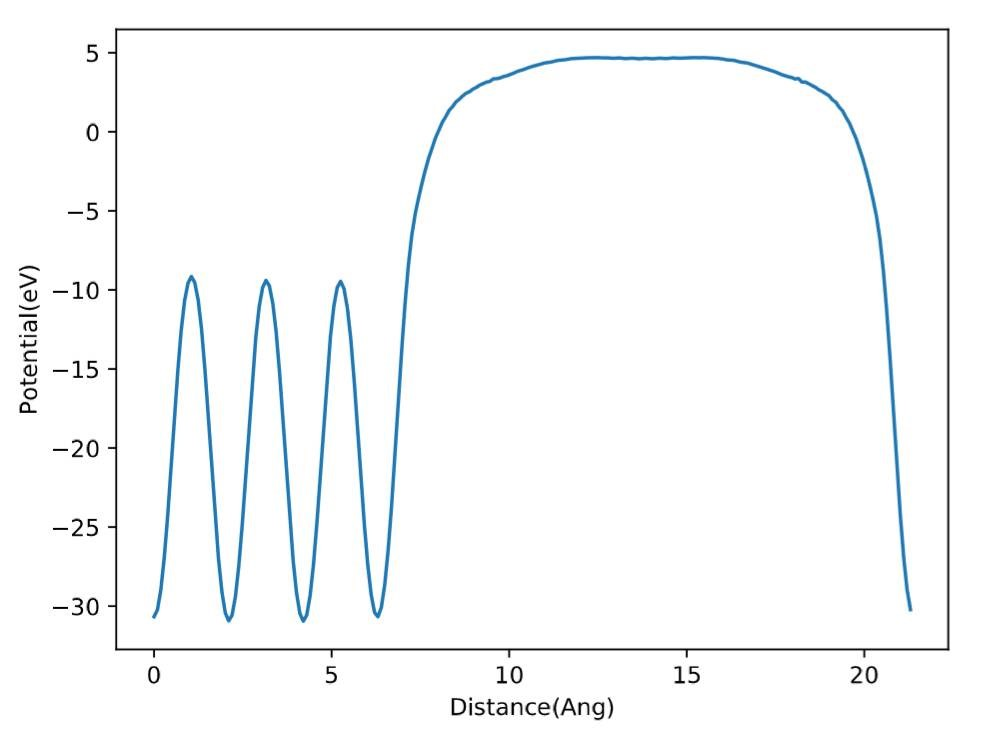
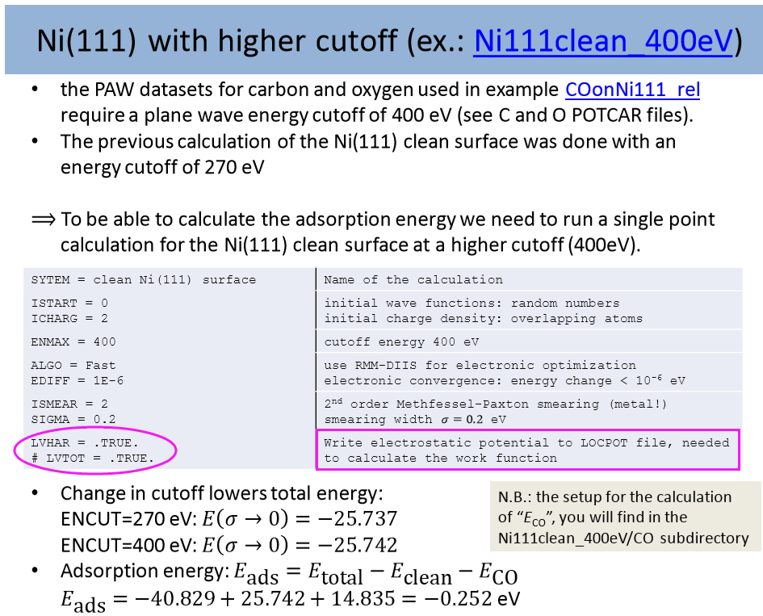

前面我们通过 Cu(111) 表面作为例子，学会了功函数计算的基本步骤和可视化过程。那么功函数计算的时候，需要注意的事项有哪些呢？


### 1  INCAR中的参数

计算功函数的参数：`LVHAR =.TRUE.`

加入这一参数时，VASP 只将静电势能写入 LOCPOT 文件中。

在早期的 VASP 版本中，静电势的写入是通过设置 LVTOT 这个参数的。

在 5.2.12 版本之后，如果你设置 `LVTOT= .TRUE. `，那么静电势，交换相关势都会写入到 LVTOT 中。由于我们计算功函数的时候，只需要静电势这一部分。所以，如果你用的是 5.2.12 版本之后的 VASP，设置 `LVHAR= .TRUE.` 即可。

如果有疑惑的话，不妨做个测试，分别设置 LVTOT 和 LVHAR = .TRUE. 然后做个单点计算对比下结果。

设置 `LVTOT = .TRUE.` 的结果如下：



设置 `LVHAR = .TRUE.` 的结果如下：


我们对比下 13-15 $\AA$范围内纵坐标的大小和平均值


很显然，两个参数对功函数的影响是不可忽略的。使用 LVTOT 这个参数，由于加入了交换相关势，曲线变得不再那么光滑，并且与 LVHAR 的结果有一定的偏差。所以，在计算功函数的时候，LVHAR 这个参数一定要注意。

 这一点也体现在VASP官网最新的ppt中，如下如：(自己主动根据下图中的关键词找这个 ppt，别问我要，也不要在大师兄群里求助浪费别人的时间。)




**注意：**

在 Hand-on-session (**老版本**的官方教程)中，使用的是 LVTOT 这个参数。老版本就是过时的意思。希望大家的以新版本的计算为准。


老版本中功函数的计算例子。


### 2 真空层的厚度及修改

真空层的厚度：指的是 slab 在 z (或者 c )方向上的长度减去表面原子在 z 方向的坐标。


Slab 方向的长度，指的是 POSCAR 或者 CONTCAR 中第 5 行中的数值，上图箭头所指的地方。

那么我们怎么修改真空层的厚度呢？

由于 slab 模型中的原子部分就在那边乖乖地待着，我们只需改变 slab 中晶格常数在 z 或者 c 方向的长度即可。

例子1：上图中真空层的厚度为 15 $\AA$，我们需要一个 20 $\AA$  的 slab 模型，也就是在 21.2994 的基础上再加 5 个 $\AA$，等于 26.2994。但这样做，对不对呢？修改之后的 POSCAR：


结构如下图：


我们发现 slab 的 Cu 原子部分之间好像也被拉长了。测量了一下两个 Cu 原子之间的距离为： 2.956 Å。


修改之前为： 2.547 Å。


所以：我们在前面的操作中，直接修改的 z 方向的数值，**方法是错误的。**

原因在于：前面的结构中坐标为分数坐标： Direct

我们修改完成之后，Cu 原子在 c 方向的距离也会发生相应的改变。

所以，如果直接修改 POSCAR 或者 CONTCAR 改变真空层厚度的话，我们一定一定要先将它们转化为 Cartesian 坐标。怎么转化呢？

方法1：用软件操作，比如 p4vasp。


我们可以切换坐标通过鼠标点一下即可，然后保存成 Cartesian 的 POSCAR。

当然啦，也可以使用其他软件，比如 VESTA 等等，更好的选择，也欢迎留言补充。

方法2：使用脚本转换：

1. VASP 官网在 POSCAR 的解释部分，提到了怎么进行坐标切换的公式。

   链接如下：<https://cms.mpi.univie.ac.at/vasp/vasp/POSCAR_file.html> 

   

2. 在此基础上，本人写了一个 python 的小脚本，可以实现 Direct 到 Cartesian 的转换。 

   运行如下：

   

   图中流程的解释：

   1. 将一个计算中的 CONTCAR 复制过来；
   2. 使用 head -n 10 看一下这个 CONTCAR 的文件结构。(10 指的是前面 10 行，如果你想看前面 5 行，使用 head -n 5 )；
   3. dire2cart.py CONTCAR  使用脚本进行转换，转换的对象为 CONTCAR；
   4. 转换完成后，Cartesian 的保存为 CONTCAR_C 文件；
   5. cat CONTCAR_C 这个命令查看转化后的内容。(当然也可以继续使用前面的 head 命令) 

   本脚本下载链接： <https://pan.baidu.com/s/1eRMJ7m6>   密码：btsl

   ```python
   #!/usr/bin/env python
   # -*- coding: utf-8 -*-
   #Convert direc coordiation to cartesian Writen By Qiang 
   import sys
    
   script, file_to_be_converted = sys.argv 
    
   print """
   ###################################
   #                                 #
   #for VASP 5.2 or higher versions  #
   #                                 #
   ###################################
   """
    
   file_read = open(file_to_be_converted, 'r')
    
   line = file_read.readlines()
   a1 = float(line[2].split()[0])
   a2 = float(line[3].split()[0])
   a3 = float(line[4].split()[0])
   b1 = float(line[2].split()[1])
   b2 = float(line[3].split()[1])
   b3 = float(line[4].split()[1])
   z1 = float(line[2].split()[2])
   z2 = float(line[3].split()[2])
   z3 = float(line[4].split()[2])
    
   num_atoms = sum([int(x) for x in line[6].split()])
    
   x_cartesian = []
   y_cartesian = []
   z_cartesian = []
   tf = []
    
   start_num = 9 # Default: With Selected T T T, coordination starts from line 9
    
   def convert():
        
       for i in range(start_num, num_atoms + start_num):
           x_cartesian.append(float(line[i].split()[0]) * a1 + float(line[i].split()[1]) * a2 + float(line[i].split()[2]) * a3)
           y_cartesian.append(float(line[i].split()[0]) * b1 + float(line[i].split()[1]) * b2 + float(line[i].split()[2]) * b3)
           z_cartesian.append(float(line[i].split()[0]) * z1 + float(line[i].split()[1]) * z2 + float(line[i].split()[2]) * z3)
           if len(line[i].split()) > 3:   # if  T T T exist, there are more than 3 elements in the list line[i].split()
               tf.append((line[i].split()[3]))
           else:
               tf.append(' ')   # if there is no T T T, use space instead. 
        
       file_out = open(file_to_be_converted+'_C', 'w')
        
       for i in range(0,7):
           file_out.write(line[i].rstrip() + '\n')  # first 7 lines are kept the same 
        
       if 'S' in line[7]:
           file_out.write(line[7].rstrip()+ '\n')  # if  T T T exists, write the Selective line 
       file_out.write('Cartesian' + '\n')          # Coordination system is Cartesian now. 
        
       for i in range(0,len(x_cartesian)):
           file_out.write("%+-3.10f   %+-3.10f   %+-3.10f   %s %s %s\n" 
           %(x_cartesian[i], y_cartesian[i], z_cartesian[i], tf[i], tf[i], tf[i]))
        
       file_out.close()
       print '-----------------------------------------------------\n'
       print 'POSCAR with Cartesian Coordiations is named as %s_C\n' %(file_to_be_converted)
       print '-----------------------------------------------------\n'
    
   if line[7][0]  == 'S' or line[7][0]  == 's':  # # With Selected T T T, coordination starts from line 9
       start_num = 9
    
       if  line[8][0]  == 'D' or line[8][0]  == 'd':
           print """
   This POSCAR has Direct Coordinations, Conversion is starting....
    
                 """
           convert()
        
       elif  line[8][0]  == 'C' or line[8][0]  == 'c':
           print """
   This POSCAR has Cartesian Coordinations! Process is aborted!
                  
                 """
    
    
   else : 
       print """
   ----------------------------------------------------
   Pay Attetion! There is no TTT in coordinations part!
   ----------------------------------------------------
   """
        
       start_num = 8 # without Selected, No  T T T , coordination starts from line 8 
        
       if  line[7][0]  == 'D' or line[7][0]  == 'd':
           print """
   This POSCAR has Direct Coordinations, Contersion starts....
    
   """
           convert()
        
       elif  line[7][0]  == 'C' or line[7][0]  == 'c':
           print """
   %%%%%%%%%%%%%%%%%%%%%%%%%%%%%%%%%%%%%%%%%%%%%%%
   This POSCAR has Cartesian Coordinations already! 
    
   Process is aborted!
   %%%%%%%%%%%%%%%%%%%%%%%%%%%%%%%%%%%%%%%%%%%%%%
   """
    
   file_read.close()
   ```


那么怎么把 Cartesian 转化为 Direct 呢？

1. 使用 VASP，因为 VASP 的默认输出就是 Direct 坐标，算个单点就可以啦（笑话，别当真！）；
2. 使用 p4vasp 等其他软件；
3.  写个脚本倒着再做一遍，不过本人经常使用的是 Cartesian 坐标，懒得再写了，有兴趣的可以自己试试。


### 3 批量处理POSCAR

当我们完成转化后，就可以批量处理 Cartesian 坐标的 POSCAR 了。

1. 先准备一个文件夹，名字为 10，这个文件夹中有一个真空层为：10 Å 的 POSCAR 以及 INCAR, KPOINTS, POTCAR， 任务脚本；

2. 运行命令：

   ```
   for i in $(seq 12 2 36); do cp 10 $i ; sed -i "5s/16/$((6+$i))/g" $i/POSCAR; done
   ```

3. 示例演示：

   

   运行完这个命令后,会生成从 12 到 36 的 N 个文件夹，每个文件夹之间间隔为 2。我们通过下面这个命令查看所有文件夹中 POSCAR 中 z 方向的大小：

   ```
   for i in *; do head -n 5 $i/POSCAR | tail -n 1 ; done
   ```

**解释：**

* head -n 5 $i/POSCAR 获取POSCAAR前5行中的内容，

* 后面跟着一个 |tail -n 1， 这个命令的意思是，显示前面5行中的最后一行。

* head 和 tail 这两个命令之间用  |  (pipe) 连在一起，表示将前面 head 命令的结果传递给后面的 tail 命令。

* 任务准备好之后，批量提交就可以了。(不会的话，请前面自己翻批量操作的介绍。)


### 4 扩展练习：

1. 使用 LVTOT 和 LVHAR 测试一下，加深下印象；
2. 使用不同的测试不同真空层对功函数的影响以遍下一节的学习。


### 5 总结：

下一节我们讨论一下真空层对计算功函数的影响，以及如何批量获取真空能级。