前面功函数的计算流程( VASP 计算细节以及结果分析)，我们已经掌握了。这一节介绍一下影响功函数的主要因素：真空层的厚度。首先个人经验：计算功函数的时候，真空层厚度一定要足够。

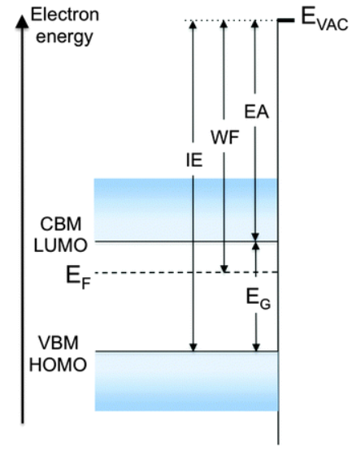

这里有两点：

1. 多厚才算足够?具体要根据自己的体系测试下，一般来说 20 Å 左右足以。
2. 是不是越厚越好? 越厚的话，计算出来的结果差别不大，但会增加计算量。前面我们讲过影响计算量的因素。

我们以 Cu(111) 表面的例子，简单介绍下真空层厚度对功函数的影响。


### 1 不同真空层厚度的测试(上一节内容)

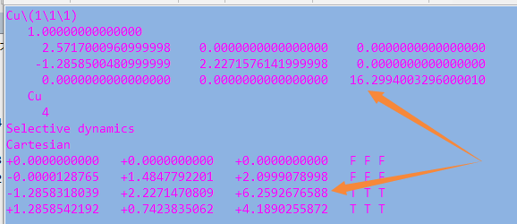

1. 先准备一个真空层为 10 Å 的计算文件夹： POSCAR 如上图；

2. 将前面两节的 INCAR,KPOINTS, POTCAR, 以及提交任务的脚本复制过来；

3. 批量生成测试文件，每个文件夹以真空层的厚度命名。命令如下：

   ```
   for i in $(seq 12 2 36); do cp 10 $i; sed -i "5s/16/$((6+$i))/g"$i/POSCAR ; done
   ```

4. 批量提交任务。

**注意：**

1. 这样的批量操作本书刚刚开始的时候就已经讲到了，这里不要再问我。
2. 如果不会用这个办法批量制作输入文件，想其他的办法批量操作，条条大路通罗马，不要死磕在我的这个命令上。


### 2 结果处理

前面的测试计算中，共有 14 个任务。在 Ex50 这一节中` vtotav-v5.2f`, `vtotav.py` 或者 p4vasp 这三种可视化的方法，我们查找真空能级的数值，都必须读取数据文件，比如 VLINE, LOCPOT_Z 或者 p4vasp 导出来的 *dat 文件。所以，我们要分别在这 14 个任务的文件夹中重复 Ex50 的操作14次。手动挨个弄可以完全实现，但本人不想这么做，因为这样弄除了让你的操作更熟练些外，并不会有其他的收获。那就写个脚本批量处理吧。

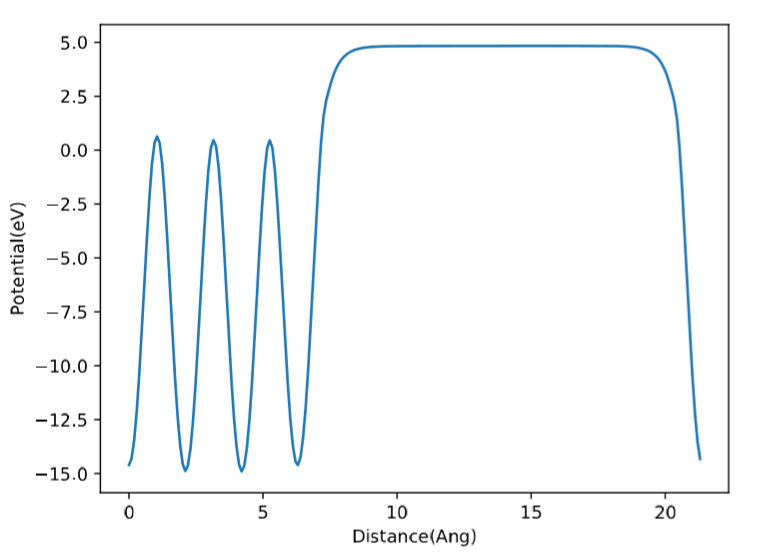

首先我们分析下上图： 我们获取的真空能级在图中直线部分中间的一个点或者一个小区间的平均值。大约是真空层一半的高度。比如，我们的表层原子 z 方向坐标为 6，真空层厚度为 16，那么我们可以取 6 + (16/2)= 14 时对于的点来得到真空能级。也可以通过 [14-1, 14+1] 这个区间中所有的真空能级求平均数来获得。下面我们看一下脚本的主要内容：

1. 注意部分：

   使用这个脚本的时候，需要注意的内容。本人写了一堆废话在脚本里面，主要是提醒大家使用脚本的时候，需要注意的一些事项。

   ```python
   #!/usr/bin/env python
   
   # Welcome to visit our website: www.bigbrosci.com to get more useful information.
    
   '''
   Written By Qiang 
   This script has two functions:
    1) workfunction Visualization from LOCPOT_Z file
    2) Roughly estimate the Vaccum Energy
   
   Please Contact lqcata@gmail.com if you have questions.
   
   Note1: Read POSCAR with Cartesian coordinations! 
     This means 
     1) you have to convet the direct to cartesian firstly 
     2) otherwise you will get an error.
   
   Note2: Read LOCPOT_Z to plot the figure and calculate the vaccum energy
     This means 
     1)1you have to run command:  work.py LOCPOT z firstly to get the LOCPOT_Z file before use this script
   
   Note3: the idea to calculate the vaccum energy is following:
     1) get the middle z value in the plateau: 
        middle z value = ( coordination of the highest atom + length of the slab in z direction) / 2 
     2) selecte the area to calculate the vaccum energy: 
        from  (middle z  value - 1) to (middle z value + 1)  unit is in angstrom 
     3) do the average of all points y direction.
   
   Note 4: this is only a rough estimation but useful.
   
   Note 5: Check the figure firstly and then use the numbers calculated from this script. 
     1) If the midlle z value is far from the plateau in the figure, you have to calculate the energy by hand.
   
   '''
   ```

   1. 脚本是谁写的，主要功能是什么；
   2. 脚本读取 POSCAR, POSCAR 要为 Cartesian 坐标；
   3. 脚本默认读取 LOCPOT_Z 文件，如果没有该文件，你需要做的一些事情(生成以及如何将 VLINE 文件转换为 LOCPOT_Z 文件)
   4. 该脚本是如何获取真空能级的；
   5. 一定要查看功函数可视化的结果，用来判断我们的这个方法是否试用。

   写这么多废话，原因主要有 2 个：

   1. 提醒大家在使用别人脚本的时候，一些需要注意的事项你要清楚。如果不清楚，可以咨询下脚本的作者；
   2. 如果你写了一个脚本放到网上供大家使用，请花些时间写清楚脚本的运行原理，以及尽可能详细的注意事项。

2. 脚本正文：

   ```python
   import matplotlib.pyplot as plt
   import numpy as np 
   x = []
   y = []
   dic = {}
   with open("LOCPOT_Z", mode='r') as f:
       first_line = f.readline()
       name_x = first_line.split()[1]
       name_y = first_line.split()[2]
       for line in f:
           xy=line.rstrip().split()
           x.append(float(xy[0]))
           y.append(float(xy[1]))
           dic.update({xy[0]:xy[1]})
   plt.plot(x,y) 
   plt.xlabel(name_x) 
   plt.ylabel(name_y) 
   plt.savefig('workfunction' + '.pdf', dpi=400)
   plt.show()
   
   #%%%%%%%%%%%%%%%%%%%%%%#
   # Get the Vaccum Energy
   #%%%%%%%%%%%%%%%%%%%%%%#
   
   # Get the total line numbers of POSCAR 
   num_lines = sum(1 for line in open('POSCAR'))
   
   # Read POSCAR 
   pos = open('POSCAR', mode = 'r')
   line = pos.readlines()
   
   # Get  the  slab length in z direction 
   vaccum = float(line[4].split()[2])
   
   # Get all atoms' coordination in z direction and store them in the list
   z_list = []
   for i in range(9, num_lines): 
       z_list.append(float(line[i].split()[2]))
   
   #  max(z_list) is highest atoms' coordination in z direction
   # Get the vaccum lenth: 
   l_vaccum = vaccum - max(z_list)
   print 'The Vaccum in this calculation is:\t\t %s'  %(l_vaccum)
   
   # Choose the middle z value in the workfuntion.pdf 
   num_middle = (max(z_list) + vaccum) / 2 
   #print num_middle
   
   middle_y = []
   
   for i in dic.keys():
       i = float(i)
   # Select the date area within 1 angstrom from the middle point:
       if i > num_middle -1 and i <  num_middle + 1:
           middle_y.append(float(dic.get(str(i))))
   # Get the average value in the selected area
   print 'The Vaccum Energy in this calculation is:\t %s'  %(np.mean(middle_y))
   
   pos.close()
   ```

   1. `plt.show()` 之前为我们 Ex50 这一节可视化的脚本： 44 和 53 行中，额外将 LOCPOT_Z 中两列的数据保存到一个字典里面，便于后面根据 z 方向的坐标查找真空能级。

   2. 获取 POSCAR 文件总的行数

     ```
     num_lines = sum(1 for line in open('POSCAR'))
     ```

   3. 读取 POSCAR 文件

     ```
     pos = open('POSCAR', mode = 'r')
     line = pos.readlines()
     ```

   4. 获取 slab 在 z 方向的数值

     ```
     vaccum = float(line[4].split()[2])
     ```

   5. 将所有原子的 z 坐标保存到 z_list 数列中

     ```
     z_list = []
     for i in range(9, num_lines): 
       z_list.append(float(line[i].split()[2]))
     ```

   6. 获得真空层的厚度

      ```
      l_vaccum = vaccum - max(z_list)
      ```

   7. 计算距离表层原子一半真空层厚度的z方向的数值： num_middle

      ```
      num_middle = (max(z_list) + vaccum) / 2 
      ```

   8. 将 [num_middle-1, num_middle+1] 区间范围内所有的真空能级提取出来，并保存到middle_y 这个数列中

      ```
      middle_y = []
      
      for i in dic.keys():
          i = float(i)
      # Select the date area within 1 angstrom from the middle point:
          if i > num_middle -1 and i <  num_middle + 1:
              middle_y.append(float(dic.get(str(i)))
      ```

   9. 求平均值，并打印出来

      ```
      print 'The Vaccum Energy in this calculation is:\t %s'  %(np.mean(middle_y))
      ```

3. 运行脚本：

   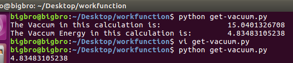

   图中第一个命令中，输出比较复杂，并且会和前面示例一样，展示功函数可视化的结果。

   但这不便于批量提取数据，可注销脚本中一下三行，直接获取真空能级

   ```
   #plt.show() 
   #print 'The Vaccum in this calculation is:\t\t %s'  %(l_vaccum)
   #print 'The Vaccum Energy in this calculation is:\t %s'  %(np.mean(middle_y))
   ```

4. 使用脚本批量获取真空能级

   先将脚本复制到bin文件夹中，赋予可执行权限。

   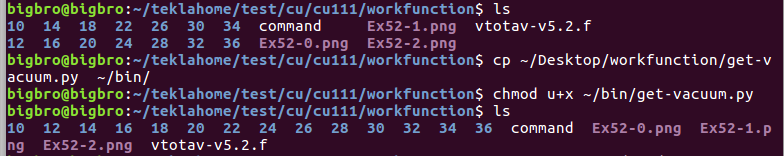

   1. 批量生成 LOCPOT_Z 文件：

      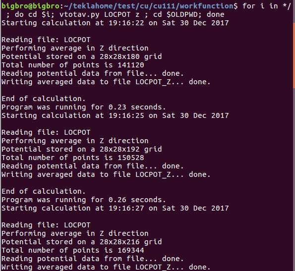

   2. 使用脚本批量读取

      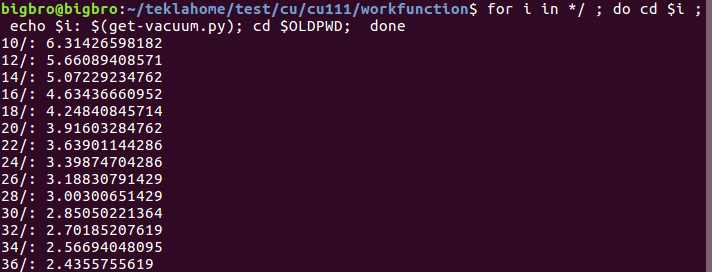

5. 批量获得费米能级：

   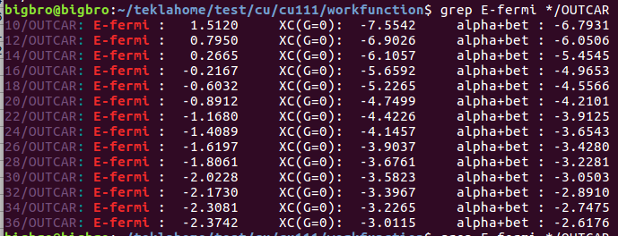

   我们需要的为第 4 列的数据。(图中的冒号也算作一列)


### 3 数据分析：

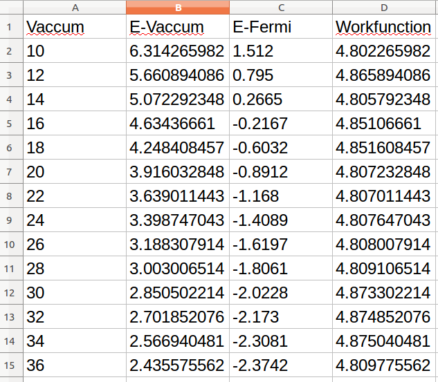

真空能级，费米能级以及功函数随真空层厚度的变化

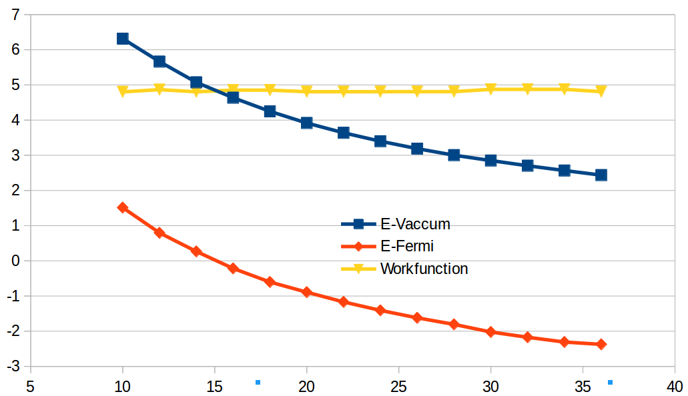

图中的测试曲线看起来很漂亮，但纵坐标范围太大，我们将功函数随真空层的变化作图如下：

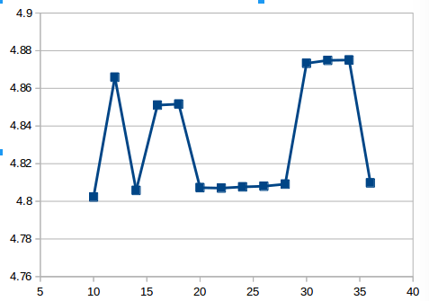

从图中，可以看出： 20-30 Å 范围内，功函数的波动变化较小，为 4.81 eV。其他的波动值在 4.85-4.87 eV 之间。Cu(111) 表面的功函数为：4.94 eV。参考的是 CRC handbook 中的数值。

|  Gu  | 100  | 5.10 |  FE  |
| :--: | :--: | :--: | :--: |
|      | 110  | 4.48 |  PE  |
|      | 111  | 4.94 |  PE  |
|      | 112  | 4.53 |  PE  |

实验与理论偏差为： -0.13 / 4.94  = 2.63 %

师兄，实验值结果是 4.94 eV， 如果我们采用 30 Å 时的结果 (4.87 eV)，跟实验的差别更小，是不是更好?

可以这么说。但是

1. 从我们测试的结果可以看出来，功函数随着真空层的变化，存在一个计算的误差；
2. 实验测量值也会有一定的误差范围。

所以，如果你硬要把理论和实验结果完美地吻合，这是很难做到的，这当然也是大家所梦寐以求的终极目标。一般来说，只要在合理的误差范围之内 (5% 的样子)，跟实验值结果一致就可以了，此外，如果你发表文章的时候，为了保证计算的可重复性。计算参数设置，模型尺寸等都要尽可能地详细。

师兄，不是说真空层对功函数的影响很大吗，为什么在 10 Å 的时候，得到的功函数 (4.80 eV) 和 20 Å (4.81 eV) 的时候一样?

这是因为，在当前的体系下，4 层的 p(1x1)-Cu(111) 表面，10 Å 已经可以了。但 10-20 Å 时，误差波动较大。12 Å 的数据也可以用，如同前面所提到的，他们都在一个合理的误差范围之内，但必须注明你的模型尺寸。对于其他的体系，还需要大家自己动手去测试一下。

此外，给大家推荐一篇文章：[Fermi level, work function and vacuum level](https://pubs.rsc.org/is/content/articlehtml/2016/mh/c5mh00160a)

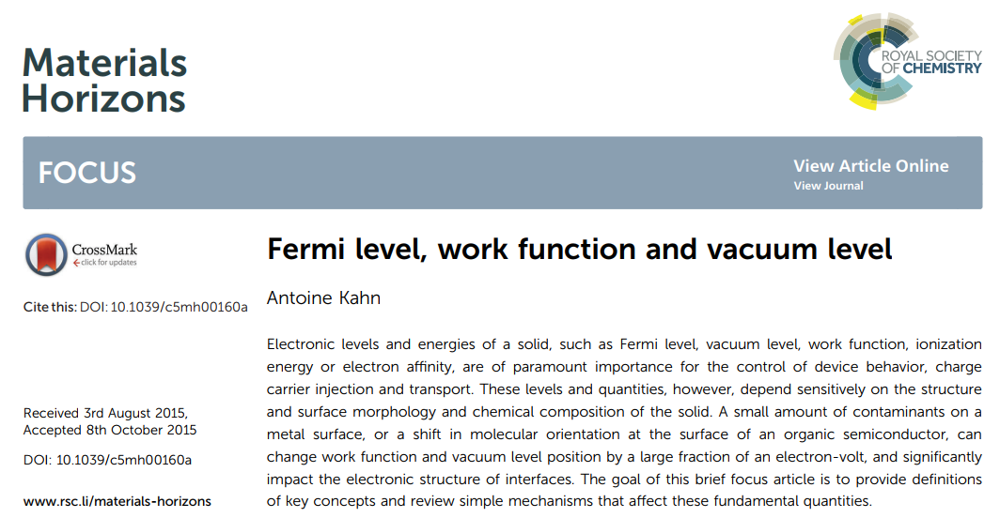

本文刚刚开始的图片就是从这篇文章中偷过来的。


### 4 扩展练习：

1. 复习功函数的相关内容；
2. 计算，测试自己研究体系的功函数；
3. 弄清获取真空能级的脚本原理(切记，搞不明白之前，不可乱用！！！)


### 5 总结：

到本节为止，功函数的计算就先简单介绍到这里了，计算步骤，可视化以及测试都大体讲解了一下。但我们用的模型例子比较简单，如果你的体系复杂，计算仍有疑问，请在 QQ 群中交流或者发邮件给我 (lqcata@gmail.com) 。
