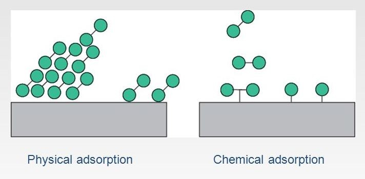
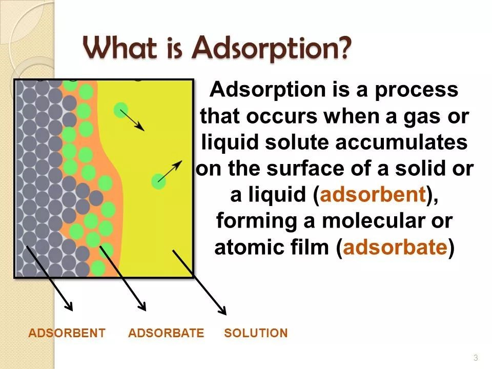

吸附这个词，对于做表面化学的人来说，是一个普通的不能再普通的名词了。从今天这一节开始，我们将逐步进入表面化学相关计算领域。

 

## 1) 我们先看一下维基百科的解释:

a）吸附是指某种气体，液体或者被溶解的固体的原子，离子或者分子附着在某表面上。这一过程使得表面上产生由吸附物构成的膜。吸附不同于吸收，吸收是指作为吸附物的液体浸入或者溶解于另一液体或固体中的过程。吸附仅限于固体表面，而吸收同时作用于表面和内部。

b) 吸附也属于一种传质过程，物质内部的分子和周围分子有互相吸引的引力，但物质表面的分子，其中相对物质外部的作用力没有充分发挥，所以液体或固体物质的表面可以吸附其他的液体或气体，尤其是表面面积很大的情况下，这种吸附力能产生很大的作用，所以工业上经常利用大面积的物质进行吸附，如活性炭、水膜等。吸附过程有两种情况:

一种是物理吸附，在吸附过程中物质不改变原来的性质，因此吸附能小，被吸附的物质很容易再脱离，如用活性炭吸附气体，只要升高温度，就可以使被吸附的气体逐出活性炭表面。

另一种是化学吸附，在吸附过程中不仅有引力，还运用化学键的力，因此吸附能较大，要逐出被吸附的物质需要较高的温度，而且被吸附的物质即使被逐出，也已经产生了化学变化，不再是原来的物质了，一般催化剂都是以这种吸附方式起作用。

## 2) IPUAC GoldBook中的定义:

Adsorption: An increase in the concentration of a dissolved substance at the interface of a condensed and a liquid phase due to the operation of surface forces. Adsorption can also occur at the interface of a condensed and a gaseous phase.

https://goldbook.iupac.org/html/A/A00155.html

## 3) 参考书

吸附在物理化学中也是一个非常重要的概念，只要学过物理化学，肯定不会错过这一部分的内容。主要列举有关吸附的几本参考书，具体内容本节则不再详细介绍，这也超出了本书所包含的范围。

a) Atkins’ Physical Chemistry 

(链接: https://pan.baidu.com/s/1hsJ95sg 密码:nfxw)

b) Concepts of Modern Catalysis and Kinetic  (By I. Chorkendorff）

链接: https://pan.baidu.com/s/1hrA5LHi 密码:aqvq)

c) 南大物理化学(傅献彩主编)

# 吸附在催化研究中的地位

催化剂发挥催化作用的前提是:反应物需要和催化剂有接触（也就是反应物吸附到催化剂表面上并且得到活化）。写这句话的意思就是:研究一个催化反应，第一步我们需要搞懂的就是反应物在表面的吸附情况。个人计算的心得就是：反应的初始态，过渡态以及末态，它们都是表面的吸附物种。这句话的意思是：在我们的计算中，吸附贯穿着我们对催化现象的整个研究过程中。吸附不仅仅是把反应物放到表面上就完事了，更与后面的反应息息相关。切记不要在思考的时候把后面我们要学习的过渡态和吸附隔离开。

# 吸附模型的搭建

前面我们已经讲过slab模型了，搭建吸附模型的本质就是在slab模型基础上，再添加吸附分子的xyz坐标。搭建的模型无非就是一个xyz的坐标文件。需要注意的有3个方面:

1) 熟悉VASP的POSCAR格式: 每一行的内容所代表的意思以及它们之间的相互联系:

* 元素行，原子数目以及原子的坐标之间的关系；
* Selective Dynamic 行与 T T T， F F F 等原子固定的关系；
*  Cartesian 坐标和 Direct 坐标的区别等等；
*  POSCAR与KPOINTS的关系。

熟悉POSCAR或者CONTCAR的格式可以使你在搭建模型过程中游刃有余。

2) Slab模型在Z方向上: 

* slab的厚度

* 真空层的厚度，

这两点一方面决定了我们计算量的大小。另一方面，对于不同的体系，我们需要不同厚度的slab模型来保证计算的准确性。例如：对于金属体系来说，越开放的表面往往需要更多的层数。所以，在准确性和计算量上，我们要合理地权衡和取舍。可以通过一些基本的测试工作，以及参考他人发表的计算参数来确定。

3) Slab模型在XY方向上:

* 表面的大小：这个主要影响覆盖度，计算的工作量；

* 表面的吸附位点：比如面心立方金属的111表面，有top(t)，bridge(b)，fcc(f) 和hcp(h)这几个位置，在搭建模型的时候要考虑吸附物种分别在这几个位置上的情况；

* 吸附物种与表面的结合情况：不同的分子构型?用什么原子?哪一部位和表面接触?初始猜测的键长多少? 等等

这些对于你搭建合理的模型至关重要。一个合理的模型可以极大地降低计算工作量，提高你的计算成功率。当然，这需要一个扎实和良好的化学基本功来作为保障。

# 小结

本节简单介绍了一下吸附的概念，吸附模型搭建的一些基本的思路，大家可以自己主动思考一下:本节提到的相关内容之间的相互关系以及具体的注意事项。在后面具体的实例操作计算中，我们会逐步慢慢展开详细介绍。
