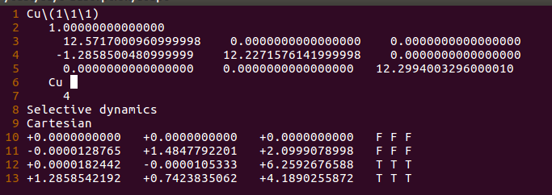

$\require{mediawiki-texvc}$

Ex54-Ex56主要介绍一下如何计算：单个氧原子在p(1x1)-Cu(111)表面top位上的吸附。在实际的计算过程中，一个好的初始结构会极大地加快并节约你的计算时间，这不仅仅体现在服务器运行的时间上，也会避免很多错误的结果，因为这些错误结果的纠正耗时费力，通常折磨得新手们心力交瘁。可以回顾下前面我们O$_2$ 分子的优化过程：不合理的初始结构导致的错误结果以及计算时间的增加。本节主要介绍一个快速获取优化初始构型的方法。该方法简单粗暴，可以让你在极短的时间内快速获得一个化学的feeling。

------

## 1 Top site 的构型

在Cu(111)表面上，top位指的是直接吸附在Cu原子上方。其他的位点是什么，先不要着急，后面会慢慢学。如果一个O原子吸附在Cu原子上方，在空间坐标上，大家很容易想到，O和Cu在xy方向的坐标应该是差不多的，z方向O的坐标为：Cu的z坐标 + Cu-O键的键长。如下图：

------

## 2  确定O原子在z方向上的坐标

知道了前面的基本原理，O原子的坐标我们就可以通过Cu-O的键长来初步获得了。那么Cu-O的键长怎么获得呢？这里列举了一下几个常用的方法。

1）查数据库：

2）查文献：自己去查，不要在QQ群里让别人给你发文献。

这两条主要考验的是大家查询资料的能力，这里暂且不详细介绍了。有兴趣的可以加入大师兄文献互助超级群，跟众多文献检索大牛学习。(群号:**157099073**)

------

3）自己估算

估算的话，可以根据Cu和O原子的半径：Cu和O成键，键长肯定要小于两者的半径之和。搜一下维基百科，Cu的半径为1.35 Å，O的为0.60 Å。([维基百科](https://www.wikipedia.org/)，搜索`Atomic Radius`就可以得到下面这个表)

从上面的数据我们可以得出：Cu-O键要小于1.95 Å。在吸附构型搭建的时候设置比1.95 Å小点的值作为初始，进行优化。一般来说，原子半径之和减去0.1-0.3 Å都是可以的。但是不能太小，否则第一步优化的时候排斥力太大，会导致计算出错。

------

4）自己初算：

初算就是初步采用一个小的模型，简单优化一下，得到一个合理的键长数值。小的模型主要指2个方面： 

* 结构简单；

* 计算参数简单。

下面我们主要在估算的基础上，介绍一个初算的方法：直接优化一下气相中Cu-O双原子分子的结构。

这个结构不难搭建，将前面练习中O$_2$分子中的一个O原子换成Cu进行优化即可。

为了加深大家对搭建模型的印象，我们从`p(1x1)-Cu(111)`表面的结构出发，然后一步一步搭建CuO的气相结构模型，并计算。

------

## 3  搭建初算的模型(Cu-O双原子结构)

1）p(1x1)-Cu(111)表面的结构

将前面几节计算的一个真空层为15 $\AA$的例子直接拿过来。表层原子在z方向的坐标为6.259 (第十二行)。

------

2）修改格子大小(3-5行)

这里修改的很随意，第三行中直接把2.571改成了12.571；

第四行中把2.227改成了12.227。

第五行中将21.299改成了12.299

效果如下:

注意：

A）当然也可以用其他大小的格子；(例如：8x8x8 $\AA^3$)

B）格子大小直接影响计算量和时间。(回顾下前面所学)

------

3）保留表层的Cu原子，删除其他的Cu原子。

注意：

A）我们这里将表层以下的三个原子删掉了，只保留z坐标为6.259的这个原子；

B） 第7行中原子数目也要相应的改变。从4 改成1。

C） 效果如下图：

------

4）加入O原子

注意：

A）第6行中，在Cu的后面加上了一个O，不是数字0；

B）Cu 和 O 之间用1个或者几个空格隔开，不要用`Tab`；

C）第7行中，记得加上O原子的数目

D）最后一行添加O原子的坐标，这里我们直接把Cu原子的复制过来了。

由于两个原子坐标一样，Cu和O堆在一起了。

------

5）修改O原子坐标

注意:

A）这里我们把Cu固定住了;为了方便下一步的计算。

B）Cu-O之间的键长，设置的为1.8 Å；

C）O的z坐标为：6.259 + 1.8 = 8.059。

------

6）到这里，Cu-O双原子分子的气相结构就搭建完毕了，保存成POSCAR即可。

上面的效果图是本人每一步打开展示给大家的。实际操作中，完全没有必要。我们需要学习的是：

A）怎么将脑子中的模型转化为VASP的POSCAR文件；

B）格子大小怎么修改；

C）怎么添加原子，添加或者删除原子后，原子数目怎么弄；

D）怎么添加原子坐标。

E）怎么通过改坐标修改原子位置。

------

## 4 INCAR检查

注意:

1）算的是气相中的：ISMEAR = 0；SIGMA = 0.05 (本书前面就讲过了)

2）IBRION = 2；POTIM = 0.1；NSW =100 是优化的参数

3）EDIFF和EDIFFG是电子步和离子步的收敛标准。

------

师兄，磁性呢？对称性呢？

因为本例子是一个初算，几步算完，看下键长。这个任务的使命就完成了。

很多细节的东西可以暂时不用考虑。这里EDIFFG用的也有点小，本人忘了修改了。大家可以设置为 -0.05或者直接使用能量作为标准，这些都可以的。

虽然本节我们很多地方都没有考虑，这是由于任务的性质所决定的。我们对其定位就是瞎算下，得到一个初始的构型。这也是一个课题中为数不多的，可以为所欲为的计算了。但你正儿八经开始算的时候，各种细节问题都要考虑进去。而这一步的计算，也可以作为一个缓冲期，让你有充足的时间去思考一下正式计算时其他需要的注意事项。

------

## 5  POTCAR、KPOINTS检查 

A) 根据POSCAR获取对应的POTCAR：见附录自动生成POTCAR的脚本。

B) 使用gamma点计算。`cat POTCAR`

**注意：**

在提交一个任务前，一定要将INCAR、KPOINTS、POSCAR、POTCAR以及脚本在心里默念一遍。然后对应的检查一下，是否有些遗漏的地方。否则等算完了，发现错了，又得浪费很多时间重新计算了。

------

## 6 检查结果

1）上个厕所的功夫，任务就结束了，共算了6步。(其实是切换电脑系统的功夫)

2）Cu—O 的键长：7.95-6.26 = 1.69 Å

**注意：** 

此时的键长只作为下一步的初始猜测，如果和文献去比有点差异，也不要太较真。

## 7 总结:

本节，你会学到：

1）如何通过原子半径，估算一个初始的键长值。

2）如果搭建一个简单的模型，初算一个键长值。

3）复习气相中的优化。

4）复习下计算前准备工作：INCAR、POSCAR、POTCAR、KPONTS的检查。

如果本节的内容，你有不理解的地方；想获取脚本等信息；请查阅前面讲的以及附录中的内容。搭建几何模型，无非就是按照软件的格式，修改原子坐标罢了。这里我们强调的是几何模型。但，几何模型所具有或者要表达的物理、化学意义，这才是最关键的。
