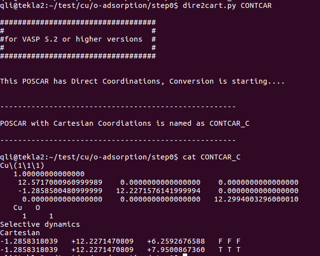
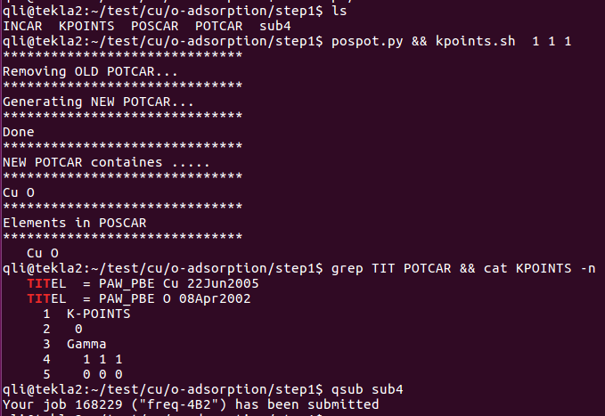

前面一节，我们通过一个简单的方法获取了一个Cu-O键的键长。因为我们固定了Cu的坐标，当计算完成之后，O原子初始构型的坐标可以直接将计算后的结果复制过来。此时需要注意`Direct`和`Cartesian`的坐标问题。

## 1 搭建合理的O吸附模型

1）取Cu(111)表面模型的POSCAR (Cartesian坐标)


------

2) 复制快速获取初始构型计算(Cu-O dimer)的结果



<center>上图中的最后一行。</center>

------

3) 构建O的吸附模型：


当然了,我们也可以根据键长或者O在z方向的坐标直接在Cu(111)表面基础上搭建。


------

这个简单粗暴的方法到此就讲解完了。有以下几个需要注意的地方：

A）这里我们用的是Cu(111)的 p(1x1) slab模型,表面只有一个原子。一般来说，大家计算吸附的时候，模型都比这个大，我们可以取一层原子。记住，要固定住这层原子。

B）这个方法基于的是气相中的计算，因此偶极矫正不要加！因为加上去之后，收敛会变得很困难。这个大家可以用自己测试测试。

下面我们讲一个基于slab模型的方法，虽然比这个计算量大，但也异常的快，相对于后面的计算，花费的时间也可以忽略不计。

------

## 2 快速获取初始构型方法（二）

1）在这个方法中，第一步我们先取slab模型的结构，这里就不讲了。

2） 搭建一个初始的吸附模型。此时我们要根据原子半径，大体确认一下键长的合理范围，前面也讲过了，就不再细说了。 由于前面一节我们已经有了一个O原子的坐标数据，可以直接拿过来。如下：


注意：实际操作的时候，这个方法可以使用前面一节的方法的出来的结果；也可以直接设置初始值，这两个方法之间联系不太大。

------

3） 固定slab模型中的所有原子！所有原子！所有原子！

重要的事情说三遍，是把slab模型中的原子全部固定!只放开吸附的分子。这里大师兄在vim里面操作，使用了下面的命令：`:12,13s/T/F/g`  意思是把12和13行中的T全部替换成F。当然也可以使用sed进行操作，相信大家经过这么长时间的练习，已经掌握基本的Vim和sed操作，就不浪费时间了。效果如下：


------

4）  设置INCAR，这里是slab模型，把之前Cu(111)表面优化计算的INCAR直接拿过来了。

EDIFF、EDIFFG 可以适当放宽，下图大师兄懒得改了。


------

5）  生成对应的POTCAR，K点只用gamma点！K点只用gamma点！K点只用gamma点！



这里需要注意的有两点：

A）  计算前一定要检查POTCAR和POSCAR是否对应，养成这个好习惯

B）  一定要用gamma点。因为我们知道，K点越多，计算量越大。

------

6）  提交任务等待结束。

O原子的坐标，从最初的7.950优化到了8.009。

到此，另外一种快速获取稳定构型的方法，也介绍完了。希望大家可以举一反三，运用到自己实际的课题计算中。

------

## 3 正式优化O的吸附

前面我们已经获取的初始的一个合理的构型，下面就开始正常计算了。想一想，在上一步的基础上，正式计算的时候，我们有哪几个需要修改的部分。

1） 结构 

这个是必须要想到的。怎么做呢？ 直接将CONTCAR 复制成 POSCAR即可。

PS： 怎么完成复制这一步还不会的话，请从头开始学。

2） 复制完了并不代表完事，前面一步我们还固定了表层的原子，此时我们需要放开。使用sed命令：

```
 sed -i '12,13s/F/T/g' POSCAR
```

3）KPOINTS：使用前面Cu slab优化时用的 13x13x1

4） INCAR中，如果前面一步的计算精度较低，这时，我们就要提高一下了。

5）POTCAR 不变

6）提交任务的脚本：由于前面的计算量很小，一般可以使用小队列进行计算，如果计算量增大了，这时我们也需要稍微修改下脚本。


7)   提交任务，等待结束，查看结果。


O原子的坐标从8.009 优化到了8.093。键长从1.75 Å 优化到 1.80 Å，变化很小，这说明我们的初始构型已经很接近优化结果了。

## 4 扩展练习：

1)   本节的实例中，使用了 `&&` 这个连接前后的命令，大家学习下是怎么回事

2)   重复本节练习，掌握其中的关键点。


## 5 小结

一个合理的初始构型可以极大地降低我们的工作量，这一点是大家务必要记在心里的。而获取合理的初始构型，一方面需要我们用化学的知识去搭建结构，另一方面，也需要配合一些简单的低精度的计算去完成。希望大家可以掌握这两节的精髓，运用到自己的课题中，提高自己的计算效率。
