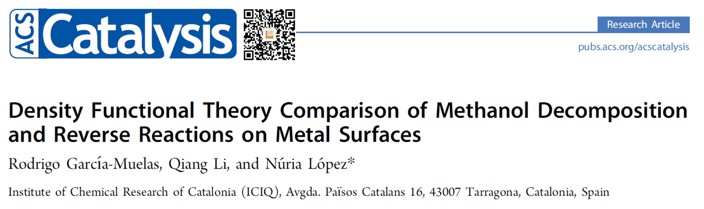

我们已经优化完成了O原子在Cu(111)表面上的吸附。总结并数一下，到目前为止我们从前面的计算中可以获取哪些能量。

* Cu(111) slab 的能量
* slab上有O吸附时，体系优化完的能量

再往前想一下，我们也计算了

* O$_2$分子的能量

*  以及O原子在气相中的能量。

 有了这几个能量，我们就可以计算O在p(1x1)的Cu(111)表面上的吸附能了。这也是本节的主要内容。

## 1 什么是吸附能？

从字面上不难理解，就是分子或者原子从气相中吸附到表面上所释放的能量。计算吸附能的时候，需要注意的有两点：起始和终态。

1）  **终态：**这里说的终态就是O原子在表面吸附，并且优化完的构型。我们标记为 slab+O，它的能量为  E(slab+O)。

2）  **初态：**我们计算O的吸附能，起始状态是O$_2$ 和 纯净的slab表面。因为在实际反应中，O$_2$在气相中解离成2个O原子，然后再吸附，这种可能性微乎其微。前面我们讲了O$_2$分子的优化，这里我们直接把O$_2$分子的能量拿来用。起始的两个结构能量分别标记为：E(O$_2$) 和 E(slab)。

由于在终态的吸附结构上面，我们只有1个氧原子， 所以初始态我们要用O$_2$能量的一半:  E(O$_2$)/2。

3）  注意：文献报道里面，也有很多人用O原子在气相中的能量来计算O的吸附能。这样做的话，其物理意义为：O$_2$需要先解离成O原子，然后O原子再吸附。此时，初始状态为分解的O原子，因此O$_2$分子解离的能量没有考虑在内。由于O$_2$解离是吸热反应，忽略掉解离能，会导致O的吸附能很强。单个O原子的能量标记为：E(O)。

4）  所以，大家在计算的时候，一定要把自己的计算公式标出来，此外，大家看到直接用O原子能量计算出来的吸附能，不要用O$_2$作为参考能量的结果进行对比。

5） 这两个计算方法，哪个对，哪个错呢？ 答：都是对的。因为O$_2$的解离能是一个常数，加上去（用O$_2$能量作为起始）或者忽略掉（用O原子能量作为起始）得到的结果之间的区别无非也是这个常数。看下面的计算。

------

## 2 计算吸附能（单个O原子）

公式1: 
$$
E_{ads1}(O) = E_{slab+O} – E_{slab} – E_{O_2}/2
$$
公式2: 
$$
E_{ads2}(O) = E_{slab+O} – E_{slab} – E_{O}
$$

$E_{slab+O}$ ：O 在Slab上，优化完结构的能量；

$E_{slab}$: 优化的slab的能量；

$E_{O_2}$: O$_2$ 分子在气相中的能量；

$E_{O}$: O原子在气相中的能量；

 

带入数据后：

$$
E_{ads1}(O) =  -17.68238420~eV – (-13.97082922~eV) – (-9.85498627~eV) = 1.216~eV
$$

$$
E_{ads2}(O) =  -17.68238420~eV – (-13.97082922~eV) – (-1.89237882~eV) = -1.819~eV
$$

------

前面我们说了，如果直接用O原子在气相中的能量，则忽略了O$_2$分子解离的能量（或者是O原子结合能）。

我们知道O$_2$ 分子解离是一个吸热反应，那么，解离能可以通过以下两个方式来获取：

1)     两个吸附能量相减来得到：
$$
E_{ads1}(O) - E_{ads2}(O) = 1.216~eV – (-1.819~eV) = 3.035~eV
$$

2)    直接通过O$_2$分子和O原子的能量得到。单个O原子的结合能为：

$$
E_{binding} = [ E_{O_2} – E_O * 2] /2，
$$

代入数据后得到：

$$
E_{binding} =[ -9.85498627~eV – (-1.89237882~eV *2) ] / 2 = -3.035~eV
$$

------

## 3 思考问题：

1）  前面我们计算的$E_{ads1}(O)$ = 1.216 eV 是一个正值，为什么会这样？ 算错了吗？还是有其他物理意义？

2）  如何计算H，CO，CH$_4$, CH$_3$OH 等的吸附能，把计算的公式列出来。每个能量计算的细节，注意部分有哪些？

3） 如何计算脱附能？

------

## 4 扩展练习：

1）  推荐阅读下面这两篇文章（本人的，当然喜欢大家多多引用了。）讲的是关于甲醇，乙醇，乙二醇，以及甘油在Cu, Ru, Pd以及Pt的(111)上面的解离。Ex系列的后续文章，表面反应的优化，过渡态的计算等，基本都以这两篇文章的内容为主。希望大家能够好好学习，并多多引用。此外，计算的很多细节都在支持信息里面，大家不要错过。一时半会看不完没有关系，下载后结合本书慢慢看。

链接：https://pubs.acs.org/doi/abs/10.1021/cs501698w

**链接：**[**https://www.nature.com/articles/s41467-018-02884-y**](https://www.nature.com/articles/s41467-018-02884-y) 

------

2）  回顾并重复本节所涉及到的计算，以及注意细节部分。

A.      单个O原子的能量；

B.      O$_2$分子优化；

C.      Cu bulk的优化；

D.      p(1x1)-Cu(111)表面的搭建及优化；

E.       O原子在p(1x1)-Cu(111)的top位吸附的模型搭建及优化；

G.      不满半年的新手，建议从Ex0 从头学习。

------

## 5 总结：

本节我们主要介绍了O原子在p(1x1)-Cu(111)表面top位上的吸附能的计算公式。顺便带大家回顾一下整个计算流程。如果你从头跟着学过来的话，每个流程中的细节，需要注意的部分肯定都已经掌握了，后面举一反三，就慢慢渐入佳境了。也就是所谓的开始入門了。
