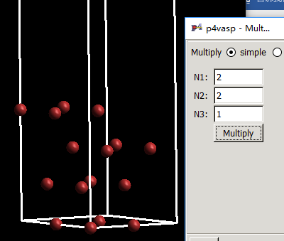
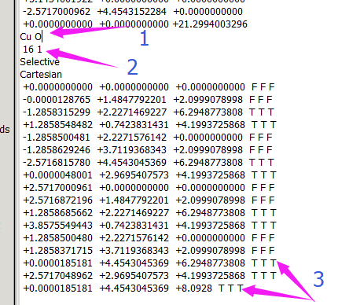

$\require{mediawiki-texvc}$

本节我们简单讨论一下覆盖度对吸附能的影响。首先回顾一下，前面我们讲到的内容。

* 吸附能为初态和末态的能量差：
  * 初态为纯净的slab 和 O$_2$分子或者O原子
  * 末态为O吸附的slab

*  O$_2$分子优化计算的时候，要注意: 
  * 从数据库获取O$_2$分子的键长，作为初始值；
  * ISPIN = 2  
  * ISMEAR = 0; SIMGA = 0.05 
  *  IBRION= 2; POTIM = 0.1
  * 用gamma点。
* O 原子优化计算的时候，注意的计算细节与前面相同。额外注意的是：
  * O 原子再怎么优化还是一个O原子，所以上一行表述是不恰当的，应该是O原子的单点计算；
  * Box的尺寸为：$13\times14\times15~\AA^3$  或者$13.1\times13.2\times13.3 \AA^3$ 但绝对不能为$13\times13\times13$这种正方体的
* 怎么优化Bulk的结构，扫晶格拟合和ISIF = 3直接优化（ENCUT要大，不妨取个700~eV）
* slab怎么优化，Selective 和 坐标后面 T F 的关系
* O吸附模型怎么搭建，如何得到合理的初始模型（有实验值优先使用，没有的话用粗精度的初算一下）。
* 此外，还要学会怎么判断计算结束，不同类型任务结束的特征是什么？

------

## 打个比方

回到上一节我们留的问题，为什么O在p-(1x1)-Cu(111)表面上的吸附能是正的呢？在解释这个问题先，我们先看下面一组照片：

------

第一张里面，地铁车厢里面是空的，这时候你上去，座位随便挑。

第二张里面，有些人了已经占了，但还是有座位的，你的选择并没有那么多了。

第三张里面，人太多，能不能出来都是个问题，有没有座位想都不敢想了。

那么回到我们的这个问题，我们把O的吸附结构在xy平面上重复一下：

你会发现，表面上密密麻麻全是O原子（绿色的为Cu原子）！空间这么小，如果你是O原子，你愿意在这上面挤么？ 你是选择空旷的车厢还是人满为患的呢？如果我是氧原子，我肯定不愿意。所以，如果非得在这个表面上挤的话。我们就需要一些外力的作用，比如下图中的这俩年轻力壮的小伙子协警。

这俩人使的劲就是O原子的吸附能。正值的意思表明我们需要额外的力才能将其吸附在表面上。表面越挤，正值越大。

------

如果你还是不理解的话，我们看另外一个例子：

早上，开学了。老师有1个苹果，需要将这个苹果分给教室里面的学生。而学生还没有来齐，当你第一个到达教室时，发现整个苹果都是你的。开心程度 100%。正要吃的时候，小明进来了，老师说你俩要分一下，你只能得到一半了，开心程度 50%; 你俩正要吃的时候，小红和小白也进来了，老师说，打住，你们四个分，于是每人只能拿1/4，你的开心程度掉到 25%了。

表面就是这个苹果，O原子就是学生，总共就这一个苹果，学生越多，平均分到的就越少。学生之间可能还会因为分的不均匀而打架（相互排斥），导致开心程度越来越低。当开心程度成负的时候，老师就需要施展神通费心思（额外的功）逗你们开心。

------

看完这两个例子，你也许就明白了，为什么这个时候O原子的吸附能这么大了。太他妈挤了或者人太多，分不到苹果吃了，心里肯定不爽！下面，我们把车厢清空，学生数目控制一下，看看心情能不能好点。

------

## 搭建p-(2x2)-Cu(111)表面

1 用p4vasp打开p-(1x1)-Cu(111)的CONTCAR

2 选择Edit —> Multiply cell

3 弹出的窗口，如图填入扩展的倍数：

这代表我们在x和y方向上分别扩展到原来的2倍。点击Multiply，效果如下图：

4 关闭Multiply这个窗口，p4vasp主界面左上角选择：`File` --> `Save system as`

5 在弹出的窗口，选择目录，保存成POSCAR，点击OK即可。

6 这样我们就有了一个p-(2x2)的slab模型了。

------

## 搭建O在p-(2x2)-Cu(111)上的吸附结构

1 我们可以用之前计算的结果搭建这个初始结构,O吸附优化的CONTCAR：

O原子在$z$方向的坐标为8.0928$\AA$。先记住这个数字。

------

p-(2x2)的Slab坐标（在p-(1x1)基础上扩展的）:

在这个坐标上面修改，搭建结构：

1）添加O原子元素

2）添加O原子数目

3）添加O原子坐标

4）弄完后，保存成POSCAR

到现在，p-(2x2)的slab以及O原子的吸附模型都有了，准备INCAR,KPOINTS,POTCAR以及任务脚本，提交这两个结构的优化计算。等待结束。

------

计算吸附能：

公式1： 
$$
E_{ads1}(O) = E_{slab+O} – E_{slab} – E_{O_2}/2
$$
公式2： 
$$
E_{ads2}(O) = E_{slab+O} – E_{slab} – E_{O}
$$
带入数据：

$$
E_{ads1}(O) = -60.61682891~eV – (-55.96049190~eV )- (-9.85498627~eV)/2 = 0.271~eV
$$

$$
E_{ads2}(O) = -60.61682891~eV – (-55.96049190~eV )- (-1.89237882~eV)= -2.764~eV
$$

发现吸附能$E_{ads1}(O)$从正的1.216降低到0.271 eV了。看来空间对O原子的吸附影响很大。

------

地铁里面空间稍微大了些，现在不需要年轻小伙子暴力推搡了，大妈指挥下就可以了。

分的苹果稍微多了些，虽然还是有些不情愿，稍微诱导一下，就开心了。

------

前面的解释只是用现实的例子瞎扯一顿。但发表文章的时候不能这样说啊，我们就需要一些科学和专业的解释。而在实际表面上，覆盖度影响吸附能的因素有很多。体相中电子的分布转移，与吸附物种的成键，吸附物种之间的排斥和吸引等等。如果你想了解的更多，更专业！阅读下面这篇文献：

谷歌上可以下载免费的，有权限的也可以直接下载。类似这样已经注明的文献，请不要花时间找我要，自己去下载。

（每设一道坎，就会把很多懒家伙挡住！跨过一道又一道坎，你就把别人远远甩在后面了。所以，请自己主动起来！）

------

## 扩展训练：

1 重复p-(2x2)-Cu(111)的练习，心里面默念一遍INCAR, KPOINTS, POTCAR, POSCAR。看看都有些什么需要注意的。

2 阅读推荐的文献，学习表面物种之间的相互作用，覆盖度是怎么影响吸附能的。有哪几方面？

3 本文提到了一个专业名词：覆盖度，查找相关的文献，了解这个名词是怎么回事，文献报道的覆盖度都是怎么算出来的。

------

## 总结：

本节，大师兄带你做了趟地铁，当了回幼儿园的小朋友。来体验下人多的感觉。覆盖度高的时候吸附能很小或者是正值，说明物种在表面不稳定，需要额外的力来促使它们老老实实待在表面上。表面就那么大点的地方，空间有限，p-(1x1)上吸附的时候，表面太挤了，O原子不愿意待在上面。而表面扩成p-(2x2)后，空间明显大了很多，O原子虽然不情愿，但明显不像在(1x1)上那么不爽了。从吸附能就可以看出来，降低了1~eV左右。从另一个角度来看，这明显就是一场O原子争夺表面资源的战争。
