丑话说在前头，本节内容有点多，大家慢慢消化。掌握本节的核心思想，对于后面提高你的工作效率，节省时间有着很大的帮助。前面一节，我们在扩展练习中提到了扩胞后，原子坐标的后面T T T 和 F F F 修改的问题。因为扩展后原子坐标是按照单胞为顺序排列的，如果想要将表面的原子快速固定或者放开，那么我们就需要知道表面原子所在的行数。


## 方法一：找规律+sed命令

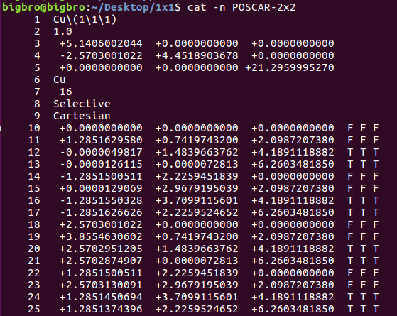

上图中，p(2x2)的POSCAR命名为POSCAR-2x2，最表层原子所在的行数为：13，17， 21， 25，次表层的原子所在的行数为： 12， 16， 20， 24。仔细分析下，你会发现，表层原子的行数为： 9 + 4*n ；次表层的行数为：8 + 4 * n，其中n = 1-4，4表示在扩完后的slab模型里面有4个(1x1)的单元。有了这个关系，我们就可以通过sed命令任意固定这两层的原子了, 命令如下：

```
for i in {1..4}; do sed -i "$((8+4*$i)), $((9+4*$i))s/T T T/F F F/g" POSCAR
```

或者：

```
for i in {1..4}; do sed -i "$((8+4*$i)), $((9+4*$i))s/T/F/g" POSCAR
```

效果如下图：通过sed命令快速将表层原子批量固定住。

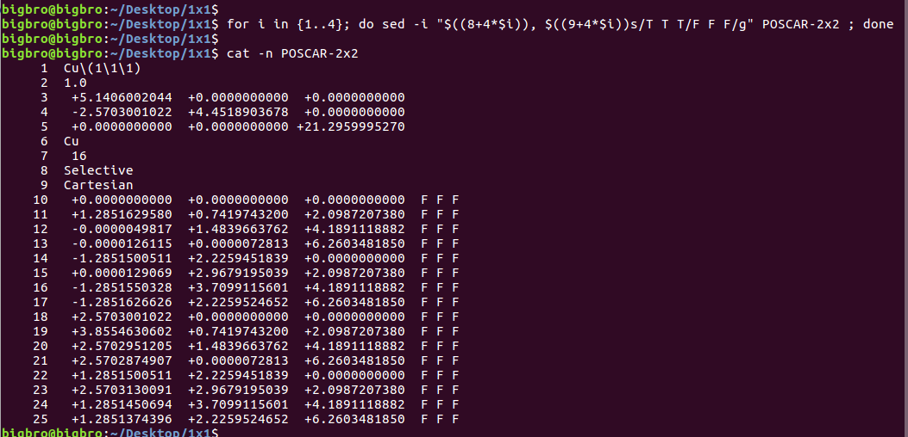


我们还可以只放开最表层的原子，使用sed命令快速将最表层的原子批量放开！

在前面结果的基础上可以使用命令：

```
for  i  in {1..4}; do sed -i "$((9+4*$i))s/ F F F/ T T T/g" POSCAR
```

或者：

```
for  i  in {1..4}; do sed -i "$((9+4*$i))s/F/T/g" POSCAR
```

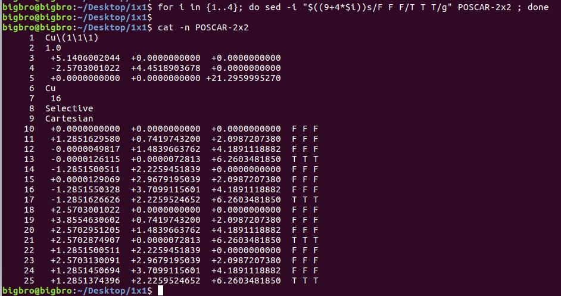


Soooo Easy！！！再也不用挨行修改T T T 或者F F F 了。


## 方法二：分层处理+sed命令

什么，原来还有第二种方法？ 这种方法是本人常用的。前面我们提到，在p(2x2)的slab模型中，原子坐标是按照p(1x1)的单元排列的。既然我们想根据层数固定原子，那么我们可以先将原子按照层数来排列，这样就可以方便的选择同一层的原子了。


那么该怎么将它们按照层数排列呢？ 这时候你应该想到，不同层之间的原子，它们的坐标在z方向是不同的。有了这个依据，我们就可以根据z方向坐标的大小来排列原子了。

首先我们先用一个笨方法实现所预想的小目标。

**第一步：**将坐标复制到excel表格里面。本人用的是libre office(Linux下面的Microsoft)。不过功能大同小异，Windows用户按照做就可以了。

**第二步：**选中所复制的数据，然后根据图中的D列来排序。

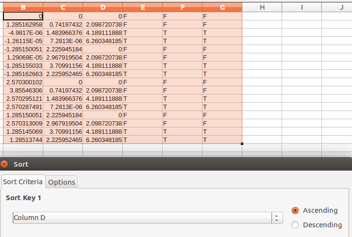


排序完的结果, 如下图：

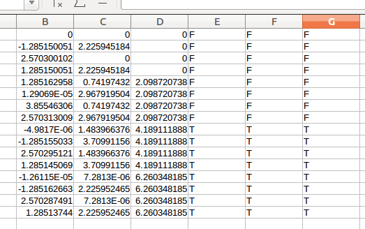

从图中，我们可以看出，原子根据在z方向上的坐标分成了4部分。

**注意：**这里我们所有原子都是Cu原子，因此可以全部选中然后直接排序。如果你的体系中有好几种不同的原子，你需要按照元素，逐一进行排序。 比如体系中有C H O，我们先将C原子按照Z方向坐标排序，然后再排H原子的，最后再排O原子的。要保持和POSCAR前面元素顺序一致。


排序完成之后，将POSCAR中的坐标替换为Excel中的数据。

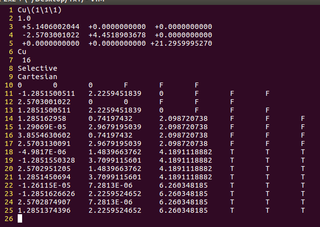

这样的话，我们的模型就搞定了。剩下的就是使用sed命令批量替换T T T和 F F F了

但是，师兄等等，上图看起来坐标很乱啊，结构能用吗？ 放心，绝对可以用。

如果不放心的话，可以用p4vasp打开一下，然后重新保存成POSCAR即可。最终我们的POSCAR如下图：


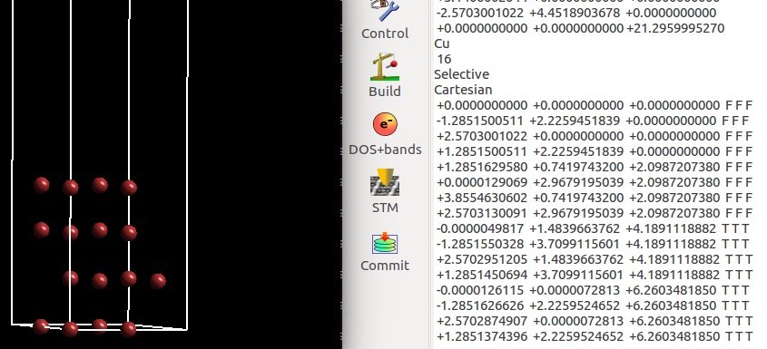

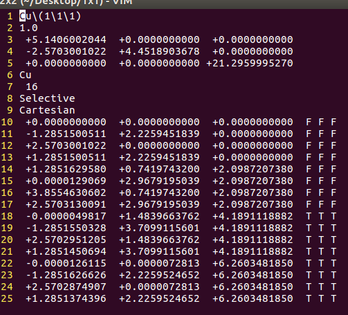


从图中可以看出来，次表层的原子在18-21行，最表层的原子在22-25行。所以可以这样使用sed命令来快速实现表层原子的固定与弛豫。

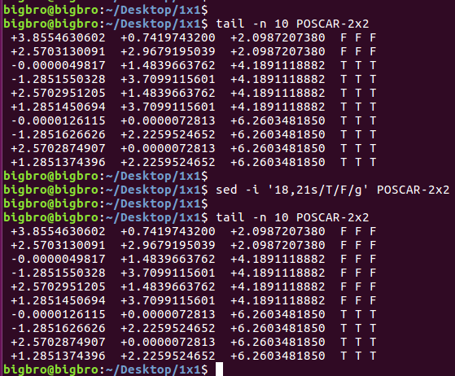

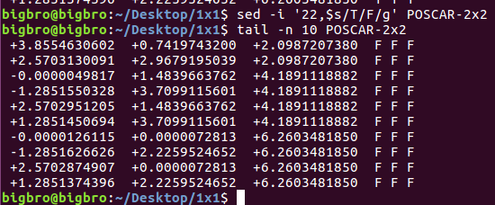


## 方法三： 使用脚本分层

师兄，这个问题竟然还可以使用脚本来解决？

当然了，使用鼠标拖拖点点的事情，一般都可以用脚本来实现。脚本是用python写的，本人给它起了一个高大上的响亮名字：sortcar.py。（适用于python2.6以及以上的版本，低于2.6或者python3可能会出错。）

由于p(2x2)的slab坐标前面已经用过了，下面我们用p(3x3)的slab来演示一下脚本的使用。

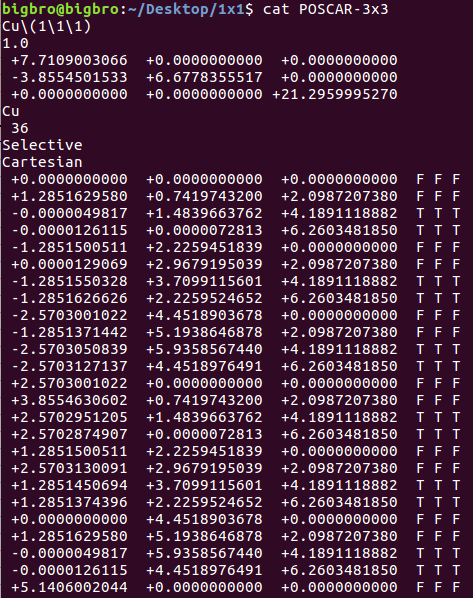

新鲜出炉的，等待被sort的p(3x3)slab的POSCAR。被sort过的POSCAR如下图：

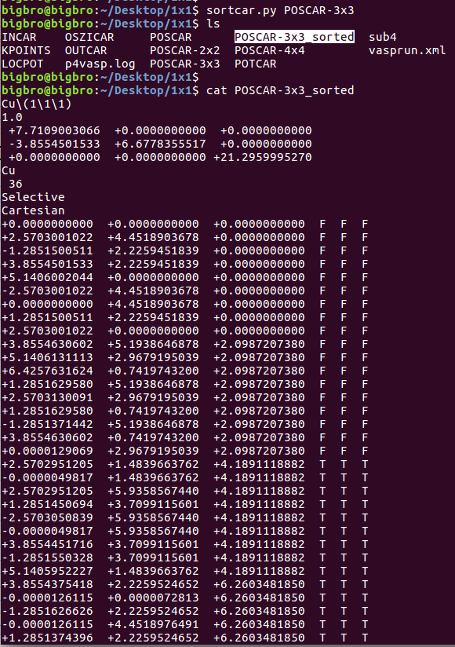


使用sortcar.py 将坐标按照z方向大小排列。输出文件为XXX_sorted，其中 XXX为我们想要排列的POSCAR或者CONTCAR。如果你的VASP坐标结构文件名字为：BigBro，那么被sort之后，输出文件就是: BigBro_sorted。

脚本这么神奇，内容如下：

```python
#!/usr/bin/env python 
from collections import defaultdict
import numpy as np
import sys 

in_file = sys.argv[1]

### READ input file ###
def read_inputcar(in_file):
    f = open(in_file, 'r')
    lines = f.readlines()
    f.close()
    ele_name  = lines[5].strip().split()
    ele_num = [int(i) for i in lines[6].strip().split()]
    dict_contcar =  {ele_name[i]:ele_num[i] for i in range(0, len(ele_name))} 
    dict_contcar2 = defaultdict(list)
    for element in ele_name: 
        indice  = ele_name.index(element)
        n_start = sum(ele_num[i] for i in range(0, indice+1)) - dict_contcar.get(element) +1
        n_end = sum(ele_num[i] for i in range(0, indice+1)) +1
        dict_contcar2[element].append(range(n_start, n_end)) 
    return lines, ele_name, ele_num, dict_contcar2, dict_contcar

def get_elements(ele):
    lines, ele_name, ele_num, dict_contcar2, dict_contar = read_inputcar(in_file)
    coord_total = []
    my_list = []
    my_dict = {}
    for j in dict_contcar2.get(ele)[0]:
        coord_list = lines[j+8].strip().split()[0:3]
        tf_list = lines[j+8].strip().split()[3:]
        my_list.append(coord_list)
        dict_key = '-'.join(coord_list)
        my_dict[dict_key] = tf_list
       
    data = np.array(my_list)
    data=data[np.argsort(data[:,2])]

    for k in data:
         coord = '  '.join(k)
         tf = '  '.join(my_dict.get('-'.join(k)))
         coord_total.append(coord + '  ' + tf )
    return coord_total

## Generate the New POSCAR file

def Get_and_Save_lines(file_name, start_line, end_line):
    f = open(file_name)
    lines =  f.readlines()
    for line in lines[int(start_line):int(end_line)]:
        file_out.write(line.rstrip()+'\n')

out_name = in_file + '_sorted'
file_out = open(out_name, 'w')
Get_and_Save_lines(in_file, 0, 9)

ele_name = read_inputcar(in_file)[1]
dict_contcar = read_inputcar(in_file)[-1]

for i in ele_name:
    if dict_contcar.get(i) > 1 :
        file_out.write('\n'.join(get_elements(i)))
    else: 
        file_out.write('\n %s \n' %('  '.join(get_elements(i))))

```


**注意事项：**

1） 这里我们用的是Cu(111)的例子，比较简答，脚本的威力展示不出来。
2） 如果你的体系有很多不同的原子，脚本首先会将同一种元素原子的坐标排列，然后依次类推。
3） 有些地方可能有些冗余。但本人一直在用，效果还不错。
4） 本人建议，只针对表面使用这个脚本。也就是吸附前的slab模型。如果你放了吸附物种，不建议使用，因为吸附物种间不同原子之间的连接顺序可能会被打乱。
5） 在放吸附物种之前，最好将表面先排序完，怎么做，前面三种方法任选。
6） 脚本的话已经上传，大家可以通过链接下载：https://pan.baidu.com/s/1X5xLRsvRmFfNE8IlKwvbFQ）

7）如果使用脚本出错的话，可能是因为你的python版本太低。这个脚本只适用于python2.6及以上的。Python3可能也不适用。出现错误，直接放弃，掌握了这个方面的思想就足够了。


## 总结：

本节讨论的内容与科研关系说大不大，说小也不小，主要是在解决工作效率和时间上。想象一下，如果你的slab中有很多原子（金属氧化物，硫化物等），而且还不是同一种的，你用前两种方法的时候，就得十分小心了，此时脚本的作用就显示出来了。
