前面我们发现将p(1x1)-Cu(111)的表面扩展成p(2x2)后，由于O的覆盖度降低了，O原子的吸附能能+1.2 eV降低到 0.2 eV作用，说明O原子更加容易吸附在表面上了。当你仔细观察p(2x2)的表面，你会发现，表面上不仅仅有Cu原子的上方可以放O原子，还有其他的位点。如下图：

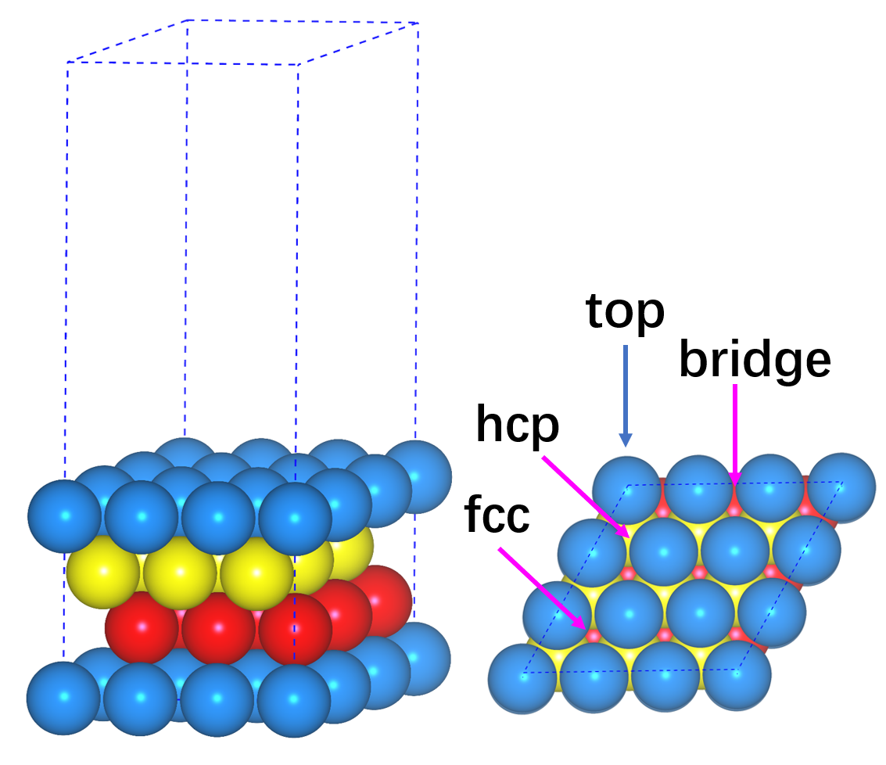

如果我们想分析下不同位点对吸附能的影响，首先我们需要搭建模型，然后重复O原子的吸附优化步骤。本节主要简单介绍一下如何快速搭建不同的吸附位点模型。

## 1 不同表面位点：

观察不同位点的结构特征，在面心立方金属的(111)表面上有4种不同的位点:

1) Top位，前面已经花了很多时间介绍了，本节就不再啰嗦
2) Bridge位：从名字大家就可以推断这个位点的吸附为两个Top原子的中间。
3) Fcc位和Hcp位：这两个吸附位点都是在三个原子的中心，为hollow位。

那么这两个位点怎么区分呢？ 

如果表面的Hollow位正下方（即第二层，图中黄色的）有原子，为Hcp位，在第三层的话（图中红色的），则这个hollow为Fcc位。
由于Fcc位点的原子在第三层，离表面最远（far），大家把英文单词的far 和 Fcc位的第一个字母关联起来即可。远的那个就是Fcc，近的是Hcp。
注意： Fcc 和 Hcp 分别是 face centered cubic 和  hexagonal close-packed 的缩写。

## 2 不同位点的吸附模型

怎么搭建Bridge和Fcc，以及Hcp位的吸附模型？

1) Bridge位: 

这个位点在两个原子的中心。设两个原子的坐标分别为（x1，y1， z1）和（x2， y2， z2），它们中心得坐标为： （x1+x2）/ 2， （y1+y2）/ 2， （z1+z2）/ 2。在这里，z1和z2 是相等的。所以我们可以通过两个原子的坐标，计算一下中心的坐标，然后按照之前O原子搭建的步骤，添加O原子的Bridge位的坐标即可。
2) Fcc位和Hcp

* 这两个位点就更容易了，前面我们知道它们正下方分别为第三层和第二层的原子。那么我们在这两层随便取个原子，x和y 方向的坐标就确定了。

* 关于z方向的坐标，大家可以想象一下，如果O原子从Top位移到Bridge，Fcc和Hcp，由于和O成键的原子多了，也就是O和表面结合地更强了，那么它在z方向的坐标肯定比在Top位上要小。所以在这三个构型的z坐标，我们可以在Top位O的基础上稍微调小一点。那么小多少呢？ 一般来说0.1-0.2Å就可以了。

## 3 使用p4vasp搭结构

前面介绍的方法是直接修改POSCAR来搭建模型，对于O原子的吸附这种简单的模型，大家都还可以胜任，但如果体系复杂了，比如一个苯环，乙醇分子等等，这样我们的计算坐标的工作量就有点大了。此时，p4vasp的优势就开始慢慢显示出来了。

### 3.1 从Top到Bri 

1） 首先，我们要有一个O原子在Top位上的吸附结构
2） 然后选择Top位的原子和相邻的那个原子，（p4vasp选中的结构看起来不是很清楚，见黄圈标出来的那两个）

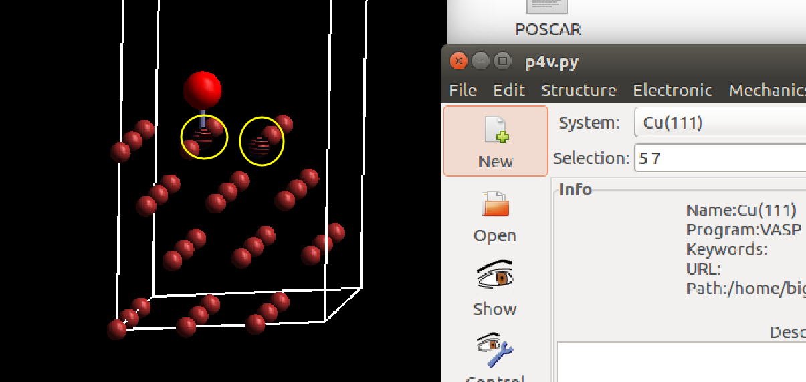

3） 选则 Edit –> Move Atoms 后会弹出这样的界面：

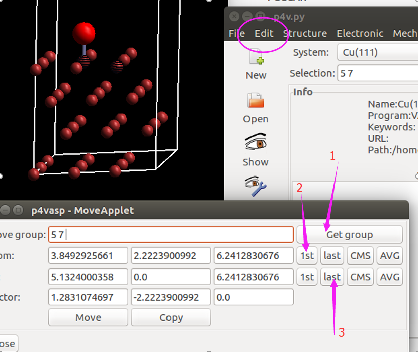

按照图中的1 2 3依次点击， 你便会获得一个`Vector`。也就是从5到7号原子的一个向量。

但我们如果按照这个向量平移O原子的话，只会把它从5号原子移动到7号原子上，而不是Bridge的位点。 

前面我们说了，Bridge的坐标就是这两个原子连线的中心。所以，我们把Vector减小一半就可以了。

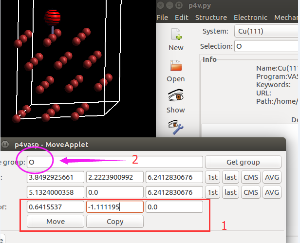

修改完Vector之后，我们便可以移动O原子了。

**这里注意**

要把前面选中的5 和 7 号原子换成 O，要不然你移动的是 5和7 号原子而不是O。最后点move，效果如下：

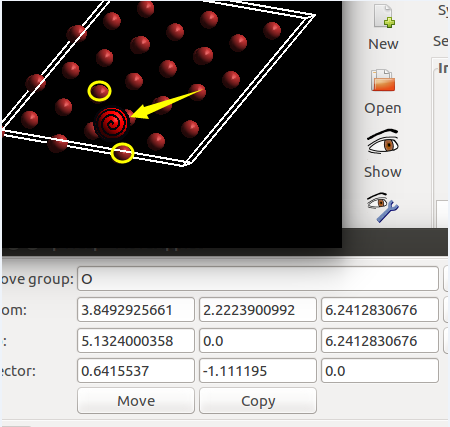

这样我们便获得了Bridge的吸附结构。

前面提到，我们在搭建Bridge结构的时候，O原子的坐标可以比Top位的稍微低一些，这个操作怎么实现呢？
1） 首先选中氧原子，
2） 在Vector那一行修改移动的位置即可。如下图：

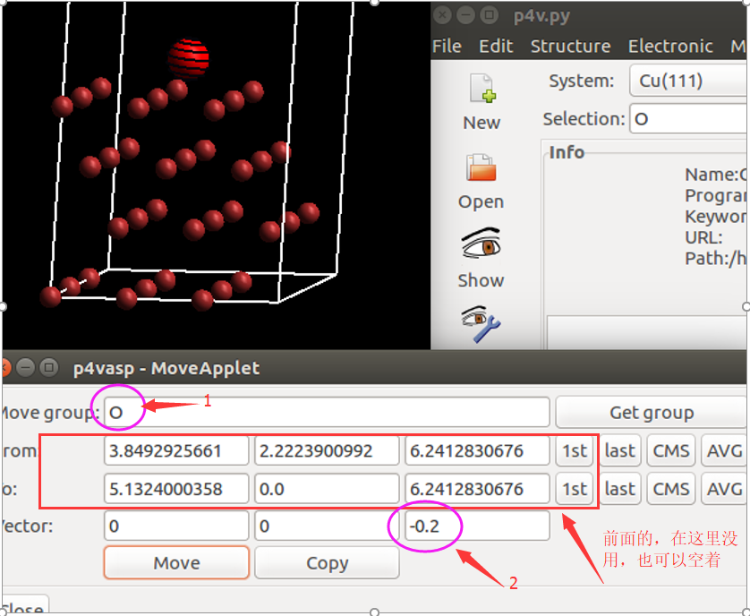

点击move ，保存POSCAR即可。

### 3.2 从Bridge 到 Hcp：

1） 选中O原子和Hcp位下面的Cu原子，并获取Vector

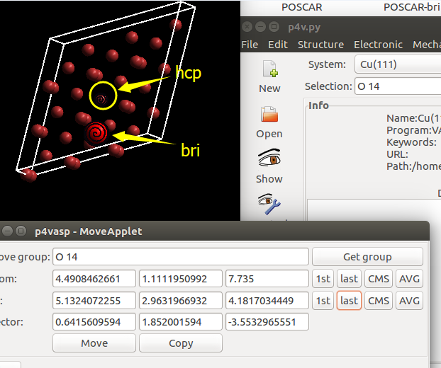

2） 修改Vector在z方向的大小。

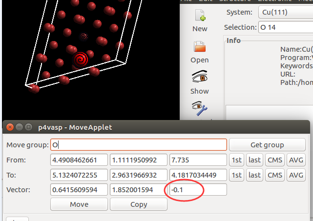

点击 Move，效果如下：

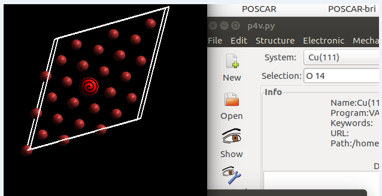

保存成Hcp对应的POSCAR即可。

### 3.3 从Hcp到Fcc

1）选中O原子和Fcc的一个原子，获取Vector：

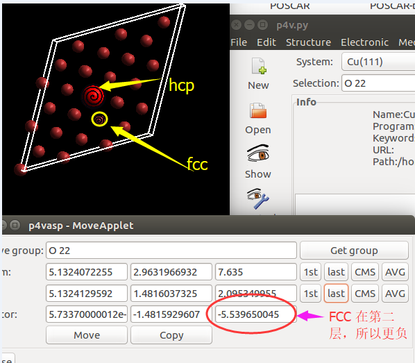

2）修改Vector在z方向的大小，由于Fcc和Hcp的吸附很接近，直接平移即可，也就是z方向大小为0

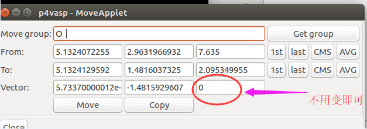

点击move，最终的Fcc结构，如下图，保存POSCAR。

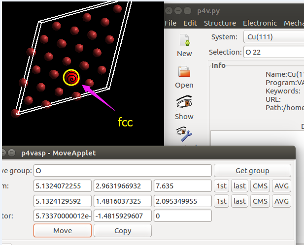

**注意：**

保存结构的时候，可以自己建对应的文件夹，在文件夹里面将结构保存成POSCAR，也可以保存成类似`POSCAR-Fcc`， `POSCAR-Hcp`， `POSCAR-Top`这一种的名字，计算的时候，将它们重新命名为`POSCAR`就行了。

## 总结：

本节，大师兄主要给大家介绍了如何在表面上，使用`p4vasp`平移原子来搭建不同的吸附位点模型。使用p4vasp搭结构非常方便简单，也会加深你对模型结构的理解，另一方面，使用这一种操作的话准确性更高，搭建出来的模型比自己手动放原子要合理很多。所以强烈推荐大家使用`p4vasp`。

