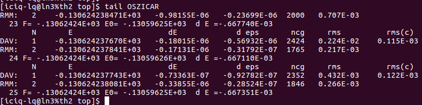

前面一节我们搭建好了p(3x3)-Cu(111)表面上不同吸附位点的O原子吸附模型。（fcc, hcp, top以及bri）也就是我们有了4个`POSCAR`。下面我们计算O原子在不同位点上的吸附能。根据吸附能的公式，我们还要有Cu(111) slab的能量。总共5个计算。O$_2$的前面已经算了，这里就不重复了。

强调一下吸附能的定义：就是物种吸附到表面上所放出的能量，放出能量意味着吸附能是负值。很多人把这个过程颠倒了，然后来定义吸附能，这是错误的！虽然数值一样，但表示的物理意义完全不一样。颠倒过来是脱附，而不是吸附！！！而基本概念搞不清楚，最直接的后果就是给审稿人留下一个坏印象，增加拒稿的几率。当然，基本概念正确也会被拒稿，概念搞错了文章也有可能会接收。


## 1 准备工作:

`INCAR`：和前面p(1x1)的计算一样
`KPOINTS`：根据前面我们经常提到的经验规则：k*a=30 

链接：https://wiki.fysik.dtu.dk/gpaw/exercises/surface/surface.html
`POSCAR`：已经准备好
`POTCAR`: 根据POSCAR生成对应的POTCAR，脚本见本书的附录章节。
提交任务的脚本或者命令。

```
A rule of thumb for choosing the initial k-point sampling is, that the product, ka, between the number of k-points, k, in any direction, and the length of the basis vector in this direction, a, should be:

    ka ~ 30 Å, for d band metals
    ka ~ 25 Å, for simple metals
    ka ~ 20 Å, for semiconductors
    ka ~ 15 Å, for insulators

Remember that convergence in this parameter should always be checked.
```

## 2 天河II号提交任务

前面我们已经讲解了如何在天河2号上提交任务，Learn VASP 系列的前面几节也介绍了一些相关的批量操作知识。下面简单通过实例操作展示下批量提交任务的一个流程。


其中`qsuball`是本人在`~/.bashrc`文件中，给批量提交任务的命令行随便起的一个名字，详见前面关于alias的使用介绍。

```
alias qsuball='for i in *; do cd $i ; qsub ; cd $OLDPWD; done'
```

`qsub` 是我们在超算中心提交单个任务的脚本，内容如下：

```bash
#!/usr/bin/env bash
rm job_sub 
echo '#!/bin/bash' >> job_sub
echo 'export LD_LIBRARY_PATH=/THFS/opt/intel/composer_xe_2013_sp1.3.174/mkl/lib/intel64:$LD_LIBRARY_PATH' >> job_sub 
echo 'yhrun -p gsc -n 24 /THFS/opt/vasp/5.4.4/vasp.5.4.4/bin/vasp_std ' >> job_sub 
yhbatch -p gsc -N 1 -J test job_sub 
```

将上面内容复制到一个文件里面，将文件命名为`qsub`，然后走一遍下面的2个步骤。
1）`chmod u+x qsub` (赋予可执行权限)
2)  ` mv  qsub  ~/bin`  （放到 ~/bin 文件夹下）

## 3 查看结果

等待任务排队，计算，结束。一个任务结束后，我们需要做的肯定就是检查结果了。那么改怎么样检查结果呢？这里列举出本人常用的几个方法和步骤。

### 1）查看OSZICAR

i)  在查看`OSZICAR`之前，我们回顾下前面的INCAR。

 

这里我们设置了`NSW = 500`,也就是允许本计算最大的离子步数。

ii） 再看下`OSZICAR`的末尾部分， 命令： `tail  OSZICAR `



从这里可以看出来，经过25个离子步，我们的计算就已经停止了，说明收敛了。

## 2） 查看OUTCAR


对于VASP的所有计算来说，只要你看到这样的结果，说明你的任务已经算完了。这里你要记住：算完和收敛不是一回事。比如你设置的`NSW = 500`， VASP优化了`500`步没有收敛的话，会自动停止，也会出现上图的结果。

**怎么查看收敛呢？** 

i) 可以对比计算的离子步和我们设置的离子步。如果实际计算得了离子步小于`INCAR`中的，任务就收敛了。这也是前面查看`OSZICAR`的目的。
ii）可以通过`OUTCAR`里面的关键词： `reached `


如果你看到最后面的： `Stopping structural energy minimisation`  这就表明你的优化任务已经完成。
而事实上，的确有很多人把这句话误认为是计算出错了，然后在群里面求助，本人实在是想不通。

## 4 删除VASP乱七八糟的输出文件


计算完成之后，VASP会出现很多平时我们用不到的文件，`CHG` `CHGCAR` `WAVECAR` 这三个占用的空间很大，容易把应胖撑爆。

由于计算目录下的存储空间有限，本人计算的时候，一般都默认VASP不写入这些文件。

此外，在表面结构优化的时候，`EIGENCAL, IBZKPT, REPORT,DOSCAR``以及超算中心与任务相关的输出文件：slurm-XXX` 文件，一般来说正常计算结束后，我们也不需要。

因此，本人写了一个小脚本，用来删除这些乱七八糟的文件。脚本运行效果如上，脚本内容如下：

```bash
#!/usr/bin/env bash
for  i  in $(find . -name INCAR); do
    cd $(dirname $i)
    rm CHG  CHGCAR  job_sub  PCDAT REPORT  slurm-*.out  WAVECAR  XDATCAR -f
    cd $OLDPWD;
done
```

大家可以针对自己的计算任务，修改`rm XXX` 哪一行中的文件名。


上图中还运行了一个脚本（ta.sh），就是提取当前目录下，所有计算结果的能量。也是本人临时写的。有兴趣的可以自己照着写一遍，然后运行下。

```bash
#!/usr/bin/env bash 
for i in *; do
if [ -e $i/OUTCAR ]; then
echo -e  $i "\t" $(grep '  without' $i/OUTCAR |tail -n 1 | awk '{print $7}') 
fi
done
```


## 5 获取能量，计算吸附能

有了上面的数据，我们就可以进行吸附能的计算，如下图：


一般来说，使用eV作为单位，精确到小数点后面2位即可。整理下表格：


从上图我们可以看出来，这四个位点的吸附能强弱顺序为： fcc ≈ hcp > bridge > top

## 6  扩展练习

1） 学会如何判断计算正常结束，并且优化达到收敛的标准了？
2） 总结并思考不同位点的吸附能的计算。
3） 学会判断稳定的吸附位点。
4） 思考下计算结束之后，除了我们讲的这些，还有那些需要检查的？
5） 本节的三个脚本： 
i)   qsub （天河II号提交任务）
ii） rmvasp.sh (删除乱七八糟文件)
iii）ta.sh (获取当前目录下，所有计算任务的能量)
