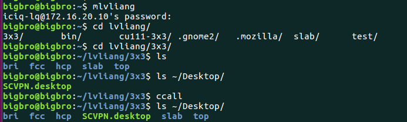
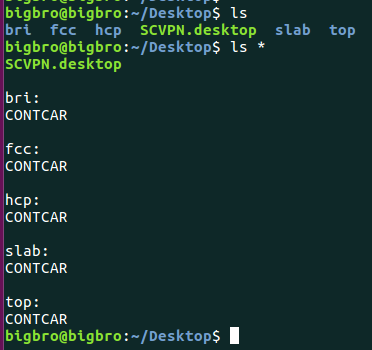
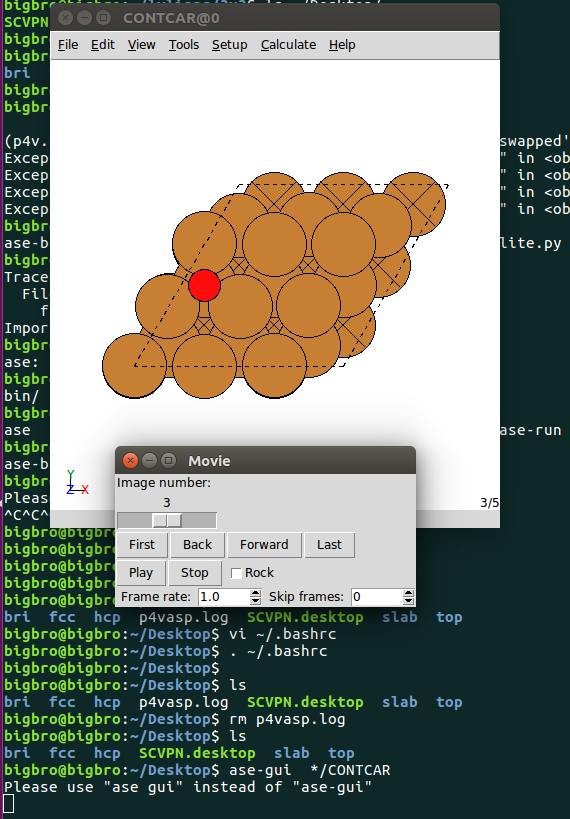
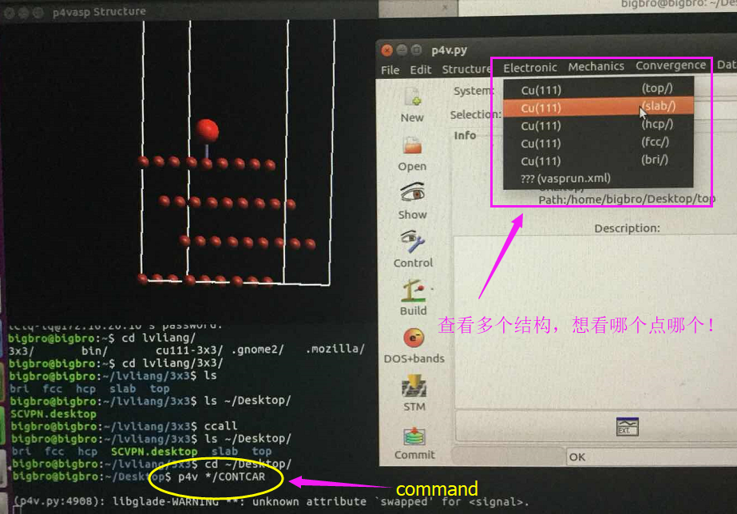
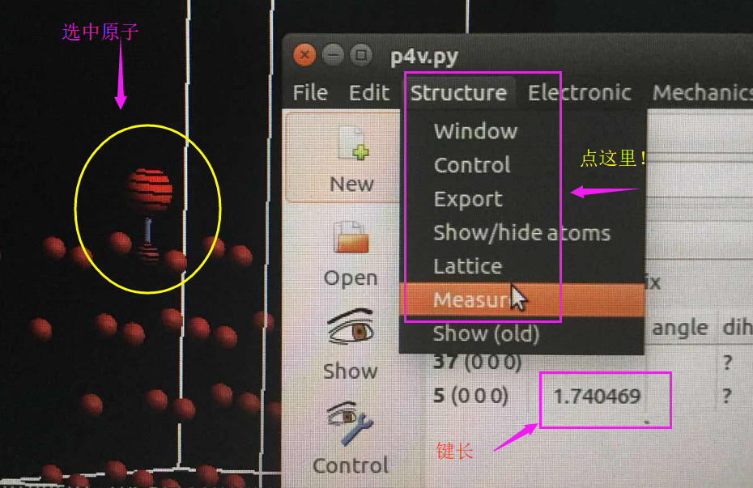

前面我们得到了不同吸附位点上吸附能的顺序，但结构是什么样子的呢？我们优化完的结果对不对？这还是一个问题。因此我们需要查看一下优化完的结果。

## 1  获取（下载）CONTCAR

没有结构，我们看个屁啊？所以第一步就是把超算中心的计算结果下载到自己的电脑里面。这里我们说获取或者下载CONTCAR，而不是OUTCAR等其他VASP的输入文件，原因在于本人这边网速传输太慢了。所以我的策略是能量等信息在服务器里面直接获取，结构的话只下载CONTCAR。如果网速允许的话，可以把所有的计算结果下载到自己电脑里面，这样查看更加方便。






上图中，我们先挂载超算中心到本地电脑上，然后将计算目录下的CONTCAR复制到本地桌面上。（ccall 这个命令）

```
for i in * ; do if [ -e $i/CONTCAR ]; then mkdir ~/Desktop/$i; cp $i/CONTCAR ~/Desktop/$i ; fi; done
```

备注：
由于本人这边传输很慢，即使挂载了超算中心到本地电脑上，访问内容的时候，后台依然有数据传输。所以先下载再查看。


## 2 使用ASE查看结构：

ASE 是Atomic Simulation Environment的简称，下载安装见：https://wiki.fysik.dtu.dk/ase/  本人只会在Linux下面使用，Windows用户自行解决。解决不了，我也没有办法。如果Linux用户解决不了，那么使用后面的第二种方法：p4vasp查看结构。

如果你的网速很给力，可以直接通过自己电脑进入超算中心的目录，进行下面的操作。



这个软件的**优点**就是： 我们可以一次性打开当前目录下，所有计算的CONTCAR， 从而避免了使用软件挨个导入结构查看。无形中会减少我们很多的工作量。

```
ase-gui  */CONTCAR 
```


## 3 使用p4vasp 查看结构

Ubuntu下面唯一推荐的软件：下面图片拍的不是很好，大家凑活着看吧。




这里，p4vasp和前面说的ASE一样，也可以一个命令打开所有的计算结果。





作为`p4vasp`的忠实粉丝，这也是本人唯一推荐的`Ubuntu`系统下查看，搭建结构的软件。

* i）使用p4vasp可以非常容易地进行原子替换，平移，旋转等基本操作。
* ii）可以查看VASP的结算结果，DOS，能带，优化过程等等。
* iii）Windows 系统下p4vasp的功能有些弱，除了不能批量打开文件外（可能是本人不会用），其他的和Ubuntu差不多。
* iv）这个软件也有很多其他细微不尽人意的地方，但不影响我们的正常使用。
* 如果你刚开始接触这个软件，认真用鼠标各个地方点点操作一下，查看各个功能按钮的作用。
* 此外，VASP官网的`ppt`教程中也有一些零星的`p4vasp`操作教程，大家可以参考一下。

## 4 其他软件： 

当然了， 不论在linux还是Windows下面，都有很多查看结构的软件，比如：`Jmol`，` Xcrysden`，` Molden`， `VESTA`， `Material Studio`等等。这里就不再详细介绍了，主要原因是本人不太会使用这些软件操作。目前大家需要做的就是根据自己的喜好，掌握一个软件：学会查看结构，键长，键角等信息即可。切记不可贪多，等一个软件掌握好了之后，有余力的话再去学习另一个的操作。

## 5 扩展练习：

1） 自己优化O在Cu(111)表面上不同位点的吸附，计算吸附能
2） 选择一款自己喜欢的软件，查看不同的吸附结构。
3） 思考其他单原子在其他金属表面上的吸附，该如何计算？
4） 思考原子在表面上，为什么不同吸附位点的吸附能不一样？

## 6 总结：

本节没有什么技术难度，全靠自己亲自手动操作，使用一个软件并不是一蹴而就的过程，大家先把基本的简单操作掌握了，后面再逐渐提高自己的其他技能。此外，本节学习完之后，单原子在表面上的吸附对大家来说应该不是什么困难的事情了。
