在进行本文的内容之前，大家先玩个人尽皆知的小游戏：

## 找不同  

**（一）**找出下面两幅图中不同的部分。


相信这个大家很快都能找出来，找不出来的话，不建议继续浏览下面的部分。


（二）下面两个截图中，找出不同的部分

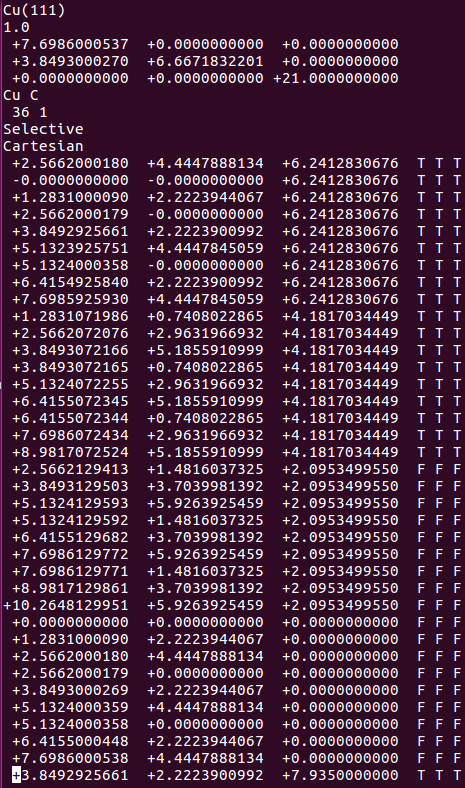 


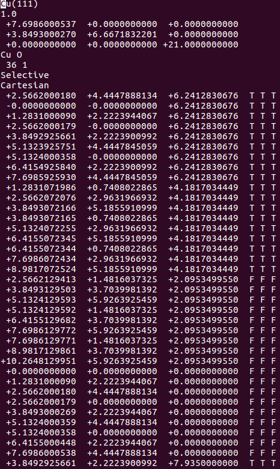


（三）下面两个截图中，找出不同的部分

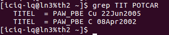  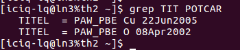


聪明美丽能干活泼善良可爱宇宙超级无敌的你会发现： 

在找不同2中，两个图中内容的区别在于：  POSCAR 的第6行
在找不同3中，两个图中内容的区别在于：  POTCAR 的第二个元素

当你发现了这些不同之处，就应该差不多明白了，这是2个计算任务文件，一个是C原子在Cu(111), 另一个是O原子在Cu(111)上的计算。

仔细分析不同的地方，你就应该想到: 既然我们有了O吸附相关的计算文件，那么就可以在此模板基础上，快速编辑C的吸附模型，然后进行计算。

在进行下面的快速编辑模型的内容，先给大家介绍一个Linux下面常用的比较不同的命令：diff。简单操作如下，更高级的大家自由去百度学习，并加以发挥拓展。 

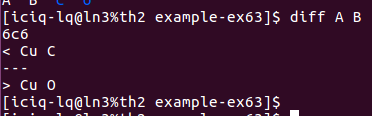


## 批量搭结构

快速准备C原子在Cu(111)上吸附的计算文件：

1）`INCAR` 保持一样
2）`KPOINTS` 保持一样
3）`POSCAR`: 将 O 直接替换成C就OK了。
i）直接编辑，无数种编辑器任你选。不过 Windows下一定要记得编辑完后运行下: `dos2unix`
ii）使用sed命令： `sed -i '6s/O/C/g' POSCAR`

4）`POTCAR`: 

i) 使用前面我们介绍的脚本：potcar.sh， 脚本运行例子如下图：（去本书的附录章节里面找脚本）

https://www.bigbrosci.com/2017/12/21/A05/

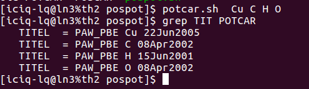

直接输入脚本名，后面跟你想要的元素名。


看下本人在天河II号服务器上的设置。

1） potcar.sh 在本人账号的： `~/bin` 目录下
2） VASP所有的POTCAR文件在： `~/bin/pot` 目录下
3） pot目录下，每个元素的文件夹中有2两个文件：`POTCAR` 和 `PSCTR` （PSCTR这个我也不知道有什么用。）
4）新手，没有经验，不会用超算的，不会Linux的，可以效仿下：

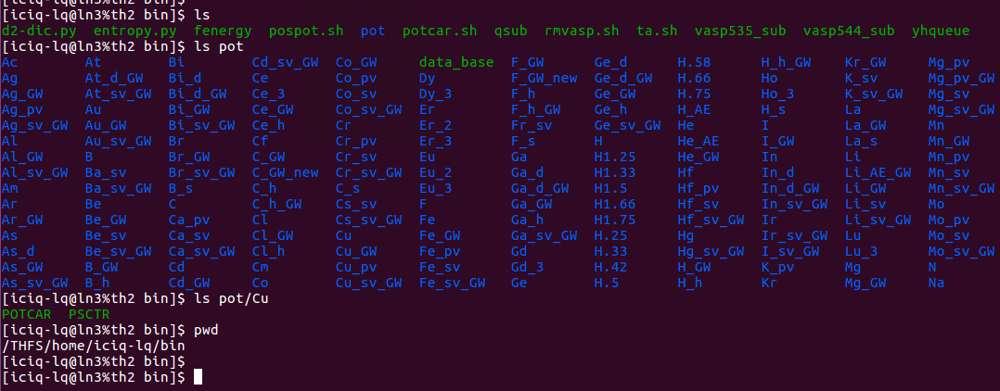

脚本下载后，将POTCAR所在的目录替换成你的： path="你的目录"。 
怎么知道目录呢？ 使用上图中的pwd 这个命令。

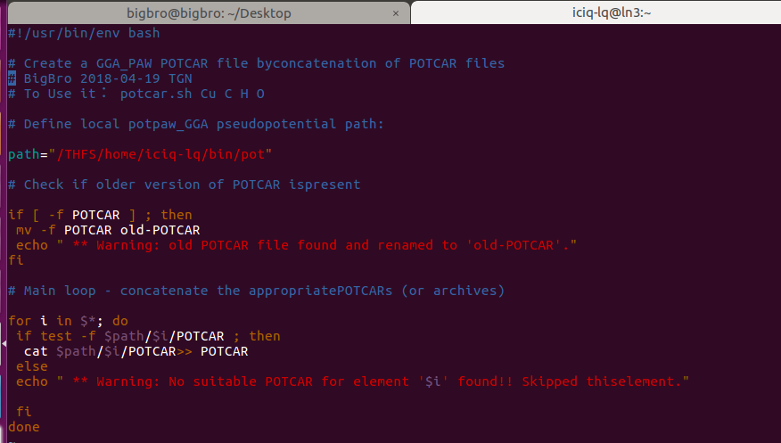


ii) 我很多时候都懒得去看POSCAR中的元素以及顺序，便打算根据POSCAR中的内容生成对应的POTCAR，于是便写了一个脚本：`pospot.sh`。使用方法如下： 


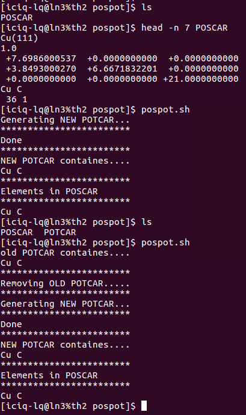

上图运行了这个脚本两次：
1） 第一次运行的时候，目录下没有POTCAR，于是脚本直接生成新的
2） 第二次运行的时候，目录下有了一个POTCAR，于是脚本将POTCAR中的元素顺序读出来，然后删掉旧的POTCAR，重复1）的操作，生成新的POTCAR。（大师兄本人的扯淡逻辑，大家可以忽略，脚本文章末尾下载直接使用即可。）
3） 注意：这个脚本读取的仅仅是以 元素 命名文件夹中的POTCAR。什么意思呢？ 举个例子：Cu的POTCAR有：Cu，Cu_GW, Cu_pv，Cu_sv_GW这四种。脚本读取的仅仅是Cu中的POTCAR。如果你想用`Cu_pv`，那么请使用： `potcar.sh Cu_pv C H O `这个命令。
4） 脚本内容如下：大家可以自己手动敲一遍，找找感觉。

```bash
#!/usr/bin/env bash  
# show old POTCAR 
if [ -e POTCAR ]; then
  echo 'old POTCAR containes....'
  grep TIT POTCAR| awk '{print $4}' | xargs
# Remove old POTCAR  
  echo '************************'
  echo "Removing OLD POTCAR....."
  echo '************************'
  rm POTCAR -f
fi

# generate new POTCAR 
echo "Generating NEW POTCAR..."
echo '************************'
potcar.sh $(sed -n 6p POSCAR)
echo "Done"

# compare elements in new POTCAR and POSCAR
echo '************************'
echo 'NEW POTCAR containes....'
grep TIT POTCAR| awk '{print $4}' | xargs
echo '************************'
echo "Elements in POSCAR" 
echo '************************'
sed -n 6p POSCAR

```


5）提交任务的脚本保持一样


前面所说的都是一些具体的做法，用化学的思维来说，应该叫基元反应。当你掌握了这些具体的做法后，可以通过批处理的方式将它们集成起来。本人的做法如下：

1）批量编辑POSCAR：

```
sed  -i  '6s/O/C/g' */POSCAR 
```

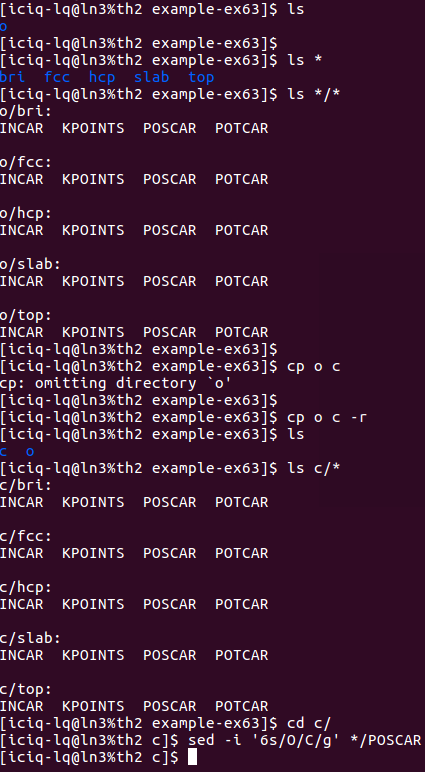

i） 将O原子的计算直接复制成C原子的
ii）使用sed 批量编辑POSCAR中的元素行。


2）完成前面的一步，直接批量提交任务： 提交任务的时候，脚本自动根据POSCAR生成对应的POTCAR.

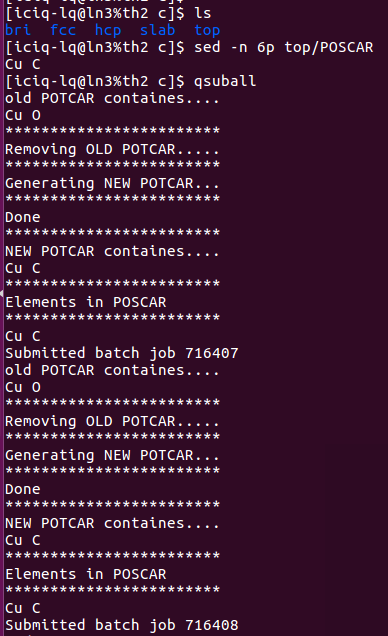
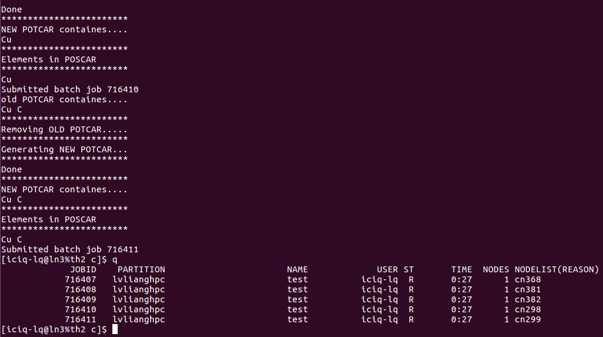


我是怎么做的呢？

在`~/.bashrc` 文件中 将`pospot.sh` 写到 `qsuball`里面了。大家可以看下我的`~/bashrc`文件：

```
alias q='yhqueue'
alias qsuball='for i in * ; do cd $i ; pospot.sh && qsub ; cd $OLDPWD; done'
alias qdel='yhcancel'
alias fenergy='grep "  without" OUTCAR'
alias ..='cd ..'
alias ...='cd ../..'
alias ....='cd ../../..'
alias gl='grep LOOP OUTCAR'
```


## 批量删除任务

前面批量提交了任务，但这些任务已经算起来了，但这些结果对我没有用出，纯属浪费机时，所以我要杀死它们。这里介绍给大家一个简单的批量删除任务的命令： {..} 操作如下：

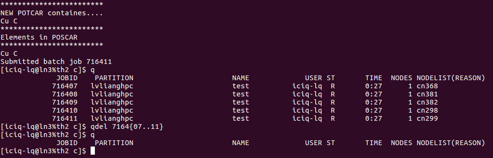

`qdel` 就是天河II号中的`yhcancel`命令，本人根据自己的习惯，修改了一下`alias`中的内容（见前面`~/bashrc`文件的内容）

如果你的任务不是连续的，也可以使用这个命令， 只要把第一个和最后一个任务的ID号写在花括号里两个点`..`的两端即可。非常简单，暴力和直接。

中间如果有些任务不是你的，即使你想杀死也没有权限，系统会报错，直接忽视即可。


## 找不同 

前面我们弄完了C原子的计算任务，下面我们再玩一次找不同的游戏

找不同4：下面2个截图中找出不同的地方：

  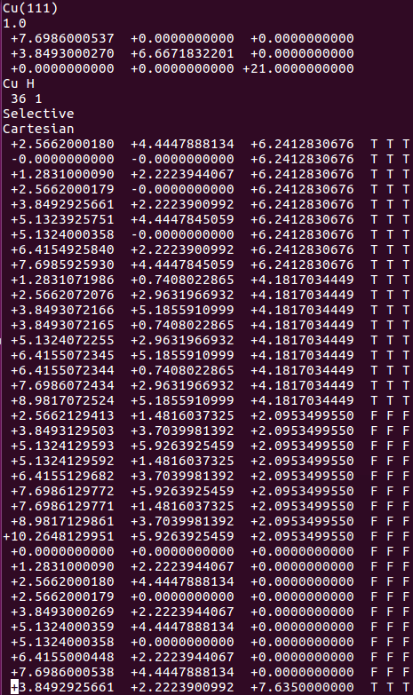


师兄，这个题很简单，你要算H原子的吸附。跟前面的操作是一样的。

**但是**，请看最后一行。

仔细的你会发现，这个题跟前面的有些不一样，原因在于最底部的坐标也稍微变化了一下，从`7.935 `变成 `7.635`了。 这是为什么呢？
原因在于和C，O原子比起来，H原子很小，它在表面上吸附的时候，会更贴近表面。因此我们把z方向的坐标稍微修改了一下： 减小了 0.3 A。这样做的话可以保证我们的初始结构更**具有合理的物理化学意义**，从而加快计算的收敛，节约时间。大家在搭建模型的时候，结构合理是必须要考虑的，也是脑子里要时刻思考的事情。

通过`sed`命令批量操作在H原子的吸附上，只能完成一半的任务，也就是把元素行中的C或者O改成H。而另一半的任务：坐标的修改，则需要大家自己手动操作一下（记得在`Cartesian`坐标下修改，如果你脑子转的很快，可以迅速将`Direct`转化为`Cartesian`的话，也可以直接编辑`Direct`坐标）。

## 扩展练习： 

1） 完成本节的所有操作；
2） 计算C,H，O在Cu(111)表面上，不同位点上的吸附；
3） 思考脚本的运行原理；
4） 思考如何通过：（找不同 + 写脚本）来节省自己的体力；
5） 思考自己平时常见的人工错误，并尝试用脚本来解决或者避免。


## 总结：

本文的题目是闭着眼算，不是让你真正闭着眼去提交任务，而是不通过可视化的界面进行结构的批量搭建，输入文件的批量处理以及提交任务。希望大家在搭结构的时候，多一些思考，少一些操作，在搭建合理结构的路上突飞猛进。
