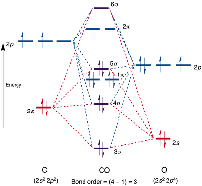

前面我们讲解了一堆单原子的吸附计算和一些日常的操作，现在是时候来点复杂的操练了。这次，我们拿CO开刷，计算它在Cu(111)表面上的吸附。由于CO比前面的O多了一个原子，复杂性稍微提高了些，但也不是太复杂。作为一个由简单向复杂体系的过渡，是一个很好地例子。

在计算CO的吸附之前，我们首先要了解以下3点：（都是教科书里面的经典内容，下面只列出来，不再细说，如果不懂的话，找本结构化学书好好啃一啃。）

## 1. CO分子信息：

### 1）CO的分子结构，如下图：



### 2） CO的几何结构：（用来搭建吸附和气相的模型）


### 3） CO与金属的成键方式 （用来搭建吸附模型）


## 2. 搭建CO吸附的模型： 

上一节我们学到了闭着眼操作的一些方式，这一节我们继续闭着眼搭结构。操作流程如下：

### 1） 将上一节中 C 原子吸附的那几个模型复制过来，进行修改：

- i) 修改POSCAR中的元素（第6行）和原子数目部分（第七行），添加O原子。


- iii）在POSCAR的尾部，添加O原子的坐标：


可以看到上图中，最后两行的坐标一模一样，这是因为CO在表面上吸附的时候，我们假定的是直立吸附。所以C 和 O原子的坐标在x和y方向上一样。不同的区别在z方向上，即CO的键长。CO如果吸附在表面上，肯定会和表面原子有作用，也就是所谓的活化，如果原子被活化了，那么CO键就会被削弱，具体体现在键长上。与气相的键长相比，表面上CO的键长数值更大一些。前面我们查数据库得到CO键长为：1.138A.这里我们不妨设置成1.2A。根据这些，我们设置O原子的坐标，如下：


同样，我们可以对其他吸附位点的坐标进行类似的修改，结果如下图：


## 3. 背一遍VASP的输入文件，检查还有那些需要修改的：

- i） INCAR： 跟之前保持一致；
- ii）KPOINTS：跟之前保持一致；
- iii） POSCAR： 已经修改完毕；
- iV） POTCAR：提交任务的脚本里面自动生成
- V）提交任务命令： qsuball （前面已经讲解过了）

## 4. 提交任务：


上图，我们删除了slab的计算，因为前面我们已经计算过了，没有必要浪费机时再算一遍。

## 5. 思考下吸附能的计算公式：

$$
E_{ads}(CO) = E_{slab+CO} - E_{slab} - E_{CO^{gas}}
$$

前面我们还忘记了CO的气相结构优化。现在我们回忆一下前面所讲的气相分子的优化：

### 1） 气相分子的结构模型搭建。

直接将一个Cu(111)表面上吸附的POSCAR拿过来修改一下即可：


### 2） INCAR：直接拿Cu(111)吸附的修改下。

对于气相分子的优化来说：

```
ISMEAR = 0 
SIGMA = 0.01
```

### 3） KPOINTS： gamma 点即可。

### 4） 这里我们没有批量提交，手动运行一下：`pospot.sh`脚本，生成对应的POTCAR。

### 5） 使用提交单个任务的脚本： qsub  提交任务。具体操作如下图：


## 6. 扩展练习：

- 1）完成CO吸附的计算；
- 2）进一步熟练简单模型的闭着眼操作方式；
- 3）复习分子气相结构的优化过程。

## 7. 总结： 

本节，通过CO的吸附模型搭建，带领大家走出简单的单原子吸附，开始逐渐接触复杂的吸附计算。如果前面内容掌握了，本节就是一个水到渠成的事情。在多原子分子的吸附计算中，首先我们要知道分子的电子和几何结构，分子哪一部分（这里的C原子）和表面成键。在本节的例子中，如果你不知道C和金属作用，你还需要计算Metal-O-C这样的结构。可能还会计算CO横着吸附的结构，任务无形中就会增加一倍或者更多，从而造成机时的浪费。退一步来说，如果你真的不知道吸附是以什么方式进行的，想尝试N种初始的结构，我的建议是：把slab的原子全部固定住，然后用gamma点算一下它们的吸附能，先大体上判断一下，把那些吸附特别强的结构筛选出来，用作下一步的计算。
