经过前面的学习，相信对于：单原子和双原子分子的吸附，大家已经掌握了怎么搭建模型，以及计算吸附能了。下一节我们要讲的是三原子分子的吸附。在进行三原子分子吸附的计算之前，我想是时候祭出本人使用p4vasp搭结构的一个法宝了。古人语，工欲善其事，必先利其器。所以，本人认为这一节的学习对于以后的结构搭建非常重要，尤其是对于那些使用p4vasp的筒子们来说。说了这么多废话，本节主要内容是手动搭建一个H$_2$O分子，并实现分子的任意旋转。

------

## 1. 获取结构

首先我们先知道H$_2$O分子的基本结构。本人的做法是去NIST数据库查找资料。操作如下图：

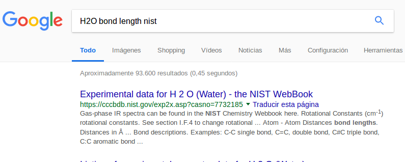

点击上的链接，或者点击 [NIST网址](https://cccbdb.nist.gov/expgeom1x.asp)查询得到下面的信息：

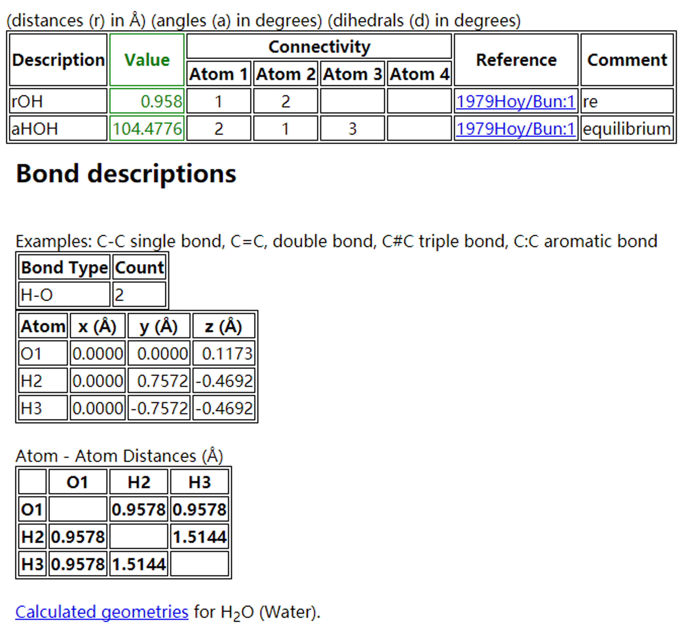

在NIST的数据库里面，基本的热力学数据，结构都有了。大家完全可以按照上图中的`Cartesian`坐标搭建一个H$_2$O的结构，直接复制到POSCAR即可。不过，这个操作我们先缓一下，以后你有的是机会操作。本节主要介绍下如何是从头开始搭建一个H$_2$O分子模型，整个操作过程的学习比搭建模型的结果更加重要。

------

## 2. 模型搭建： 

### 1）数据库结构

O—H的键长为0.9578 A，∠HOH = 104.478°。

### 2）直角形H2O分子

首先，我们在xy平面内搭建一个直角形的H$_2$O分子。O放到原点： 0, 0, 0，H_1沿着x轴， 0.96, 0, 0，H_2 沿着y轴： 0, 0.96, 0

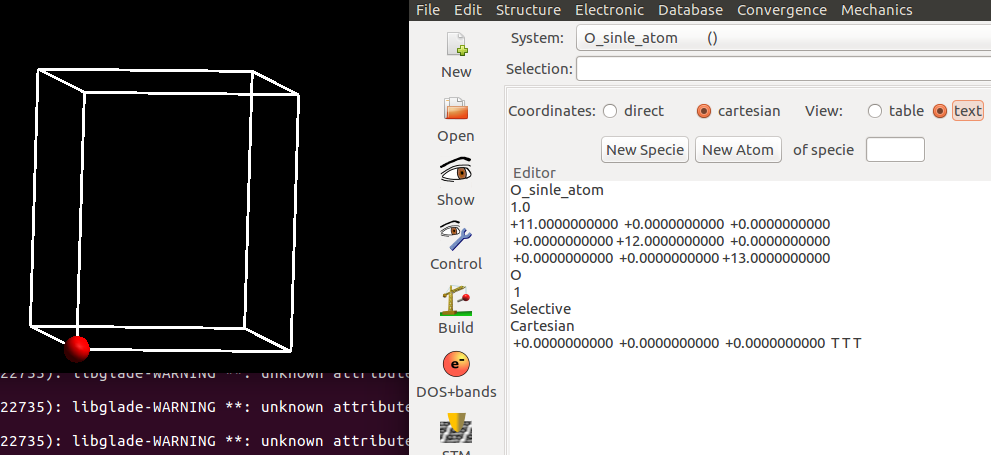

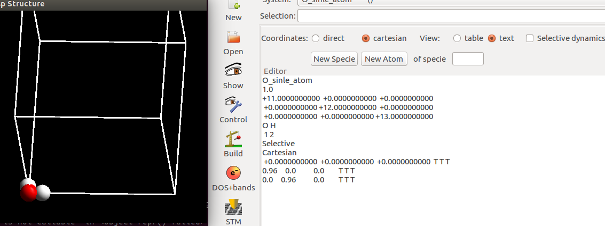

### 3）修改角度

 前面说了，∠HOH = 104.478°， 我们该怎么做呢？

- i) 可以自己手动算一算，其中一个H原子的坐标，然后更新坐标信息。三角公式大师兄早就忘的一干二净了，暂时跳过。

- ii）通过p4vasp进行旋转操作。

  对于旋转操作，我们首先要定义一个旋转轴；然后选择旋转的原子，以及角度。在上面H$_2$O的结构里面，很容易就想到，如果∠HOH 从 90°增大到 104.478°， 我们需要以O原子所在的z轴，旋转一个H原子即可，旋转角度为14.478°。

------

### 4） p4vasp获取旋转轴的操作：

- i) 选中O原子；
- ii) P4vasp界面左上方， `Edit`—>`Rotate Atoms`；
- iii) 弹出的界面点击：`Get Group`；
- iv）`Center` 那一行，点击`1st`的按钮；
- v) `Second point`那一行，点击`1st`的按钮；
- vi) `Axis `那一行，点击 `Z `的按钮。

这样我们就定义了一个穿过O原子的z轴。

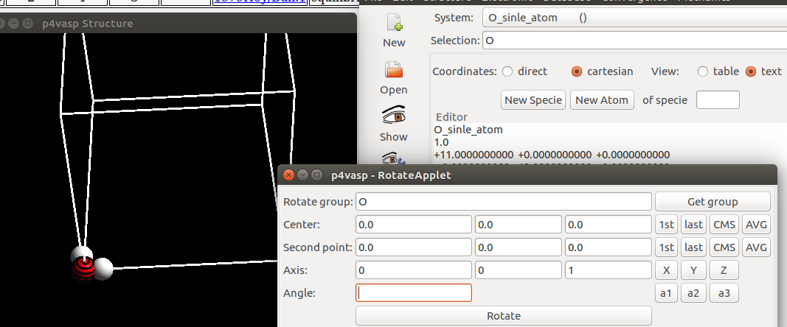

### 5） p4vasp选择要旋转的原子和角度：

- i)把鼠标分别移动要要旋转的H上，通过键盘的`space` 空格键选择。
- ii)在上一步`Edit` –> `Rotate Atoms` 弹出的对话框中，再点一下： `Get Group`。
- iii)最后一行，我们选择 -15 作为旋转的角度。

**注意1**： +15 和 -15 顺时针和逆时针旋转15°。 如果你旋转错了，不要心慌，把数值改下，重新旋转即可。

**注意2**： 你也可以先选中O和H原子，然后在center 和 second point 那两行都选择1st来获取旋转轴。

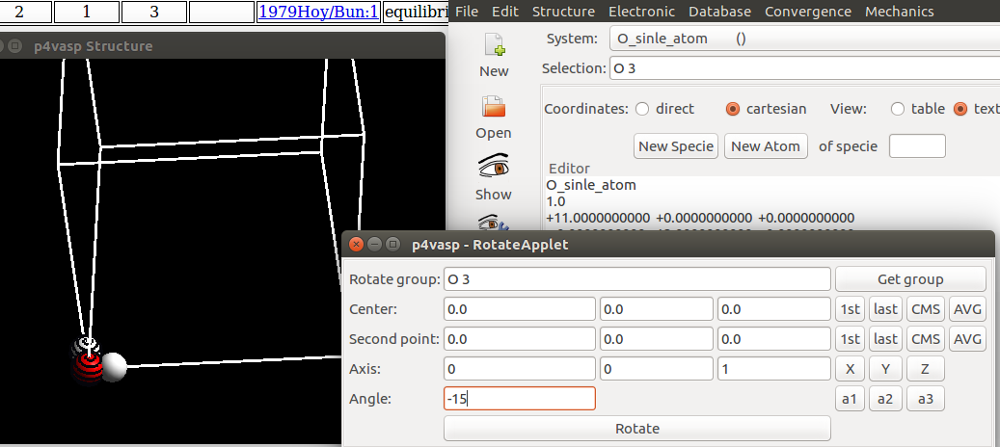

点击最下面的： Rotate，效果如下：

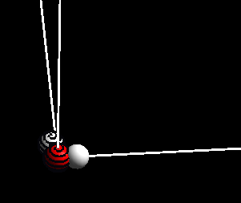

由于我们绕着O原子旋转，所以O原子选中或者不选中，旋转操作都对其坐标都没有影响。通过Structure – Measure 测定一下 三个原子的角度。

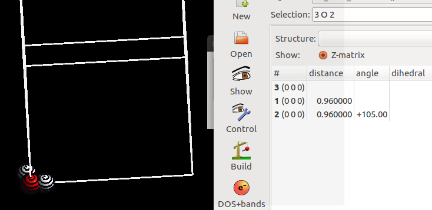

------

## 3.  绕任意轴旋转

上面我们介绍了一下，绕一个单原子的轴进行的旋转操作。而实际的模型调整，搭建的过程中，这种情况并不多，大多时候我们需要绕着一个3D空间里面的轴进行旋转，而不仅仅局限在xyz这样简单的情况。我们知道，两点可以确定一条直线，所以，对于旋转轴来说，我们可以通过两个原子来定义。下面我们讲解一下，H$_2$O分子绕着一个O—H键的旋转操作。

### 1）定义旋转轴：

- i) 选择 O 原子 和 H原子；
- ii) Edit –-> Rotate Atoms；
- iii) Get group；
- iv) Center 那一行，点 1st；
- v) Second point那一行，点 last。

点完之后，下面一行会自动填充我们选择的旋转轴。即从1st原子指向last原子的一个轴。最后一部分，我们写的是60，即绕着O—H键 旋转60°。

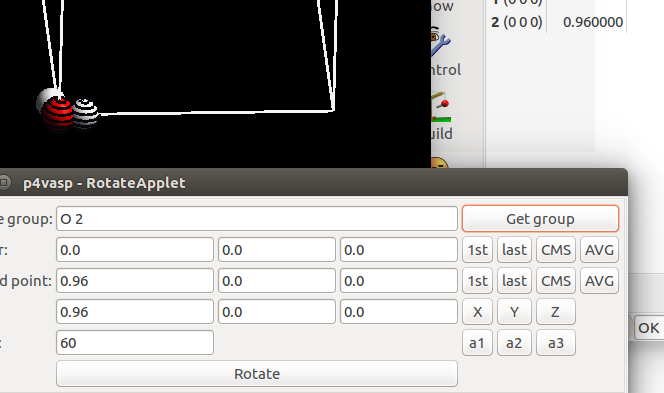

选择要旋转的原子，由于前面两个原子已经用来定义旋转轴了，剩下的第三个就是我们旋转操作的对象。选中所有的原子，然后点击 Get group。 下面的图是：H$_2$O 的一个H原子绕着另外两个原子的轴旋转 -60 °的效果。我们绕着一个O—H 键旋转，旋转操作对轴上的原子坐标没有影响，所以大家可以选中这些原子，也可以先通过这两个原子定义旋转轴，进行最后一步操作的时候，取消选择也可以。

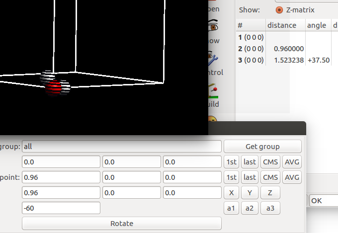

### 2）移动水分子

 一般对于分子的计算来说，如果分子在原点附近的话，由于周期性的原因，结构的一部分会进入到另外一个相邻的格子里面，虽然对于计算没有什么影响，但对后面的其他可视化过程（比如，频率计算等）会造成一定的影响。所以本人经常把原子移到格子里面。选择所有的原子，在最后的Vector部分，选择5 5 5， 即在xyz三个方向上都移动5A的距离。点击move，效果如下图，然后保存结构。

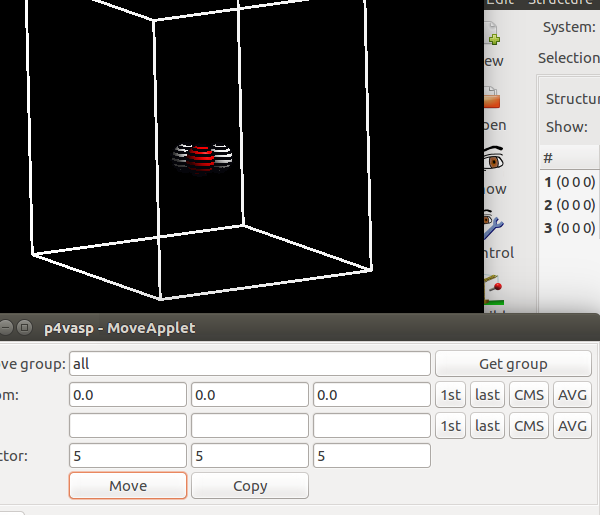

------

## 4. 扩展练习：

- 1） 重复本节的所有操作；
- 2） 复习前面乙醇分子模型的搭建
- 3） 根据今天所学，随意操作乙醇分子中，原子的旋转，平移等操作，直至熟练位置。

## 5. 总结：

本节的重点是学会用p4vasp 进行分子的旋转操作，并复习下分子的平移操作。分子的旋转在表面结构模型的搭建过程中，非常重要，熟练掌握这一个技巧，可以极大提高自己搭建模型的合理性和准确性，从而在后面的计算过程中，节约我们的计算时间。如果你有更好的方法，也也可以分享经验给大家。
