结合上一节的内容，下面主要讲解一下H$_2$O分子在Cu(111)表面吸附的初始模型搭建。

## 1. 计算H$_2$O气相分子的能量

相信大家已经轻车熟路了（老司机）。只将INCAR，KPOINTS，POSCAR列出来，不再详细解释。如下图：

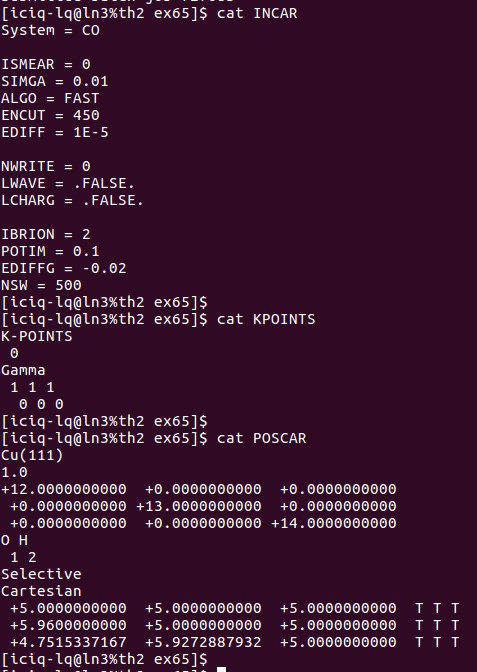

提交任务，结束后，将CONTCAR中的Direct坐标转换为Cartesian，方便后面的表面模型搭建。

怎么转换前面也讲过了，这里也不再啰嗦。

------

**☆☆☆注意：很多人问H$_2$O的分子计算用不用打开自旋的问题?**

我的回答是：

- 1）如果你的体系是开壳层的，那么就打开自旋。
- 2）如果你的体系是闭壳层的，那么就闭嘴。
- 3）如果你不知道自己的体系是开壳层的还是闭壳层的，那么就：
- - i) 自己去测试一把，然后对比下，打开与不打开的区别
- - ii）查找文献，看别人怎么做的。

------

## 2. 搭建H$_2$O的吸附模型

**1） 打开p(3x3)-Cu(111)的slab结构。**

先点击左侧的Build，然后点击右上方的text 按钮，进入编辑的部分。如下面的示意图：

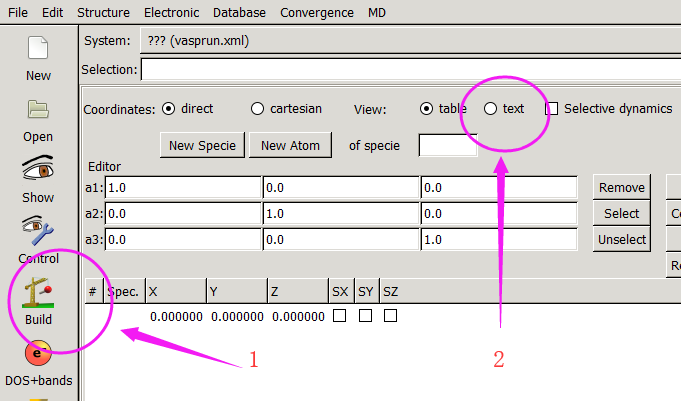

注意：上面的只是p4vasp的一个界面，不是p(3x3)-Cu(111)的slab结构。

------

**2） 元素行，原子数目**

在元素行，添加O和H，下面一行，添加对应的原子数。

## 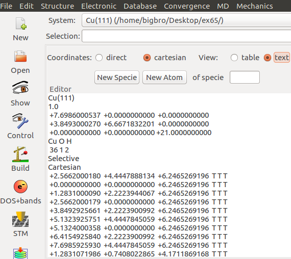

**3）添加H$_2$O分子坐标**

 在坐标的最后面，将前面CONTCAR的Cartesian坐标直接复制过来即可。

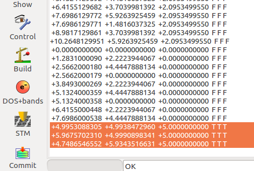

**4） 结果：**

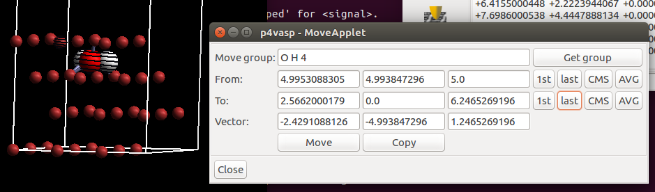

师兄，水分子跑到slab里面去了，这可怎么办？ 答：往上平移下即可。

选择O H 以及表面上的任意一个Cu原子。回顾前面的平移操作：

From 那行点 1st 代表的是O原子

To 那行点 last 代表的是表面的4号Cu原子

得到的vector 就是从O到Cu的平移矢量。

**☆☆☆注意：**

Vector的第三个数字，这个是O和Cu在垂直方向上的距离。我们知道，H$_2$O在Cu上吸附的时候，Cu—O有一定的距离，不妨先给个初始值2A。所以，我们需要把 1.246改成3.246。

------

**小窍门**：在下面红色圈出来的部分，可以通过一些快捷的操作来实现原子的选择。

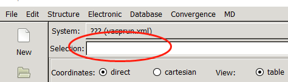

- i） 在p4vasp 里面可以直接通过写元素符号，选择该元素所有的原子；
- ii） -10 代表从第一个到第10个原子；
- iii） all 代表所有的原子；
- iv） 10- 代表从10到最后的原子；
- v） 10-25 代表从10到25号原子；
- vi） 剩下的，自己瞎捉摸去吧，我也不知道了。

------

上面移动的效果如下：

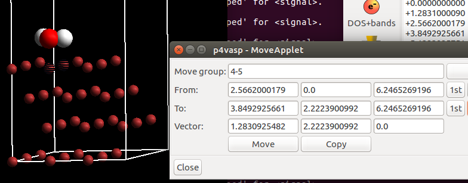

**5） 周期性显示的小技巧**

刚开始选择的4号原子在两个格子之间的界面上，本人喜欢将分子放到表面的中间。操作如上图：

- i） 选择表面上的2个原子： 4 和 5 来定义平移的一个vector。
- ii） 平移一下O和H原子，效果如下：

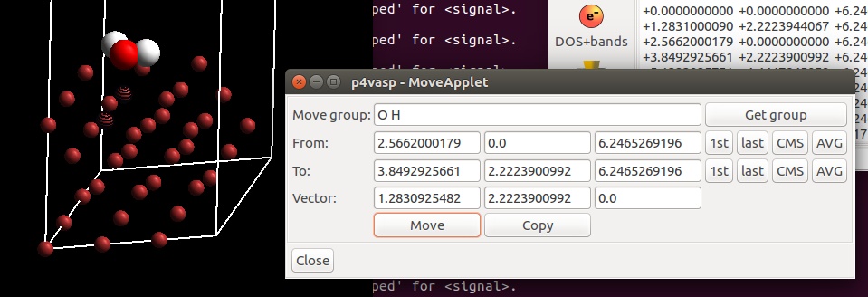

当然，在开始的时候，你也可以将H$_2$O分子直接移动到5号原子的表面，大师兄这里做了一些无用的分解操作，主要是为了加深大家的操作印象。

------

## 3. 考虑不同的可能性

到目前为止，我们已经顺利搭建了一个H$_2$O分子的吸附模型。把它保存到type_1目录下，名字为POSCAR。

**师兄，为什么要建一个type_1的目录？**

因为除了这个结构，H$_2$O分子在表面上还有很多其他的可能性。为了保证我们可以获得最稳定的吸附结构，我们就需要将这些可能的结构都算一遍。那么还有其他什么样的可能性呢？

- 1） 一个H原子指向天空，另外的O—H 键平行于表面。这个结构怎么实现？ 回想上一节我们讲到的绕着O—H键旋转的操作。看下图，不解释。

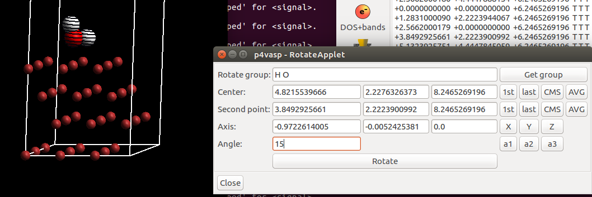

- 2） 2个H原子都指向天空，只留一个O原子在表面。（剪刀手V）

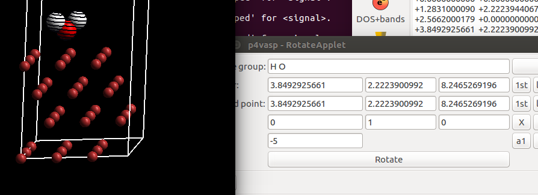

------

操作思路： 定义一个穿过O原子的y 轴，然后旋转氢原子。

将这两个结构分别保存到type_2 和 type_3 目录下，名字为POSCAR。按照这样完成的话，你的目录应该是这个样子的：

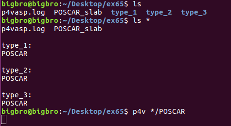

**☆小窍门**：p4vasp  */POSCAR  打开当前所有目录下的POSCAR，然后：

**☆☆☆注意**：本操作是在Ubuntu系统下操作的。Windows的用户可能不能实现p4v */POSCAR 这样的操作，下面讲解的搭建模型可能会多花出一些时间。在这里大师兄表示无能为力。

------

## 4. 不同的吸附位点

我们前面了解到Cu(111)表面也有很多不同的位点：Top，Fcc，Hcp，和 Bri。所以这三种的初始构型在这四个位点上也要考虑。

Bridge的操作，选择5 和 6， 然后将Vector的数值减小一半，然后平移。

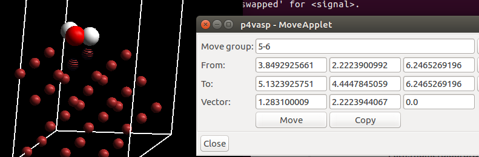

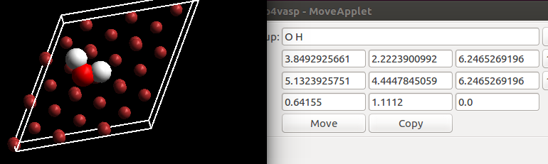

平移完了，将结构保存到bri目录下。

**此时不要关闭平移的对话框（这是☆重点1）**

**点system对应的这个框，选择type_2 的POSCAR（☆重点2）**

再点一下move，就完成这个类型的bri结构了。

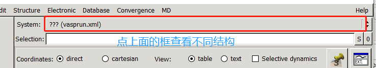

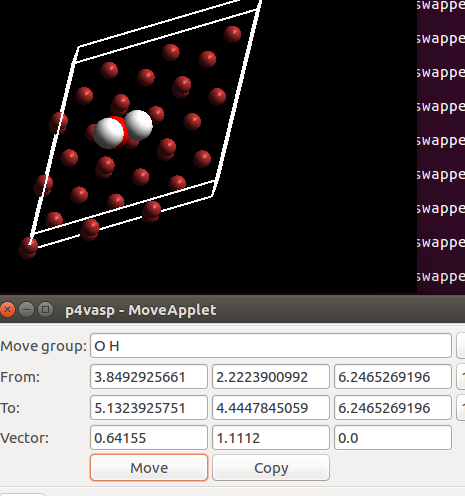

同样，不要关闭对话框，打开type_3的结构，继续平移，获取对应的bri位结构。

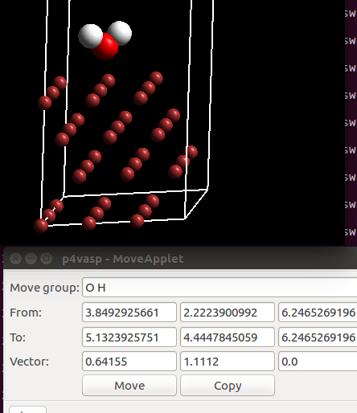

这样操作的话，避免了重复获取平移Vector的那些鼠标点点的操作。点一次，可以继续用于其他结构的操作。希望大家可以掌握这个小窍门，提高自己搭模型的速度。Windows的用户，可以通过将Vector的数值先记下，然后打开另一个结构的时候，直接输入vector就可以了。类似的，我们可以快速搭建完FCC，HCP的结构，最后，你的目录应该是这样子的：

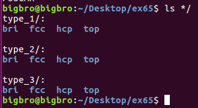

将这些结构复制到服务器里面，准备提交任务。

------

## 5. 扩展练习：

- 1） 完成这12个结构的搭建，彻彻底底地掌握p4vasp平移，旋转操作。
- 2） 使用MS，VESTA，p4vasp 搭建一个p(4x4)-Pt(111) 的吸附模型。（Bulk，slab的优化过程不用做，只熟悉搭建模型的过程。
- 3） 思考如何批量准备输入文件，并提交任务？
- 4） 思考准备的任务输入文件有什么需要注意的地方？

------

## 6. 总结：

学完这一节：

- 1） p4vasp的基本操作，我是没有什么其他可以再教的了。基本上学会这些可以说p4vasp已经入门了，剩下的就是大家没事瞎点点，然后琢磨的事情了。
- 2）至少含有1-3原子的分子吸附模型你应该会搭建了。原则如下：
- - i）通过基本的化学常识和自己所学的知识判断与表面结合地原子； 
- - ii）分析表面不同的吸附位点；
- - iii） 思考可能的吸附方式（躺着、竖着、斜着、歪着等等），并通过平移，旋转来实现。

而最后一点，每思考一种吸附方式，都会使得自己的模型数目激增（这种吸附方式在不同位点上），增加工作量。所以，大家在操作的时候，一定要多看文献，因为前人已经把这蛋疼的路帮你走通了。但这并不意味着别人算的就是对的，大家都是人，也会有疏忽的时候，如果你感觉某个结构应该会更稳定，一定要去尝试一下。
