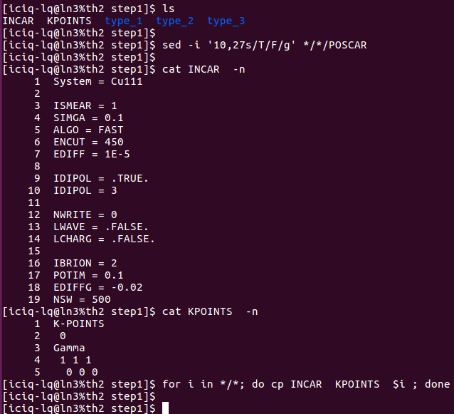
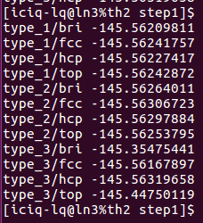
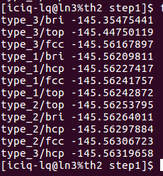
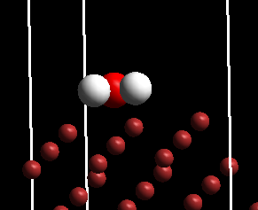
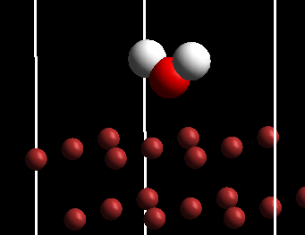
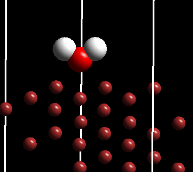
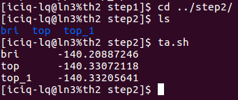
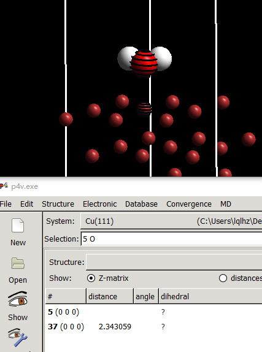
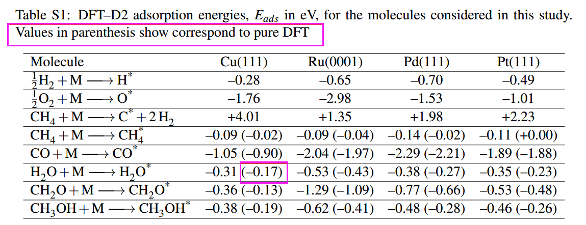

前面我们搭建了十二个H$_2$O的初始吸附构型。为了获取最稳定的结构，我们需要将这些可能的结构都优化一遍，然后通过吸附能来判断。但是这12个结构，我们都要优化的话，需要很多的机时，尤其是对于那些不太富裕的课题组来说，计算量着实不小。那么我们应该怎么办呢？ 回顾：

- 1）前面几节我们讲的通过简化模型来加快计算的步骤
- 2）谁偷了我的机时系列。

------

这里我们可以选择的办法有N个：主要是这两个：1） 减小K点； 2）减小模型。

### 1） 减小K点的做法

- i)固定住所有的表面原子（H$_2$O分子除外） 
- ii)使用gamma点进行计算

### 2） 减小模型的做法

- i)删去底部的2层原子
- ii)固定表层的所有原子
- iii)正常优化进行计算

### 3） 也可以前面两个方法结合起来进行操作

不管你使用上面什么方法，简化模型这一步的主要目的就是在最快的时间，获取一个最理想的初始构型。当你的初始构型很多的时候，这种办法非常适合作为一个初始的筛选步骤。

师兄，为什么不通过ENCUT来减小计算量？ 

答：完全可以，只是本人不经常用这种办法而已。个人偏好将INCAR保持不变，以避免ENCUT不同所导致的计算结果错误。

------

## 1. H$_2$O 吸附构型的第一步筛选：

这里，大师兄采用的是前面提到的第一个办法，即固定住表面，采用gamma点，然后优化H$_2$O。



- 1） 准备INCAR，KPOINTS(1x1x1)；

- 2） 批量固定表面： 

  ```
  sed -i '10,27s/T/F/g'  */*/POSCAR 
  ```

- 3） 将准备好的INCAR和KPOINTS批量复制到各个文件夹中: 

  ```
  for i in */*； do cp INCAR KPOINTS $i ; done
  ```

- 4） 批量提交任务qsuball.sh

------

任务结束后，首先查看一下能量信息：

```
for i in */*; do echo $i $(grep '  without' $i/OUTCAR | tail -n 1| awk '{print $7}') ; done
```



上图，我们发现能量数值相近的差不多，这表明它们很可能是同一个结构。我们把数值sort一下，如下图：

```
for i in */*; do echo $i $(grep '  without' $i/OUTCAR | tail -n 1| awk '{print $7}') ; done | sort -k 2
```



------

通过使用p4vasp 批量查看：（p4v */*/CONTCAR） 你会发现能量为-145.56XXX的都是H$_2$O平行吸附在Cu表面，O在Cu的top位上。



------

而剩下的，就只有两种结构了：

- 结构1） type_3/bri 为V型吸附，O在桥式位置上。



- 结构2）type_3/top为V型结构，O在top位置上。



## 2. 进一步优化

到现在位置，前面的12个初始结构，可以快速的被筛选成了3个。将这三个结构复制step2的文件夹中。在此基础上，开始正常计算：

- 1） 将CONTCAR批量复制成POSCAR：

  ```bash
  for i in *； do mv $i/CONTCAR $i/POSCAR ; done
  ```

- 2） KPOINTS变回原来的（4x4x1）:  sed 批量操作

- 3） 表面两层原子放开： sed 批量操作

- 4） 默背一遍提交任务的几个输入文件：INCAR，KPOINTS，POSCAR，POTCAR，脚本，集中注意力思考是否还有没有考虑到的参数或者细节，确保无误后

- 5） 批量提交任务： qsuball.sh

- 6）等待结束，查看结果



你会发现两个top的能量也一样了，说明这两个结构很可能优化到一块去了。查看后发现都是平行吸附的结构了。

- 7） 结构细节：化学上，我们对键长，键角这些信息一定不要放过。测量一下Cu—O 的距离，为： 2.343 $\AA$。



- 8） 计算吸附能：
  $$
  \begin{align}
  E_{ads} &= E_{slab+H_2O} – E_{slab} – E_{H_2O^{gas}} \\
  &= (-140.33072118 eV) – (-125.93154318 eV) – (-14.21915741 eV)  \\
  &= - 0.18 eV。
  \end{align}
  $$


与本人4年前的计算结果（-0.17 eV）相差0.01 eV。[ACS Catal., 2015, 5, 1027-1036： https://pubs.acs.org/doi/abs/10.1021/cs501698w ](https://pubs.acs.org/doi/abs/10.1021/cs501698w ) 



本人发表文章支持信息里面的数据。

**☆☆☆注意1：**

这里吸附能计算的时候，我们取的是最稳定的结构。文献里面提到的也通常是作者所找到的稳定结构。当然，对于不稳定的结构，吸附能也就是顺带的事情了。写在文章里面的话，要标明什么结构对应的吸附能是多少。

**☆☆☆注意2：**

分子在表面上是物理吸附？还是化学吸附？ 通过计算出来的吸附能你应该会判断。如果不知道的话，那么就需要多多翻阅物化书了。

------

## 3. 扩展练习：

- 1） 根据结构和吸附能判断我们的计算结果是不是对的？
- 2） 查找其他相关文献，将自己的计算结果与文献的进行对比。
- 3） Step1中12个计算，以及step2中的3个计算，结构和输入文件已经打包，下载链接：[https://pan.baidu.com/s/1iyS_nzhI-MuJykabI6rj1w](https://pan.baidu.com/s/1iyS_nzhI-MuJykabI6rj1w)

## 4. 总结： 

 通过本节，你应该学会的知识有：

- 1） 学会如何通过降低工作量来快速筛选不同的初始结构，并最终获取稳定的构型。
- 2） 巩固和加深对批量操作的理解。
- 3） 对于更加复杂的结构，其吸附能的基本计算流程要掌握。

