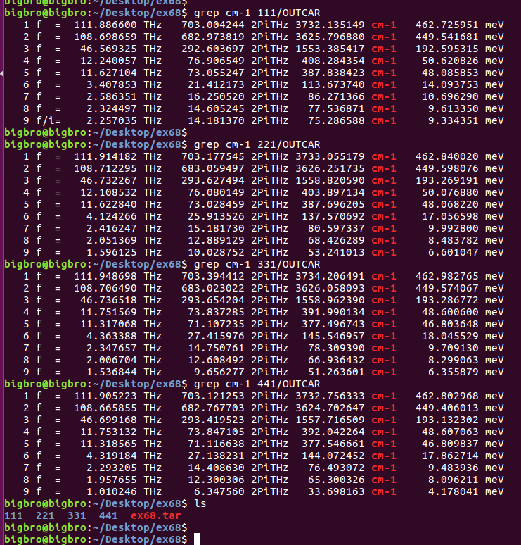
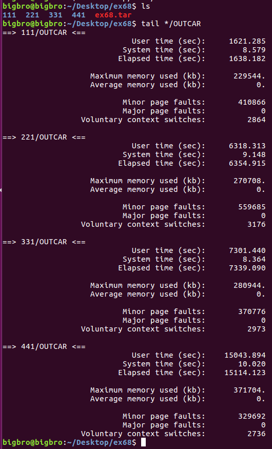
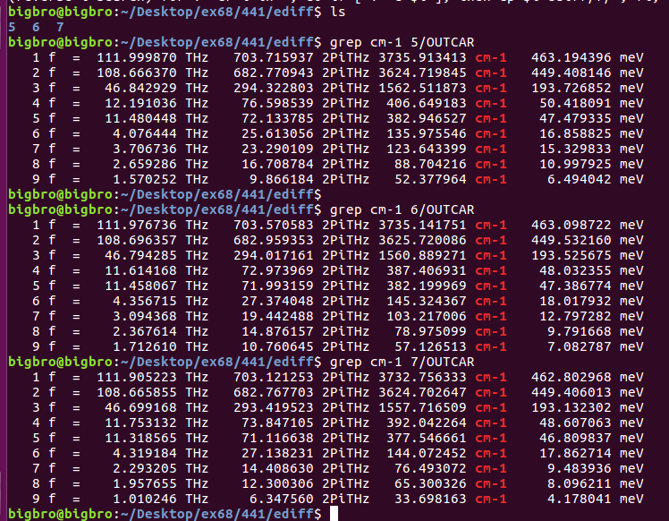
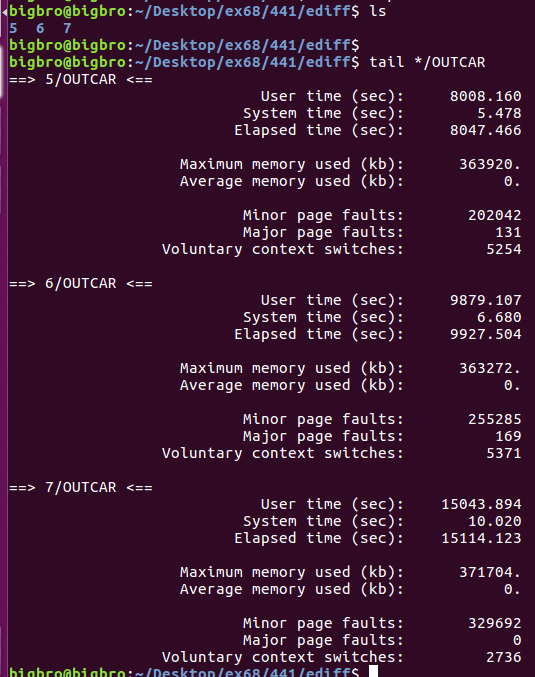
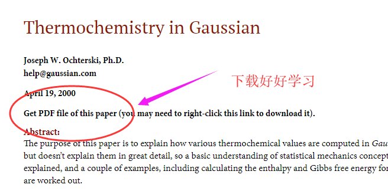
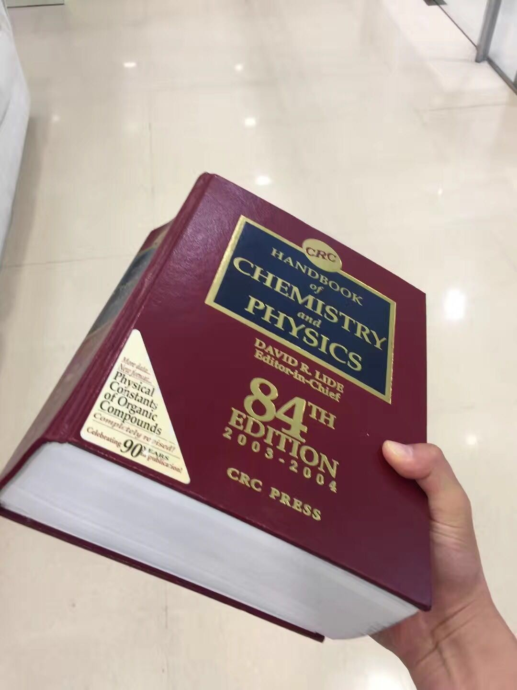
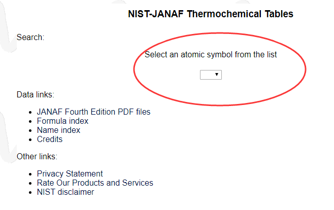
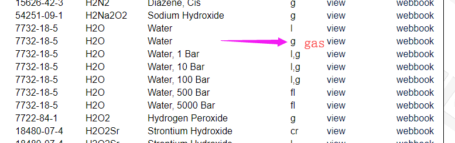
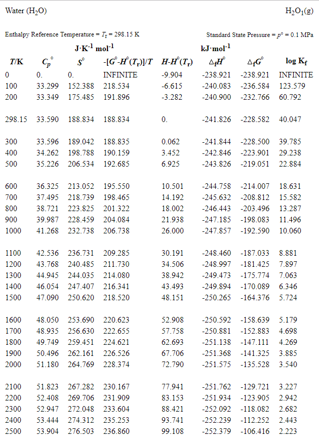

前面几节，我们讲解完成了表面上吸附的计算细节。学习到现在，表面吸附的具体流程，如何简化计算，如何判断优化的结构正确与否，这些都是你应该掌握，并且时刻保持思考的事情。尤其是计算存在N种可能性的时候。当你优化出来最稳定的结构，一定要认真琢磨一番，为什么这个结构比其他的构型稳定？是什么因素导致了这个结构最稳定？ 从本人多年老司机的经验，简单来说：最稳定的结构从骨子里都透着美的气质，也就是比其他结构看起来更加顺眼。

* * *

一旦我们获得了最稳定的结构，就可以进行后面的其他计算了，比如相关的过渡态，与其他分子的吸附能进行对比，与已有的参考文献进行对比，等等。**应公众号阅读和分享冠军的要求**，我们本节以及后面两节要讲解一下吉布斯自由能的计算，这也是物理化学、化学反应中最常见的一个物理量，尤其是对做电化学的筒子们来说，吉布斯自由能的计算是大家都需要牢牢掌握的。物理化学中，我们学到了：G = H – TS。 而对于G的计算，大家普遍卡在S的这个部分。**再次强调**，VASP不可以直接算熵，因此我们需要通过频率来自己计算，而OUTCAR里面的那个entropy不是我们物理化学的熵。本节我们简单介绍一下表面吸附物种的频率计算的一些注意事项，以及气相分子的S的获取以及G的计算

* * *

**1 准备频率计算：**

回顾前面我们讲解的乙醇分子的计算例子，然后进行如下的步骤：

1） 修改INCAR的参数

IBRION = 5

POTIM = 0.015 或者0.01-0.02范围的值都可，闲的没事也可以测试下。

NFREE = 2

NSW = 1  1-10000的值均可，没事也可以测试下。

2） POSCAR: 将表面的原子固定住，使用sed命名，或者自己写个小脚本来处理。

3） KPOINTS，一般来说，很多人都使用和优化过程一样的KPOINTS，但从我个人的经验来看，使用更小的K点来计算则是一个更加有效，节约机时的做法。但前提是你要做足够的测试

4） POTCAR保持不变 （废话，等于没说）

* * *

**2 K点的测试：**

回顾前面谁偷了我的机时系列，思考下面的计算，学会分析节约机时，省钱省力省时间。

1） 我们首先使用111, 221, 331, 441进行测试，然后对比振动频率的不同。EDIFFG 对于所有的计算均为 1E-7。

小技巧1）： 提取频率的波数，对应的能量，使用 grep  cm-1 OUTCAR 这个命令

小技巧2）： 只提取虚频，使用 grep  f/i OUTCAR

下面是我们测试的结果。H2O为三原子非线性的分子，振动的自由度为：3N - 6 = 3; 也就是有三个振动方式。减去的那6个分别为平动和转动。

对比下不同K点振动波数的区别，都在下面图里了，大家自己看下。

上面图中，前三个为振动的一些能量信息，通过对比可以发现：

i）使用 111 的KPOINTS的时候，我们得到了一个虚频，而其他的KPOINTS没有。

ii）对于振动来说，所有的KPOINTS的结果基本保持不变。

* * *

2) 看下不同K值对计算时间的影响。

啥也不想说了，111所花的时间也仅仅是441的一个零头。如果你是个糙哥，111的结果完全够用。如果你是个细心的软男，不敢用111，但又害怕浪费机时，221则是个很好地选择。

* * *

**3 EDIFFG的测试 **

这里之所以测试EDIFFG这个参数，是因为它决定了每一个离子步中电子步的步数。收敛条件越苛刻，需要的时间也就越多。

1） 下面是EDIFFG分别为1E-5，1E-6和1E-7的结果， 所有的计算中：KPOINTS为441

通过上面，你可以发现：EDIFFG  从1E-5到1E-7，振动频率变化很小。这个给我们的启示是，1E-5够用了。

2） 我们看一下时间：

K点都为441的时候，1E-5所花的时间是1E-7的一半。

* * *

**4  思考与测试**

i) 通过前面的测试结果, 是不是就可以说我们可以使用gamma点和EDIFFG = 1E-5结合进行计算呢？

2）测试不同的KPOINTS + EDIFFG， 并且与 441 + EDIFFG = 1E-7的结果进行对比，筛选出最佳的节约机时，而又保证结果准确的参数。

* * *

**5 总结一下表面上频率的计算：**

1） POSCAR， 固定表面

2） 修改INCAR： IBRION， POTIM， NFREE， 以及NSW（可有可无）

3） Play with KPOINTS + EDIFFG，节约机时，省时间去做其他的事情，给老板省钱。

4） 如果收敛困难的体系，可以保存优化步骤的WAVECAR用于下一步的频率计算。

* * *

**6  零点能的计算：**

频率计算完成之后，我们便可以计算零点能了。回顾前面乙醇的例子。这里的振动零点能等于前三个振动模式能量之和，（EDIFFG = 1E-7， KPOINTS=441）的结果为：

（462.8 meV + 449.4 meV + 193.1 meV）/ 2000 = 0.55 eV。

* * *

**7  熵的计算**

 零点能算完之后，我们还可以继续算以算熵。通过振动频率计算熵的做法我们下一节具体讨论。本节先介绍一下气相分子熵的获取。对于H2O来说，有3个平动和3个转动，而VASP在这方面做的实在是太差了。如果你有兴趣，可以翻阅一下**Gaussian**对于熵的计算细节：（**下载链接**：[http://gaussian.com/thermo/](http://gaussian.com/thermo/) ）

我们可以根据这个，手动去计算平动和转动对熵的贡献，但相信大部分人不知道怎么去计算。庆幸的是，气相分子的熵值有热力学数据可以查。这里大师兄推荐2个数据库：

**1）CRC Handbook**

这是本人使用频率最高的数据库了。只要数据库里有的东西，写文章的时候直接引用这本书即可，非常方便。

如果有师弟师妹再问你类似相关的问题，也可以用这本书直接砸砸砸！真可谓是绝世好板砖！

* * *

**2) NIST 数据库 ** 

网址： [https://janaf.nist.gov/](https://janaf.nist.gov/) 

如果你看一些原子热力学或者其他相关的计算，你会发现很多人在这个数据库里面获取熵值。很多人不仔细阅读文献，经常给我抱怨说找不到别人怎么算的。是的，你肯定不知道别人怎么算的，因为人家直接查的表，没有算。下面是这个数据库的简单用法：

1）点击红圈中的箭头： 

2） 出来的下拉菜单中，点下H，然后找到H2O

3） 点view ，你会得到下面的界面：

-

不同温度下的熵值已经在表中了。直接拿过来用，气相的T*S到手！

* * *

**8 吉布斯自由能的计算(气相分子)**

气相分子的吉布斯自由能为： G = H - TS = U + PV - TS = E_DFT + E_ZPE + nRT - TS  （n=1）

i） E_DFT就是我们直接提取的OUTCAR的能量。

ii） E_ZPE 我们计算的气相分子的零点能。（**注意**：是气相的，不是本节中我们算的表面的零点能）

iii）TS 查表获取

iV) 注意单位要统一。

* * *

**9 总结: **

通过本节，你应该学会

1）怎么计算表面吸附物种的振动；

2）计算零点能；

3）知道频率计算中KPONTS和EDIFFG对计算时间和结果的影响；

4）知道怎么去测试它们的影响，并筛选出合理的参数，节约机时；

5）知道气相分子的熵怎么获取；

6）知道气相分子吉布斯自由能的计算。

7） 关于数据库：如果你是

i) 单身狗：如果有心仪的女生问你怎么算气相分子的熵，请一定不要告诉她这两个数据库。自己查了以后告诉她，没准儿她下次还会来问你。大师兄也只能帮到这儿了，剩下的就看你们自己的发挥啦！

ii）单身的小姐姐或者小妹妹：有了这两个数据库就完全掌握了主动权，剩下的就看个人的心情喽。

iii）老板的话，请直接拿板砖砸！