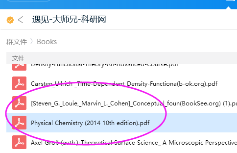
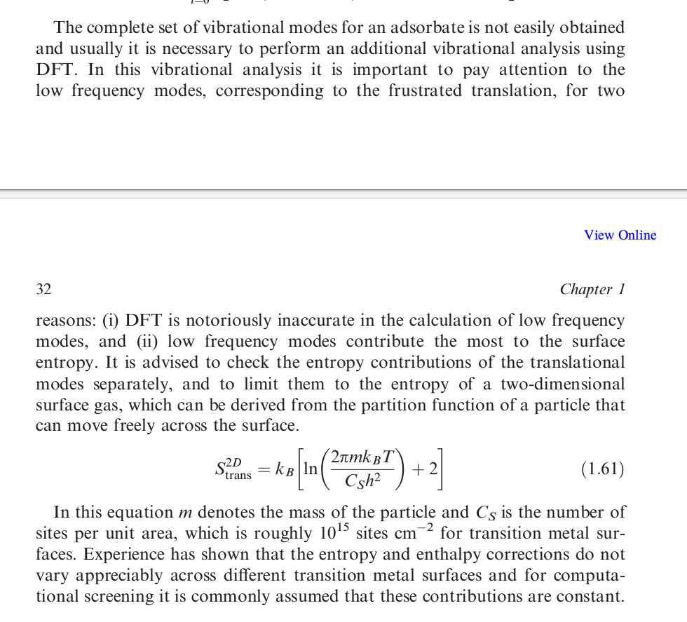

上一节我们知道怎么获取气相分子的熵以及吉布斯自由能的计算。这一节，我们简单介绍一下表面吸附分子熵的计算。

###  复习基础知识 

首先我们应该要知道对一个体系来说，都有哪几部分对熵有贡献。一般熵通过统计热力学计算分子的配分函数来获取：主要有平动，转动，振动，电子以及核这5部分。参考下面的这个链接： http://210.45.168.34:8080/elite/wlhx/jiaocai/C_05.htm 或者找本物化书狂补统计热力学的知识。

1）电子运动的能级间隔很大，除了在几千度以上的高温条件下，电子常常处于基态。一般情况下各激发态对配分函数的贡献都可忽略。

2）原子核的能级间隔极大，在一般的物理和化学过程中，原子核总是处于基态。所以这一项也可以忽略。

3）到现在我们需要考虑的只有平动，转动和振动这三个了。

###  分子从气相到表面吸附的过程 

当分子从气相吸附到表面上，打个不恰当的比喻，就如同图中的苍蝇被粘住在纸板上，因此就不能随便乱飞了，更不用说施展什么空中技巧了。

同样，对分子来说，举个例子，一个非线性的三原子分子，一共有3N个自由度。气相里面为：3个平动，3个转动以及3N-6个振动。但是当它吸附到表面上，由于平动和转动被限制住了，这6个自由度则会转化成振动自由度，也就是在表面上分子有3N个振动模式。如果你可视化表面上吸附分子频率计算的结果，会发现最后6个分别对应的是平动和转动，但它们已经不是气相中的平动和转动了，我们称之为：frustrated translation，frustrated rotation。

（你大妈(平动转动)已经不是十年前的大妈了，你大爷(振动)永远是你大爷）

这两个在表面化学里面是非常令人蛋疼的东西。这个我们后面慢慢讲。至少现在我们知道了，表面的吸附物种有3N个振动方式。所以，平动和转动对熵的贡献也不用管了，直接处理振动即可。（不会算的筒子们小开心下。）

### 通过振动频率来计算Entropy 

振动频率对熵的贡献，随便查阅一本统计热力学的书，都可以找到答案，这里我们的参考书是第十版Atkins的物理化学。

Physical Chemistry 第10版的642页。获取方式：QQ群文件，Books文件下里面就有，自己下载。

  

* * *

图里面圈出来的公式里面，β，h，c，是基本的物理学常数。v （上面加个波浪号）是波数，单位是：m-1。我们就是通过这个公式来计算单个振动模式对熵的贡献。这个很简单，直接把数值带入公式即可，可以摁计算器，也可以用excel等其他工具进行计算。本节，我们分享一个对应这个公式的python小脚本。

通过单个振动频率计算熵的小脚本，图里面的98.485是错的，应该是96.485，kJ/mol 转换为 eV的常数。

脚本解释：

i）VASP得到的频率波数是cm-1，这也是大家所习惯接受的，所以在12行，单位要乘以100先将 cm-1 转化成m-1。

ii） 剩下的14-19行是一些基本的物理量，我们默认温度是300K;

iii) 21-27行：是我们定义的一个计算熵的小函数。

x_i 是书里面的 βhcv

pf_l和pf_r 是花括号里面，减号左面和右面的部分

pf 得到的是花括号的结果

然后entropy 是 pf * R

iv）29-31行就是调用函数，然后输出S, TS部分了。这里S的单位是 J K-1mol-1。TS 的单位是我们熟悉的eV。

v）自己对着图片输入一遍就可以得到脚本了，不要问我要现成的。如果自己照着抄的脚本运行出现错误，反复跟图片里面的进行对比，然后进行修改。

* * *

###  熟悉不同的振动频率对熵的贡献 

有了这个小脚本，我们就可以计算任何振动频率对熵的贡献了。一般来说，我们VASP的频率计算会有3N个波数，我们需要做的就是挨个算（虚频除外），然后求和即可。这里，大师兄想强调的并不是如何去通过这些频率去算熵（相信到现在你也已经学会了），而是要了解频率大小对熵的贡献程度。下图是我们计算了不同波数（从10到500 cm-1）的振动所对应的熵，以及TS, 单位分别为：J K-1mol-1 和 eV。

通过上图的结果，你会发现：当波数越小的时候，TS越大，随着波数增加，TS越来越小，在490 cm-1, 300K 的时候,连0.01eV都不到。一般来说，正常的振动频率（3n-6，过去以及现在的大爷那部分）对熵的贡献，基本上就可以忽略掉了，因为一般来说正常的频率波数在400-3000cm-1范围之间。

我们现在知道，波数越小，他们对熵的贡献也就越大，而前面我们说的frustrated translation 和 rotation，它们恰恰具有很小的波数，尤其是frustrated translation这部分，大部分都在50cm-1以下，因此他们对熵的贡献不能忽略。然而，它们既有体相声子谱的一些特征，也有气相分子的平动和转动的样子。因此在处理的时候，要小小心心地将它们剥离开来，非常令人蛋疼。正所谓：雄兔脚扑朔，雌兔眼迷离；双兔傍地走，安能辨我是雄雌？

另一方面：由于它们的波数很小，而VASP在小波数这部分的计算很烂，软件计算的结果也会导致很大的误差产生。一般来说大家都直接放弃，忽略这部分了。当然这样的理由很多人不服，明明知道它们波数小，对熵的贡献大，却又不得不忽略。这里，大师兄再给你另外一个解释：摘自Computational Catalysis (RSC) 这本书的第32页。如下：

在这里建议我们将平动单独处理，假设的是分子在二维平面内可以运动。也就是说只损失了一个方向的自由度。经验告诉我们，对不同的过渡金属表面来说，平动部分对熵的贡献可以作为一个常数来处理。所以，又可以不考虑了…. 以上是大家一般都不考虑这部分的贡献的原因。当然，你也可以根据上面的公式计算frustrated translation对熵的贡献，然后其他的按照振动来处理即可。

如果你对这一部分感兴趣，可以参考下这些人的工作：

1） Campbell 这个牛牛的JACS，还有一篇Chemical Review，大家自己找下。

2） 最新的一篇JPCC

3） Tamkin 这个软件的作者以及她发表的一些文章： [http://molmod.github.io/tamkin/](http://molmod.github.io/tamkin/) 

4）Norskov 这个牛牛的一本书：Fundamental Concepts in Heterogeneous Catalysis （群文件也有，自己去找）

[https://onlinelibrary.wiley.com/doi/book/10.1002/9781118892114](https://onlinelibrary.wiley.com/doi/book/10.1002/9781118892114) 

注意： 在这本书里的P33页，不同的吸附位点，构型数目，也会对熵有贡献：如下图：

这个的贡献不是很大，如果你的覆盖度为1/9的时候，R * ln((1/9) / (8/9)) = R * ln (1/8)， 300K的时候，TS = 300 * 8.314 * ln (1/8) / 1000 / 98.485 = 0.053 eV。差不多可以忽略掉。

### 再提零点能 

师兄，既然前面的frustrated的平动和转动我们都忽略了，那么他们的零点能矫正的时候还用不用考虑。

答：小波数范围对零点能的贡献很小，一般来说，考虑或者不考虑它们的贡献，无关紧要。本人一般直接都加上。

### 思考 

1）表面化学中，熵的贡献主要在吸附/脱附的阶段，因为分子损失/获得了大部分的平动和转动，对于表面吸附物种的熵：

i）3N-6的振动部分贡献很小，可以忽略不计；

ii）Frustrated rotation 大约在200-400cm-1左右，也可以和振动部分一起忽略；

iii）Frustrated translation部分，可以近似为二维平动来处理。也可以忽略，一般来说：忽略 是大家普遍的做法。如果理论基础不扎实，只想简单算算，那么你的腰椎间盘还是不要突出为妙。

iv）表面吸附位点的数目对熵的贡献，基本也可以忽略。

2） 而在表面反应的阶段，我们计算反应热和活化能的时候通过下面的公式：

ΔE = E(FS) – E(IS)；

Ea = E(TS) – E(IS) 

这两个量的计算都是通过相减来得到的，而这个相减的过程中：

i）大部分熵的贡献可以被抵消掉了；

ii）小波数范围内零点能的矫正部分也会被抵消掉，所以零点能校正的时候，大胆地直接地把非虚频的部分直接加起来就可以了。

iii）如果你不信，那么可以通过频率计算一下IS，FS，或者TS的熵，然后计算矫正过的ΔE, Ea，会发现熵的贡献很小很小，所以一般大家都直接考虑零点能，而不考虑熵的贡献，如果有审稿人问你这个问题，用脚本算一下，回答审稿人说影响不大就是了。

3）总结：表面吸附物种的熵，一路忽略，结果就是啥也不算… 不过，不算归不算，但背后的原因或者依据你得搞明白。