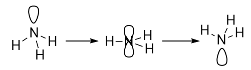
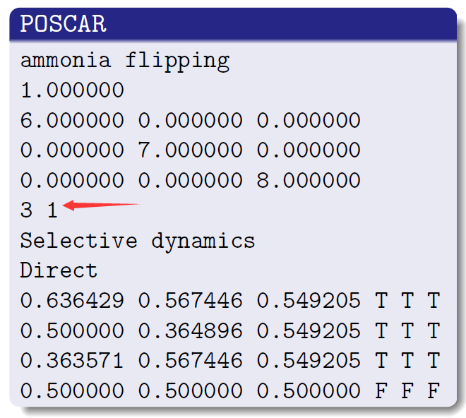
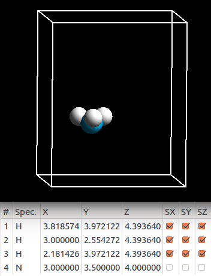
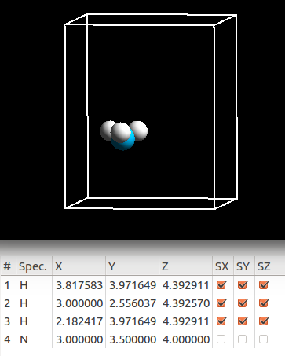
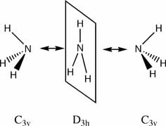
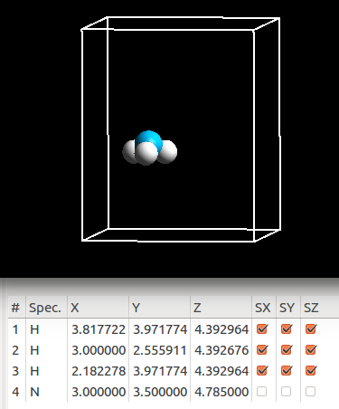
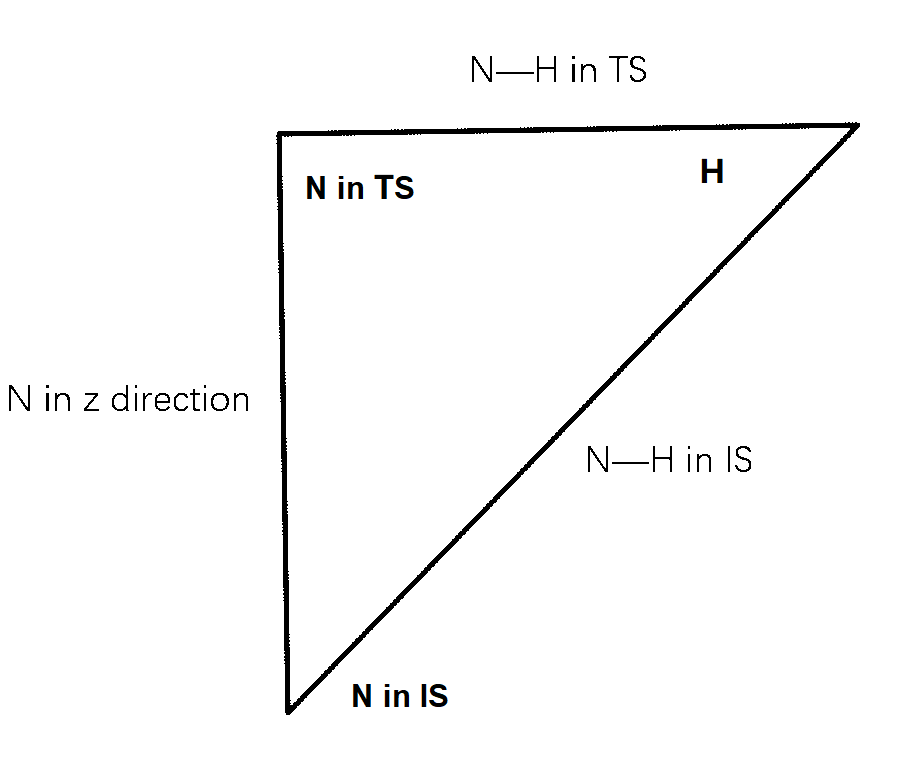
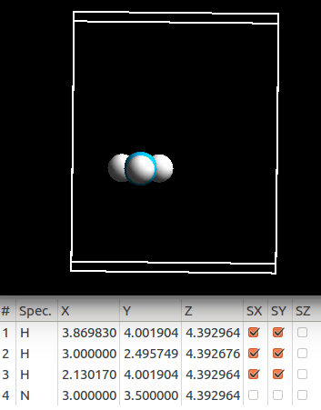
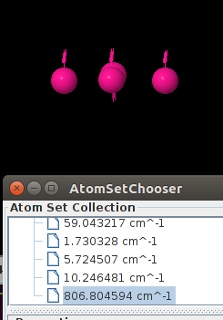

从本节起，我们开始学习下过渡态相关的计算。在进行下面的讲解之前，大家务必要记住这两点：

* 1） 过渡态只是一个结构而已，过渡态的计算并不是你想象的那么神秘；也就是计算很容易。

* 2）物理化学，结构化学书中的过渡态相关的基本知识要掌握，也就是你的理论基础要扎实。感觉基础不好的，认真看书。


### 过渡态计算的例子 

我们遵循一个从简单到复杂的顺序，慢慢介绍一下表面化学中过渡态的一般计算思路和方法。简单的例子，本节我们选取的是VASP官网的经典计算：NH<sub>3</sub>的翻转，如下图：



如果你不太懂这个过程，可以把NH<sub>3</sub>看做一把雨伞。翻转的过程，就相当于大风把伞吹翻。


对于这个计算的一些参考资料，大家可以点下面这两个链接：

1） [http://www.vasp.at/vasp-workshop/tutorials/tutorial_ammonia_flipping.pdf](http://www.vasp.at/vasp-workshop/tutorials/tutorial_ammonia_flipping.pdf)

Vasp官网的一个PPT介绍，这个PPT有些年头了，不过对于我们学习还是很有帮助的。建议看完PPT里面的内容（最好是自己练习一遍后），再继续下面的学习。

2） [https://cms.mpi.univie.ac.at/wiki/index.php/Category:Examples](https://cms.mpi.univie.ac.at/wiki/index.php/Category:Examples)

VASP wiki网页中关于过渡态计算的例子。

* * *

### 过渡态计算：初末态结构的优化。

过渡态计算的第一步：我们要知道自己想算什么，需要准备什么？

算过渡态，肯定指的是某一个反应或者过程的过渡态。过渡态的两边也分别对应着反应物和反应产物。所以，算一个反应的过渡态，不管计算过程如何，我们最终都会有三个结构：初始和末态结构，以及过渡态。初末态的结构和前我们已经讲过的优化过程是一样的，我们先回顾一番。

* * *

#### 初态结构的优化

**1）搭建结构（POSCAR）**


该图中的三个结构分别对应的是NH3翻转的初始，过渡态以及末态结构。这里反应物和产物都是NH3。首先，我们肯定要有一个NH3的结构。这里大师兄就直接复制PPT里面的坐标快速制备一个POSCAR。



注意： PPT里面没有写元素符号，大家记得自己加上。下图是本人复制后制作的POSCAR。 （添加了元素行，Cartesian坐标。）

```
ammonia flipping
1.0
 +9.0000000000  +0.0000000000  +0.0000000000
 +0.0000000000 +10.0000000000  +0.0000000000
 +0.0000000000  +0.0000000000 +11.0000000000
H N
 3 1
Selective
Cartesian
 +3.8185740000  +3.9721220000  +4.3936400000  T T T
 +3.0000000000  +2.5542720000  +4.3936400000  T T T
 +2.1814260000  +3.9721220000  +4.3936400000  T T T
 +3.0000000000  +3.5000000000  +4.0000000000  F F F
```



* * *

**2） 准备输入文件（INCAR）**

优化NH$_3$的初始结构：(回顾气相分子计算需要注意的地方)

```
System = NH3
ISMEAR = 0
SIMGA = 0.01

ALGO = FAST
ENCUT = 450
EDIFF = 1E-5

NWRITE = 0
LWAVE = .FALSE.
LCHARG = .FALSE.

IBRION = 2
POTIM = 0.1
EDIFFG = -0.02
NSW = 100
```


**3） 准备输入文件（KPOINTS）**

```
K-POINTS
 0
Gamma
 1 1 1
 0 0 0
```

**4） 准备POTCAR 并提交任务**

**5) 优化完的结构：**



只需要几步优化就完成了。这是因为我们复制的别人的（VASP官网例子）结构，因为这些结构已经被优化过了。即我们优化过程有一个很好的猜测结构。

这给我们的启发就是：在你开始计算的时候，一定要善于利用前人的或者自己前面的计算结构。这会大大节省我们的计算工作量。

* * *

#### 末态结构的搭建优化 

在上面结构的基础上，我们很容易搭建初末态的结构。仔细观察这个图，我们可以保持H原子的坐标不变，只需要将N原子的坐标修改一下。初始结构里面，三个H原子在xy平面上，

N与H原子z方向的距离为0.3929 Å。如果N原子翻转过去，那么它的坐标将会是：

4.3929 + 0.3929  = 4.7858 Å。



**自行将这个图顺时针旋转90°**



然后跟前面同样的方法，优化一下就可以了。


#### 过渡态结构的优化 


上图中，我们可以发现，过渡态是一个平面的结构，我们可以按照前面末态结构搭建的思想弄一个初始的过渡态结构出来。即直接将N原子的z方向坐标修改成H原子的。如下图：


对比下前面初末态结构的坐标，你会发现Z 方向上被固定住了（最后一列SZ没有选择）

```
+3.8177218605  +3.9717738141  +4.3929644172  T T F
+3.0000000000  +2.5559112549  +4.3926756556  T T F
+2.1822781395  +3.9717738141  +4.3929644172  T T F
+3.0000000000  +3.5000000000  +4.3929644172  F F F
```

这样做是强制优化过程中，所有的原子都在xy平面上。我们只优化H原面的坐标。原因如下：



这个三角形对应的就是我们从初始结构（IS）搭建过渡态结构（TS）的过程。在初始结构里面，N在三角形最下面，H在右边的点上，当我们人为把N原子放到H平面上的时候，N从下面的点移动到上面，导致N—H 键变短（从1.022 减小到0.944 Å）。但这个变短的过程是我们人为搭建结构所导致的。所以我们要把H原子在xy表面上放开，继续优化一下。参数（ICNAR，POTCAR， KPOINTS）保持不变，提交优化任务，最终我们的过渡态结构如下：



N, H 在同一平面内，N—H 键长为：1.004 Å

* * *

###  频率计算：（过渡态的验证办法之一）

验证一个算完的过渡态是不是真正过渡态的时候，我们需要用到频率计算。因为过渡态只有一个虚频。（自己看书去学习为什么只有一个虚频？）复习下前面我们讲过的频率计算的细节：

```
IBRION = 5
POTIM = 0.015
EDIFF = 1E-6
NFREE = 2
NSW = 1
```


5）此外，我们需要另外加一个无关痛痒的参数：NWRITE = 2 （或者不设置，默认值是2）

大师兄本人喜欢用NWRITE = 0 。但当参数为0，使用Jmol可视化频率计算结果的时候：你会发现所有的原子都是同一个颜色，如下图：



当使用NWRITE的默认值2的时候，则是正常的：这是因为NWRITE = 0 写入的OUTCAR的数据太少，Jmol无法获取元素相关的参数用来可视化。此处，特别感谢群里的：**连赞小朋友**帮忙分析.


提取频率相关的参数，可以使用下面的命令：

grep cm-1 OUTCAR 提取所有的频率（检查频率结果推荐使用）

grep 'i='  OUTCAR  提取所有的虚频 （基本没啥用）

grep 'f  =' OUTCAR 提取所有的非虚频 （计算零点能推荐使用）

Jmol中所有的虚频都在最下面，大家可以根据前面的grep命令的结果和Jmol的界面对比下。本计算一共有3个虚频： 5.7, 10.2和806.8 cm<sup>-1</sup> 。前面2个虚频很小，直接不管就可以了。


### 总结：

算到这里，NH<sub>3</sub>翻转的过渡态我们就已经讲完了。本节采用的是直接优化的方法获取过渡态的结构，适用于一些非常简单的体系或者你已经非常熟悉的过渡态结构。回到开头我们讲的那句话，过渡态只是一个结构而已，我们需要做的就是如何通过一些计算的技巧和方法来获取这些结构。很多人一提到过渡态就会想到使用VTST编译的VASP程序算NEB（Nudged Elastic Band method）以及CI-NEB (Climbing Image NEB)，其实NEB和CI-NEB也仅仅是大家常用的一个方法而已，除此之外，还有很多。

**最关键的**就是通过结构化学的基础知识来搭建、计算并判断这些过渡态结构背后的物理化学意义，通俗点说就是：算的对不对，你要自己心里有个数。

很多人会说算过渡态要通过频率来验证，其实这一步只是前面一步的副产物而已。只要你的化学基本功底深厚，加以训练，就可以准确判断反应的路径。

本节计算例子的下载： 链接：[https://pan.baidu.com/s/1hHGhrOlxMik8NBUqEzolwQ](https://pan.baidu.com/s/1hHGhrOlxMik8NBUqEzolwQ)   密码：2dw5