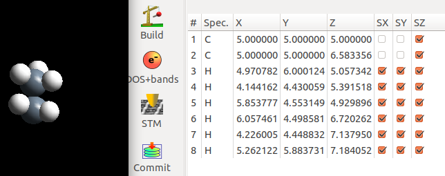
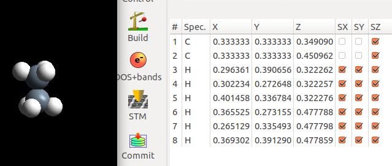
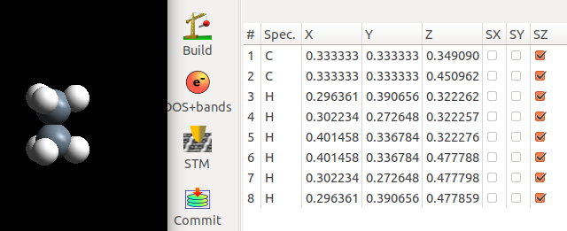
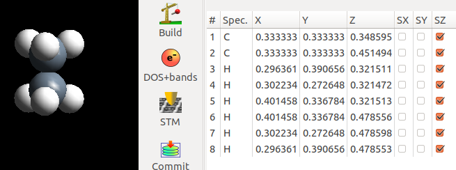
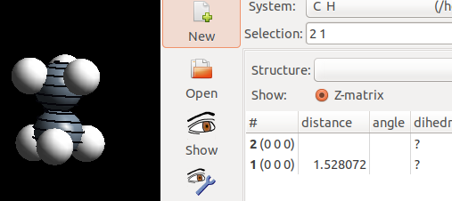
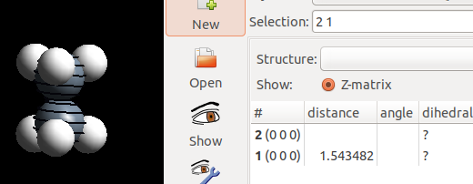
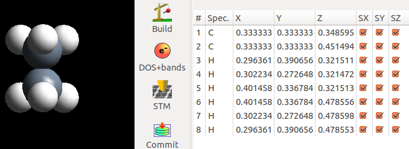
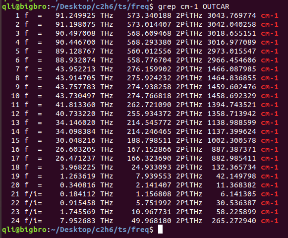
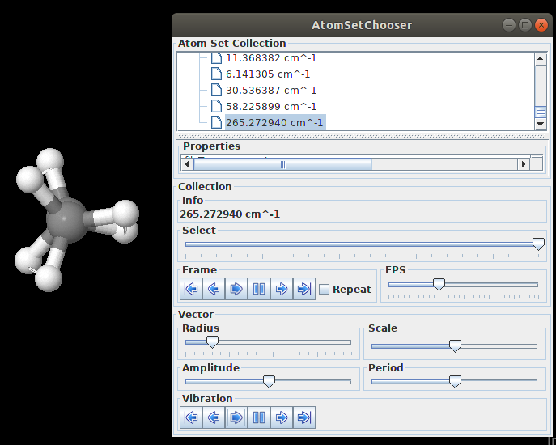

前面一节我们讲了直接优化NH3翻转的过渡态。这一节我们继续直接优化过渡态的介绍。计算乙烷分子（CH3CH3）绕C—C键旋转的过渡态。我们知道：乙烷有交错式和重叠式构型。而重叠式能量较高。想象乙烷分子绕着C—C旋转，从交错式到重叠式，再到交错式这一个过程。很容易就得到这个结论：重叠式的结构就是过渡态。所以，如果计算这个过渡态的工作就转化成了优化重叠式的构型。这也是本节的一个主要思想。

* * *

### 手动搭建初始的乙烷构型。

首先，我们要搭建一个初始的乙烷构型。把C—C键的两个C平行于z轴。思考一下：

1）  我们为什么要这样做？

2）  乙烷构型网上到处都是，随便下载一个就可以直接拿来使用，如果将任意取向的结构转化为C—C 键平行于z轴的结构呢？

下面是我们搭建的乙烷结构，并优化的结果。优化过程中，两个C原子在xy方向的坐标被固定住了。

很显然，我们的初始结构经过优化后转变成了交错式的构型。

* * *

###  搭建过渡态的初始构型

在重叠式的结构中，乙烷分子的两个CH3关于穿过CC轴的xy平面是对称的。所以，我们将上面CH3中H原子的xy坐标修改的和下面部分一样。

**注意：**

1）  只修改xy坐标，z坐标保持不变

2）  观察图中：3和8， 4和7， 以及5 和6 的xy坐标。

3）  固定xy坐标，直接优化z方向

下面是优化完的结果：计算很快就收敛了。

* * *

###  对比一下交错式和重叠式C—C的键长：

在重叠式中，C—C 稍微拉长了一点。

###  频率计算

在频率计算的时候，本人把所有的原子都放开了，如下图：

通过命令发现，有个256 cm-1的虚频。使用Jmol可视化一下：

过渡态计算完毕。

* * *

### 总结

大家等了很久，看完肯定会对本节失望。但过渡态计算里面的一些技巧很多都是自己琢磨出来的。比如我们将分子沿着平行z轴的方向放置，根据对称性手动搭建过渡态的结构，以及固定坐标，选择性地优化等。还是那句话：过渡态只是个结构，我们需要做的就是通过各种各样的办法来实现快速优化这个结构的目的。

本节计算例子下载链接: [https://pan.baidu.com/s/18TdaLhWnz4_IDMjJJGBMFw](https://pan.baidu.com/s/18TdaLhWnz4_IDMjJJGBMFw)   密码: ugjt