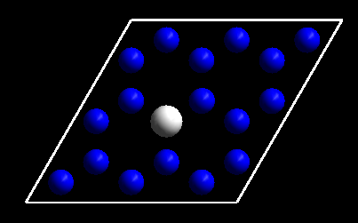

不好意思，让大家久等了。最近一直很忙，后面还是会很忙。为了不让大家失望，抽时间把简单的过渡态计算讲解一下，这一节我们需要学习的是通过CI-NEB（Climbing Image Nudged Elastic Band）计算H原子在Ru(0001)表面上的扩散过程。

### NEB计算过渡态的准备工作 

**准备工作1：**

说到NEB或者CINEB，不得不提的就是Henkelman课题组的VTST：[http://henkelmanlab.org/](http://henkelmanlab.org/) . 我们需要下载VTST的code，然后将VASP编译一下，得到一个可以使用vtst的VASP版本。

链接：[http://theory.cm.utexas.edu/vtsttools/download.html](http://theory.cm.utexas.edu/vtsttools/download.html) 

很不幸，怎么编译，我一窍不通。如果这一关过不了的话，后面的也只能看看热闹，不能亲自实践了。如果你已经编译好了VTST的VASP版本， 那么就可以继续下面的学习了。

**准备工作2：**

我们将VTST的一些实用小脚本下载下来：[http://theory.cm.utexas.edu/vtsttools/download.html](http://theory.cm.utexas.edu/vtsttools/download.html) 

 

下载VTST Scripts后解压，把所有脚本都复制到 ~/bin 目录下：效果如下:

很多脚本估计你一辈子都不会用到，没关系，它们很小，不占存储空间，静悄悄躺在bin文件里面就行了。Linux老手们嫌烦可以把这些脚本放到一个文件夹里面，然后bashrc文件里面修改下路径就可以了。

**准备工作3**：

修改nebresults.pl 文件，将57到71行注释掉，注释掉就是在每一行的开头加个#号，效果如下：

为什么需要这么做？

如果neb运行的时候，你使用这个命令，它就会把你的OUTCAR文件压缩，VASP找不到OUTCAR，就不知道该往哪里存储，然后就挂掉了。大家可以在neb任务运行的时候分别运行下注释前后的脚本，对比下就清楚了。

###  扩散的基础知识 

准备工作完成，我们加深下扩散（diffusion）的一些概念：

2.1  扩散我们高中的时候应该就学习过了。具体的定义这里不讲了。大家自行参考教科书或者维基百科：链接如下：

[https://en.wikipedia.org/wiki/Diffusion](https://en.wikipedia.org/wiki/Diffusion) 

对于分子在表面上的扩散，就跟我们在校园里瞎晃悠是一样的。哪天指不定遇到个对上眼的美女，过渡态就要开始了。

2.2  具体到分子在金属表面上的扩算，一般来说，扩散的能垒差不多是吸附能的12%左右。这里我们说的吸附能，指的是最稳定的那个结构所对应的。

为什么是12% 呢？ 这只是一个经验性的结论，大家可以参考大牛Manos Mavrikakis的俺狗娃文章: (不要留言问我要这个文章…)

A Simple Rule of Thumb for Diffusion on Transition-Metal Surfaces

[https://onlinelibrary.wiley.com/doi/abs/10.1002/anie.200602223](https://onlinelibrary.wiley.com/doi/abs/10.1002/anie.200602223)

2.3  从结构角度来看，举个面心立方的金属(111)面为例，表面上有fcc, hcp, top, 和 bridge这四个位点。如果fcc或者hcp的位点对应稳定的吸附构型，那么bridge的这个位点就是扩散的过渡态。所以，如果你想简单算一个扩散的过渡态，直接算bridge的吸附就可以了。但是，bridge的位点也不是那么容易就可以算出来的。前面我们讲过Cu(111)表面的吸附计算，很多人就反应bri的结构优化不出来。Bridge 的位点就跟下面的这个独木桥类似，少一不小心就掉下去了。

换个角度来分析：既然我们直接优化得不到bridge的结构，而这个结构恰恰就是过渡态，那么我们就可以使用算过渡态的方法来得到bridge的结构。当然，能直接优化出来bridge的结构是最好的。

### 过渡态计算的步骤

3.1 第一步：优化初始和末态结构。

 首先我们先优化一个扩散前后的两个结构： H在FCC和HCP位点上的吸附。这个对于认真练习过前面计算的筒子们来说就是小菜一碟了。直接列出来top view 的示意图：

FCC site

 HCP site

3.2 第二步：准备NEB的结构

这里我们需要用到VTST官网的一个小脚本：nebmake.pl，使用方法如下： 

`nebmake.pl   IS  FS  N`

1）  敲命令nebmake.pl

2）  IS 指的是初始结构:

3）  FS指的是末态结构

4）  N 指的是你要插点的个数。

**细节1：**

IS, FS 是VASP的POSCAR或者CONTCAR。

可以是其他目录里面的POSCAR或者CONTCAR, 也可以是当前目录下的POSCAR或者CONTCAR。 

你可以把初始结构的POSCAR命名成你的名字：bigbro ， 末态命名成：bigbra. 运行的时候命令应该这么敲：`nebmake.pl   bigbro  bigbra  8`

下面图里面的三个事例，是等价的。自己随意领会：

**细节2：** 

插入的点数要保证可以被使用的核数整除。比如我们打算用24个核进行计算，那么N可以是下面的几种情况：

<table style="width: 618px;" cellspacing="0" cellpadding="0"><tbody><tr class="firstRow"><td style="border: 1px solid windowtext; padding: 0in 7px;" width="189" valign="top">
N
</td><td style="border-color: windowtext windowtext windowtext currentcolor; border-style: solid solid solid none; border-width: 1px 1px 1px medium; border-image: none 100% / 1 / 0 stretch; padding: 0in 7px;" width="189" valign="top">
Cores used for each Image
</td><td style="border-color: windowtext windowtext windowtext currentcolor; border-style: solid solid solid none; border-width: 1px 1px 1px medium; border-image: none 100% / 1 / 0 stretch; padding: 0in 7px;" width="189" valign="top">
Total
</td></tr><tr><td style="border-color: currentcolor windowtext windowtext; border-style: none solid solid; border-width: medium 1px 1px; border-image: none 100% / 1 / 0 stretch; padding: 0in 7px;" width="189" valign="top">
1
</td><td style="border-color: currentcolor windowtext windowtext currentcolor; border-style: none solid solid none; border-width: medium 1px 1px medium; padding: 0in 7px;" width="189" valign="top">
24
</td><td style="border-color: currentcolor windowtext windowtext currentcolor; border-style: none solid solid none; border-width: medium 1px 1px medium; padding: 0in 7px;" width="189" valign="top">
24
</td></tr><tr><td style="border-color: currentcolor windowtext windowtext; border-style: none solid solid; border-width: medium 1px 1px; border-image: none 100% / 1 / 0 stretch; padding: 0in 7px;" width="189" valign="top">
4
</td><td style="border-color: currentcolor windowtext windowtext currentcolor; border-style: none solid solid none; border-width: medium 1px 1px medium; padding: 0in 7px;" width="189" valign="top">
6
</td><td style="border-color: currentcolor windowtext windowtext currentcolor; border-style: none solid solid none; border-width: medium 1px 1px medium; padding: 0in 7px;" width="189" valign="top">
24
</td></tr><tr><td style="border-color: currentcolor windowtext windowtext; border-style: none solid solid; border-width: medium 1px 1px; border-image: none 100% / 1 / 0 stretch; padding: 0in 7px;" width="189" valign="top">
6
</td><td style="border-color: currentcolor windowtext windowtext currentcolor; border-style: none solid solid none; border-width: medium 1px 1px medium; padding: 0in 7px;" width="189" valign="top">
4
</td><td style="border-color: currentcolor windowtext windowtext currentcolor; border-style: none solid solid none; border-width: medium 1px 1px medium; padding: 0in 7px;" width="189" valign="top">
24
</td></tr><tr><td style="border-color: currentcolor windowtext windowtext; border-style: none solid solid; border-width: medium 1px 1px; border-image: none 100% / 1 / 0 stretch; padding: 0in 7px;" width="189" valign="top">
2
</td><td style="border-color: currentcolor windowtext windowtext currentcolor; border-style: none solid solid none; border-width: medium 1px 1px medium; padding: 0in 7px;" width="189" valign="top">
12
</td><td style="border-color: currentcolor windowtext windowtext currentcolor; border-style: none solid solid none; border-width: medium 1px 1px medium; padding: 0in 7px;" width="189" valign="top">
24
</td></tr><tr><td style="border-color: currentcolor windowtext windowtext; border-style: none solid solid; border-width: medium 1px 1px; border-image: none 100% / 1 / 0 stretch; padding: 0in 7px;" width="189" valign="top">
12
</td><td style="border-color: currentcolor windowtext windowtext currentcolor; border-style: none solid solid none; border-width: medium 1px 1px medium; padding: 0in 7px;" width="189" valign="top">
2
</td><td style="border-color: currentcolor windowtext windowtext currentcolor; border-style: none solid solid none; border-width: medium 1px 1px medium; padding: 0in 7px;" width="189" valign="top">
24
</td></tr><tr><td style="border-color: currentcolor windowtext windowtext; border-style: none solid solid; border-width: medium 1px 1px; border-image: none 100% / 1 / 0 stretch; padding: 0in 7px;" width="189" valign="top">
3
</td><td style="border-color: currentcolor windowtext windowtext currentcolor; border-style: none solid solid none; border-width: medium 1px 1px medium; padding: 0in 7px;" width="189" valign="top">
8
</td><td style="border-color: currentcolor windowtext windowtext currentcolor; border-style: none solid solid none; border-width: medium 1px 1px medium; padding: 0in 7px;" width="189" valign="top">
24
</td></tr><tr><td style="border-color: currentcolor windowtext windowtext; border-style: none solid solid; border-width: medium 1px 1px; border-image: none 100% / 1 / 0 stretch; padding: 0in 7px;" width="189" valign="top">
8
</td><td style="border-color: currentcolor windowtext windowtext currentcolor; border-style: none solid solid none; border-width: medium 1px 1px medium; padding: 0in 7px;" width="189" valign="top">
3
</td><td style="border-color: currentcolor windowtext windowtext currentcolor; border-style: none solid solid none; border-width: medium 1px 1px medium; padding: 0in 7px;" width="189" valign="top">
24
</td></tr></tbody></table>

**注意：**

表中最后一个很可能会出错，因为你用3个核来计算一个image.  上面说的不是绝对的，具体要根据自己的服务器和习惯来设置。

本人使用4个节点（每个节点12个核，共48个核）进行计算，一般N设置位4或者8.

**细节三：** 

同样核数下，N设置的越大，计算每个image所需要的核数就会减少，导致计算变慢。

N需要怎么设置才好呢？ 

一方面需要大家去咨询一些现成的经验：问问师兄师姐，没有师兄师姐，就在现有的条件下自己去摸索摸索。当然这需要耗费大量的时间和精力，也不符合当下很多人急于速成的心态。

我们着重讲解另一个方面，也就是你对自己研究体系的掌控性。个人感觉分两点：

1）反应过程结构变化的理解，这需要我们在前面初末态的优化上下功夫；

2）化学键的理解：对一个化学键来说，它断裂时候的过渡态键长应该在这个化学键的1-2倍之间。1 指的是这个化学键本身，2指的是这个键被拉长了2倍。你肯定会说我在扯蛋，如果更经验性一点，应该在1.5倍左右。掌握这个这有助于你第一眼去判断自己的过渡态对不对。当然，1.5只是个粗糙的数值，不同的键会有不同的经验性数值。

**3.3 第三步: 检查初末态结构的原子坐标是否是一一对应。**

这是很多人算过渡态经常忽略的一步，有时候也是很费精力的一步。一个人是不是在闭着眼瞎算，从这一步基本上就可以看出来了。这里大师兄推荐一个linux下检查结构的方法。 命令：p4v 0*/POSCAR   一次性打开所有的Image结构，然后逐个点开，查看整个反应轨迹进行检查。

###  扩展练习 

本节我们需要做的很简单

1） 浏览VTST的网站，阅读相关过渡态计算的步骤以及CI-NEB相关的文献；

2） 下载VTST的脚本，复制到~/bin文件夹，修改nebresults.pl脚本；

3） 计算H在FCC 和HCP的吸附；

4） 使用脚本生成NEB计算的Images文件。

5） 使用脚本生成前面两节：NH3翻转，以及乙烷旋转的Images文件。

###  总结

本节应该够新手们练习一阵子的了，下一节，我们介绍怎么把NEB的计算运行起来。

