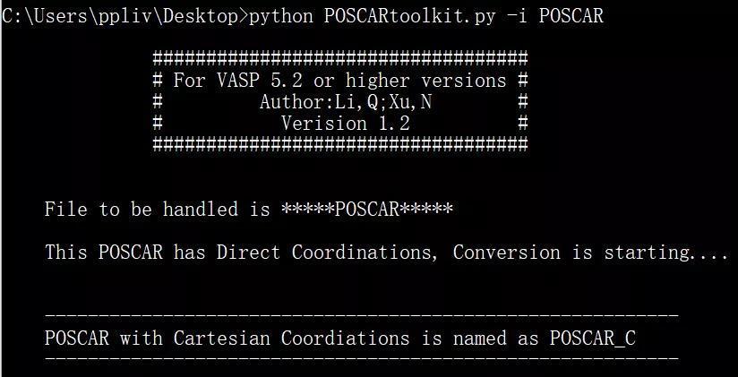
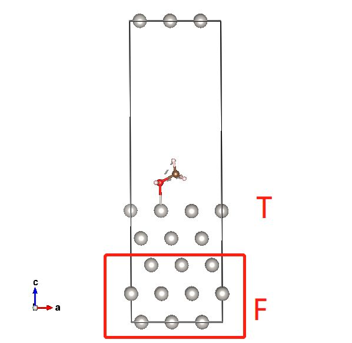
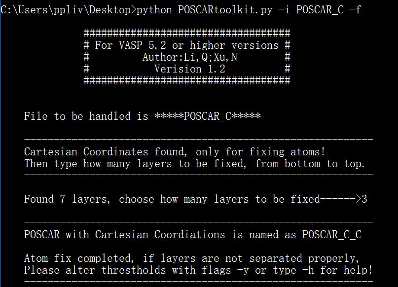
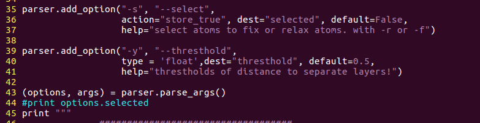
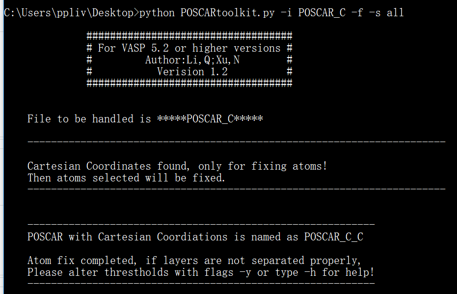
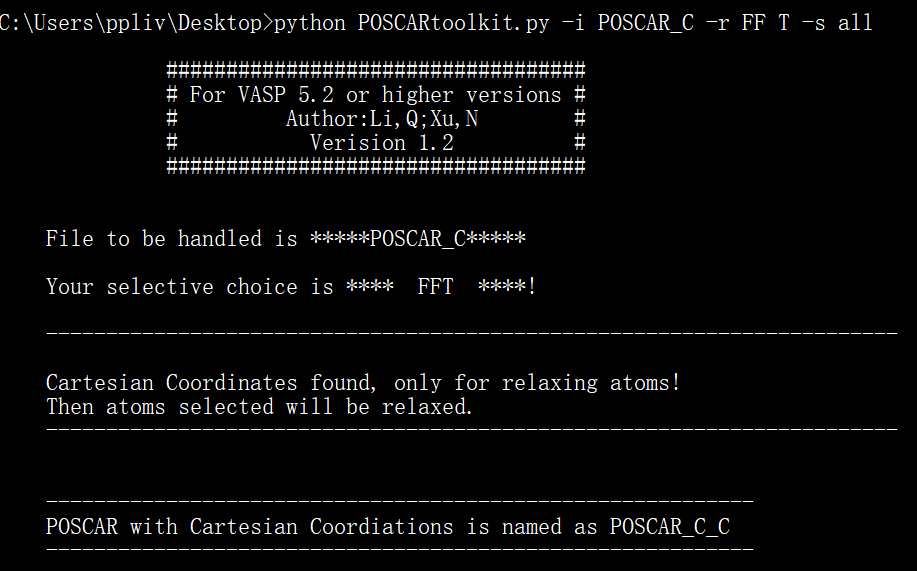

在学习下面neb的计算前，思考了很久，感觉有必要先给大家介绍一个非常实用的python小脚本，经历过反复的修改，最终在群友小塔玛斯的努力下，完成了一个稳定的过渡态计算中非常实用小脚本：`POSCARtoolkit.py`

本节我们介绍一下这个脚本的具体使用方法。

### 版本和版权问题：


版本：

这个脚本有2个版本，分别适用于python3和python2的2.6及以上版本。

大家根据自己使用的python版本进行下载，如果运行的时候出现错误，请先检查是不是版本的问题。链接:https://pan.baidu.com/s/1JJHVM27NdIC-uZlxzlg-Mg   提取码:mt7e

 

版权问题：

这个脚本大家随便实用，如果感觉不错，碰到作者时，请他吃顿饭。作者坐高铁买不起盒饭时，在任何QQ群里呼救时，使用者需慷慨解囊，集资把盒饭钱凑够。

如果不接受这个条款，请自觉不使用该脚本。


###  使用前的准备工作 


2.1）下载脚本，将脚本命名为：POSCARtoolkit.py  

2.2）可执行化：

```
chmod u+x POSCARtoolkit.py
```

2.3）将脚本移到~/bin 文件夹下面： 

```
mv POSCARtoolkit.py ~/bin
```

注释：

A) 2.2 和2.3步的顺序可以颠倒，不影响使用；

B) 如果没有~/bin文件夹，那么 mkdir ~/bin 手动创建一个即可。

 

### 坐标转换

这个脚本可以实现分数坐标（Direct）向笛卡尔坐标（Cartesian）的转换。VASP的输出结果是以分数坐标的形式存在CONTCAR中，但我们在操作模型的过程中，移动原子都是以Å来进行的，所以将分数坐标转化为笛卡尔坐标对于搭建模型很有帮助。脚本用法：`POSCARtoolkit.py -i POSCAR`

 

**注意：**

如果你的POSCARtoolkit.py脚本在和POSCAR一个目录下，使用下图中的命令，如果你已经完成了前面2中的步骤，脚本前面的python 不用输入。

 

 

描述1） -i 代表 input的意思, 后面紧跟你要转化的文件，可以是POSCAR，CONTCAR，也可以是其他的VASP的坐标文件。比如你把POSCAR命名成bigbro, 也是可以直接转换的。 POSCARtoolkit.py –i bigbro  即可。

描述2）：脚本将含有分数坐标的POSCAR 转换成笛卡尔坐标的POSCAR_C。输出的文件被命名为POSCAR_C。

描述3）如果你预先把POSCAR命名为bigbro， 那么运行程序后，输出结果为 bigbro_C.

描述4）如果POSCAR已经为笛卡尔坐标，则转换终止，大家可以尝试一下转换一个笛卡尔坐标的POSCAR。

 

### 原子层数的固定


除了可以实现坐标系的转换，该脚本还可以根据Z方向的原子坐标，固定底部几层原子。

这在slab模型的相关计算中非常实用，如下图所示，在slab模型中，我们经常将底部的原子层固定，只放开表面的来进行计算。



 

比如我们把底部的三层原子进行固定。脚本的用法如下：`POSCARtoolkit.py -i POSCAR_C -f`




 

描述1） 脚本会根据阈值（默认1.5 Å）划分层，这里的1.5 Å指的是层间距。

描述2） 用户可以通过在脚本后面增加参数 -y 1.0 自己定义更小的阈值

描述3） 如果不想每次使用的时候使用参数-y，用户也可以直接在脚本里面修改阈值的大小，如下如，在第40行中，默认的阈值1.5被修改0.5。



当然，修改脚本默认的参数后，如果使用中使用的 –y， 还是会按照 –y 后面的阈值进行操作。

 

描述4） 输入完命令，回车后，会提醒用户输入固定的层数，这里我们输入3，回车，即固定底下三层原子，而其他原子放开。

描述5） 上图命令中，我们对POSCAR_C 进行操作，输出文件问POSCAR_C_C。

 

###  固定和放开用户选择的原子

 

除了固定层数外，该脚本允许用户选择部分原子放开，固定或者部分放开。这个功能实现的前提是POSCAR 或者 CONTCAR 中有 `Selective dynamics` 信息。如果没有，则可先固定任意的原子层（POSCARtoolkit.py -i  CONTCAR  -f ），这样的话`Selective dynamics`就会被写入到输出文件POSCAR_C中。然后用户再对POSCAR_C进行原子选择性操作。 下面我们先详细介绍一下脚本的用法，然后再加一些实例的操作来帮助用户理解。

用法：POSCARtoolkit.py -i POSCAR_C [-f or -r] -s [your selections]

描述1)：POSCARtoolkit.py -i POSCAR_C 我们对输入文件POSCAR_C 进行操作

描述2): -f 和 –r  配合后面的 –s 进行操作。

* -f 表示表示固定（fix）选中的原子，
* -r 代表放开（relax）选中的原子，由于原子在xyz三个方向上都可以选择放开，所以使用-r的时候要配合F T 来进行操作。 如下：
  * -r  FFT  代表只放开z方向，同理 –r TTF， -r  TFT， -r TTT， -r FTT这些你就知道是怎么回事了。
  * -r 后面的FFT这三个字母之间可以有空格，也可以没有。也就是说：FFT 和 F  FT， FF T 以及 F F T 效果是一样的。

描述3） -s 选项表示选择部分原子, 后面是你要选择的原子，选择项如下：

* all 表示选中所有原子

* 1-5 6 9 表示选中 第1-5个和6,9 号原子

* Pt 表示选中所有的Pt原子

* 1-5 6 9 Pt 表示选中 第1-5个和6,9 号原子和所有的Pt原子

描述4）其他未选择的原子，限制信息保持不变。


实例操作1： 如果我们想固定POSCAR_C中所有的原子：

```
POSCARtoolkit.py -i POSCAR_C  -f  -s  all
```

注释： -f 表示fix， -s all 表示选择所有的原子

POSCAR_C 中必须有`Selective dynamics`这一行




实例操作2： 将所有的原子只在z方向上放开：

```
POSCARtoolkit.py -i POSCAR_C  -r FF T  -s  all
```

注释：放开z方向上使用 –r FF T， FFT之间有无空格均可。

 




实例操作3： 将所有的C，H, O 原子在xy方向上放开：

```bash
POSCARtoolkit.py -i POSCAR_C  -r TTF  -s  C H O
```

实例操作4： 将所有的Pt原子和40号原子在z方向放开：

```bash
POSCARtoolkit.py -i POSCAR_C  -r  FFT  -s  Pt 40
```

 

### 批量转化


前面介绍的都是针对一个文件进行操作，由于固定原子层数的功能我们设置了一个交互，需要用户指定需要固定的层数（z轴从下到上）。

但这对于层数批量固定操作来说是个累赘，我们不想每操作一个文件就输入一次层数。

所以，如果想跳过交互，可以通过管道连接符 | 实现。比如固定底部4层：

```
echo 4 | python POSCARtoolkit.py -i CONTCAR –f
```

知道了这一点，我们就可以通过一个for循环进行批量固定层数的操作了。比如我们有POSCAR1， POSCAR2 到POSCAR100个文件，

1) 我们想批量固定它们的底部3层。

```
for i in POSCAR{1..10}; do echo 3 | python POSCARtoolkit.py  –i  $i  –f ; done 
```

2) 我们想批量将C H O原子在z方向上放开，zy方向上固定。（这个不需要管道连接符）

```
for i in POSCAR{1..10}; do python POSCARtoolkit.py  –i  $i  –r FFT –s C H O ; done
```

 

### 评价

这个脚本在模型操作的过程中，实用性很强，也很方便。实在是VASP计算中的一大利器。本脚本是群友tamas-zju-VASP（小塔玛斯）费煞苦心完成的。如果感觉不错，欢迎打赏。下载链接: https://pan.baidu.com/s/1JJHVM27NdIC-uZlxzlg-Mg   提取码:mt7e
