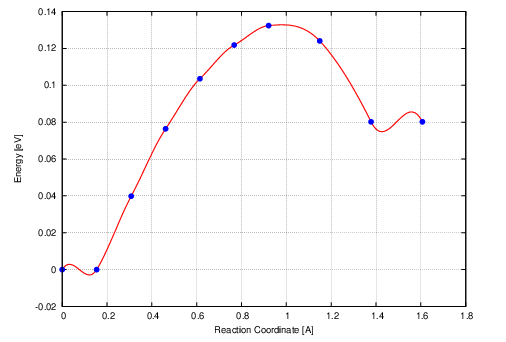
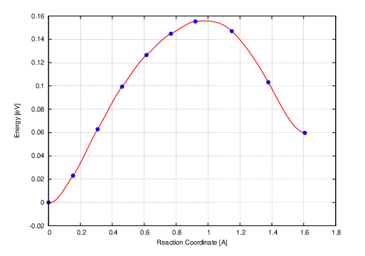

前面的准备工作完成了，`INCAR`，`KPOINTS`，`POSCAR`（IMAGES）， `POTCAR`也检查完了。剩下的就是准备脚本提交文件了。本节主要是在天河II号超算中心上给大家简单示范一下：

- 1）准备脚本，提交任务；
- 2）过渡态任务运行时候的查看；
- 3） `VTST`脚本`nebresults.pl`的安装和使用。


### 提交任务

首先通过命令操作，熟悉下天河II号超算中心提交NEB计算的流程。

```fortran
iciq-lq@ln3:/THFS/home/iciq-lq/LVASPTHW/ex77$ ls
00  01  02  03  04  05  06  07  08  09  INCAR  job_sub  KPOINTS  POTCAR 
iciq-lq@ln3:/THFS/home/iciq-lq/LVASPTHW/ex77$ 
iciq-lq@ln3:/THFS/home/iciq-lq/LVASPTHW/ex77$ cat job_sub
#!/bin/bash
export LD_LIBRARY_PATH=/THFS/opt/intel/composer_xe_2013_sp1.3.174/mkl/lib/intel64:$LD_LIBRARY_PATH
yhrun -p gsc -n 24 /THFS/opt/vasp/5.4.4_neb/vasp.5.4.4/bin/vasp_std
iciq-lq@ln3:/THFS/home/iciq-lq/LVASPTHW/ex77$
iciq-lq@ln3:/THFS/home/iciq-lq/LVASPTHW/ex77/$ yhbatch -p gsc -N 2 -J test job_sub
Submitted batch job 1004311
```

- 每个节点有24核，我们使用了2个节点，共48核，来计算这个NEB任务。
- 共有8个IMAGES，也就是6个核算一个IMAGE。
- 我们调用的VASP版本是:`/THFS/opt/vasp/5.4.4_neb/vasp.5.4.4/bin/vasp_std`
- 本例子下载链接：https://pan.baidu.com/s/1shjrJsRuDNYGEd2qDqvdFQ  提取码：`k3pp` 

### 查看NEB计算

NEB一般收敛的很慢，需要跑很多离子步才会收敛，所以大家要心里有个准备，这也是为什么我们先用gamma点粗算一下，再用高密度的K点计算的原因，总之就是节约时间。虽然NEB要花很长时间才收敛，但提交任务后，我们不能守株待兔似的等着`NEB`算完，而是要勤检查结果，因为NEB的计算中，也会经常出现结构跑乱的情况。那么该怎么检查呢？ 一看能量，二看结构，三看能量和结构。

#### 一看能量：

主要是因为在`terminal`下面，相对于打开可视化软件查看结构来说，我们通过命令提取每个`IMAGE`中`OUTCAR`能量信息的操作更加方便些而已。更重要的其实还是结构的变化，也就是你的反应路径。查看能量有2个办法：

##### 自己用脑子想象或者写脚本：

```bash
iciq-lq@ln3:/THFS/home/iciq-lq/LVASPTHW/ex77$ ls
00  01  02  03  04  05  06  07  08  09  INCAR  job_sub  KPOINTS  NEB.pdb  POTCAR  slurm-995085.out  vasprun.xml
iciq-lq@ln3:/THFS/home/iciq-lq/LVASPTHW/ex77$ ta.sh
01       -298.00705385
02       -297.96462657
03       -297.92754864
04       -297.90142637
05       -297.88475532
06       -297.87681445
07       -297.89025285
08       -297.93374021
iciq-lq@ln3:/THFS/home/iciq-lq/LVASPTHW/ex77$ cat ~/bin/ta.sh
#!/usr/bin/env bash
for i in *; do
if [ -e $i/OUTCAR ]; then
echo -e  $i "\t" $(grep '  without' $i/OUTCAR |tail -n 1 | awk '{print $7}')
fi
done
iciq-lq@ln3:/THFS/home/iciq-lq/LVASPTHW/ex77$ 
```

**用脑子想象：**

在`ts.sh` 脚本的输出中，从01的能量一直往下看，自己脑子里面自带一个xy的坐标系，将这些能量填到坐标系中，直至08。你会想象得到这样的一个曲线： 能量从01的-298.007慢慢上升到06的-297.87，然后再下降到08的-297.934。这个曲线的顶点再06处，也就是我们粗算得到的过渡态。

当然，你也写个小脚本提取每个`IMAGE`中的能量信息，然后画图即可。

##### 使用VTST的脚本：`nebresults.pl` 

前面Ex72中，我们讲过了怎么准备VTST的那些脚本，这一节，我们讲另外一个办法。

- 下载VTST的脚本：http://theory.cm.utexas.edu/vasp/scripts.html 

- 爬梯子技术不好的话，通过这个链接下载：

  https://pan.baidu.com/s/1bSoH8wdk2XvfzdmT75SZWQ 提取码：`dmlt` 

- 将下载的文件上传到服务器的`~/bin/vtst` 目录下；

- 进行如下的操作:

```bash
iciq-lq@ln3:/THFS/home/iciq-lq/bin$ cd vtst/
iciq-lq@ln3:/THFS/home/iciq-lq/bin/vtst$ ls
vtstscripts.tgz
iciq-lq@ln3:/THFS/home/iciq-lq/bin/vtst$ tar -zxvf vtstscripts.tgz
vtstscripts-937/
vtstscripts-937/pos2xyz.py
vtstscripts-937/sum_dos_np
vtstscripts-937/chg2cube.pl
vtstscripts-937/chgsplit.sh
vtstscripts-937/akmcprocess.pl
*
*
*
vtstscripts-937/nebbarrier.pl
iciq-lq@ln3:/THFS/home/iciq-lq/bin/vtst$ ls
vtstscripts-937  vtstscripts.tgz
iciq-lq@ln3:/THFS/home/iciq-lq/bin/vtst$ cd  vtstscripts-937/
iciq-lq@ln3:/THFS/home/iciq-lq/bin/vtst/vtstscripts-937$ ls
2con.py           center.py     diffcon.pl     dymanalyze.pl    dymseldsp.pl     insplot.pl  ....
```

- 使用`vim`打开`nebresults.pl`文件，将`58-71`行注释掉，或者可以使用`sed`命令：

```
sed -i '58,71s/^/#/g' nebresults.pl
```

效果如下图：

```
 57 # Zip the OUTCARs again
 58 #print 'Zipping the OUTCARs again ... ' ;
 59 #$zip = $ENV{'VTST_ZIP'};
 60 #if($zip eq ''){ $zip = 'gzip'; }
 61 #
 62 #$i = 0;
 63 #$string = "00";
 64 #while(chdir $string) {
 65 #    system "$zip OUTCAR";
 66 #    $i++;
 67 #    if($i < 10) { $string = "0$i"; }
 68 #    elsif($i < 100) { $string = "$i"; }
 69 #    chdir $dir;
 70 #}
 71 #print "done\n";
```

- 在`~/.bashrc`文件中设置脚本的目录：

```
iciq-lq@ln3:/THFS/home/iciq-lq/bin/vtst/vtstscripts-937$ pwd
/THFS/home/iciq-lq/bin/vtst/vtstscripts-937
```

- 复制上面`pwd`命令的目录，打开`~/.bashrc` 文件，添加这一行：

```
export PATH=$PATH:/THFS/home/iciq-lq/bin/vtst/vtstscripts-937
```

- `source`一下`~/.bashrc`文件：

```
iciq-lq@ln3:/THFS/home/iciq-lq/bin/vtst/vtstscripts-937$ . ~/.bashrc
```

- 进入计算的目录下，运行`nebresults.pl`命令，操作如下图:

```
iciq-lq@ln3:/THFS/home/iciq-lq/LVASPTHW/ex77$ ls
00  01  02  03  04  05  06  07  08  09  INCAR  job_sub  KPOINTS  NEB.pdb  POTCAR  slurm-995085.out  vasprun.xml
iciq-lq@ln3:/THFS/home/iciq-lq/LVASPTHW/ex77$ nebresults.pl

No OUTCAR in 00
Unziping the OUTCARs ... 
iciq-lq@ln3:/THFS/home/iciq-lq/LVASPTHW/ex77$ cp 01/OUTCAR  00
iciq-lq@ln3:/THFS/home/iciq-lq/LVASPTHW/ex77$ nebresults.pl

No OUTCAR in 09
Unziping the OUTCARs ... 
iciq-lq@ln3:/THFS/home/iciq-lq/LVASPTHW/ex77$ cp 08/OUTCAR  09
iciq-lq@ln3:/THFS/home/iciq-lq/LVASPTHW/ex77$ nebresults.pl

Unziping the OUTCARs ... done
Do nebbarrier.pl ; nebspline.pl
Do nebef.pl
Do nebmovie.pl
Do nebjmovie.pl
Do nebconverge.pl

Forces and Energy:
   0         0.003505      -298.009300         0.000000
   1         0.003505      -298.009300         0.000000
   2         0.008701      -297.969500         0.039800
   3         0.015508      -297.932900         0.076400
   4         0.018300      -297.905700         0.103600
   5         0.016765      -297.887500         0.121800
   6         0.011627      -297.877000         0.132300
   7         0.007293      -297.885300         0.124000
   8         0.003607      -297.929100         0.080200
   9         0.003607      -297.929100         0.080200

Extremum 1 found at image  0.210729 with energy:  0.002874
Extremum 2 found at image  0.788081 with energy: -0.002910
Extremum 3 found at image  6.265931 with energy:  0.132792
Extremum 4 found at image  8.211450 with energy:  0.074781
Extremum 5 found at image  8.788801 with energy:  0.085561

iciq-lq@ln3:/THFS/home/iciq-lq/LVASPTHW/ex77$ 
```



上面的那个图在Ubuntu的终端里面，通过`gs mep.eps`命令可以直接打开。

**解释：**

1)  使用`nebresults.pl`脚本的时候，我们需要在`00`和`09`的文件夹中分别放上初始结构和末态结构所对应的`OUTCAR`。上面操作中，大师兄把`01`和`08`中的`OUTCAR`分别复制到了`00`和`09`中。

为什么这么做呢？

答：偷懒。原因有2个：

A）之前优化结构都是用到的高密度的K点，直接把`OUTCAR`拿过来用的话，会出现能量差别很大。做出图来能量很奇怪的样子。如下面的例子所示：

```bash
  iciq-lq@ln3:/THFS/home/iciq-lq/LVASPTHW/ex77/high_k$ ta.sh
  00       -321.15187450
  01       -298.00935617
  02       -297.96955082
  03       -297.93296493
  04       -297.90579729
  05       -297.88754704
  06       -297.87700139
  07       -297.88531984
  08       -297.92917858
  09       -321.09850728
  iciq-lq@ln3:/THFS/home/iciq-lq/LVASPTHW/ex77/high_k$ nebresults.pl
  
  Unziping the OUTCARs ... done
  Do nebbarrier.pl ; nebspline.pl
  Do nebef.pl
  Do nebmovie.pl
  Do nebjmovie.pl
  Do nebconverge.pl
  
  Forces and Energy:
     0         0.023782      -321.151800         0.000000
     1         0.003505      -298.009300        23.142500
     2         0.008701      -297.969500        23.182300
     3         0.015508      -297.932900        23.218900
     4         0.018300      -297.905700        23.246100
     5         0.016765      -297.887500        23.264300
     6         0.011627      -297.877000        23.274800
     7         0.007293      -297.885300        23.266500
     8         0.003607      -297.929100        23.222700
     9         0.011589      -321.098500         0.053300
  
  Extremum 1 found at image  0.000009 with energy: -0.000000
  Extremum 2 found at image  6.265997 with energy: 23.275310
  
iciq-lq@ln3:/THFS/home/iciq-lq/LVASPTHW/ex77$
```


看到了没有，上面例子中`01`到`08` 结构的能量很大。这是因为参考的能量是`00`的。对于同一个体系，K点大的话，绝对能量更负一些。能量差别太大，导致过渡态的能量变化都可以忽略掉了。

B）当然我们也可以分别对`00`和`09`对应对的机构算个单点。生成各自对应的`OUTCAR`，然后再使用`nebresults.pl`。

```
    iciq-lq@ln3:/THFS/home/iciq-lq/LVASPTHW/ex77$ ta.sh
    00       -298.03233582
    01       -298.00705385
    02       -297.96462657
    03       -297.92754864
    04       -297.90142637
    05       -297.88475532
    06       -297.87681445
    07       -297.89025285
    08       -297.93374021
    09       -297.97265721
    iciq-lq@ln3:/THFS/home/iciq-lq/LVASPTHW/ex77$ 
    iciq-lq@ln3:/THFS/home/iciq-lq/LVASPTHW/ex77$ nebresults.pl
    
    Unziping the OUTCARs ... done
    Do nebbarrier.pl ; nebspline.pl
    Do nebef.pl
    Do nebmovie.pl
    Do nebjmovie.pl
    Do nebconverge.pl
    
    Forces and Energy:
       0         0.100196      -298.032300         0.000000
       1         0.003505      -298.009300         0.023000
       2         0.008701      -297.969500         0.062800
       3         0.015508      -297.932900         0.099400
       4         0.018300      -297.905700         0.126600
       5         0.016765      -297.887500         0.144800
       6         0.011627      -297.877000         0.155300
       7         0.007293      -297.885300         0.147000
       8         0.003607      -297.929100         0.103200
       9         0.084593      -297.972600         0.059700
    
    Extremum 1 found at image  0.057295 with energy: -0.000155
    Extremum 2 found at image  6.265997 with energy:  0.155771
    
    iciq-lq@ln3:/THFS/home/iciq-lq/LVASPTHW/ex77$ 
```



仔细观察，你会发现，`00` 和 `01`， `08` 和 `09` 的能量差别基本不大。所以上面我们的偷懒做法也是可取的。

**敲黑板：**

一般在粗算的时候，不用考虑那么多细节，怎么粗怎么弄。所以，我们前面讲的这个懒办法是在粗算情况下的操作。由于高K点的计算我们在优化初末态结构的时候已经有了，所以提高精度的时候就可以直接用了。


### 本节要求

1） 会提交NEB的计算任务

2） 会使用自己写的或者`nebresults.pl`脚本查看能量信息。

下一节，我们学习怎么分析这些能量。
