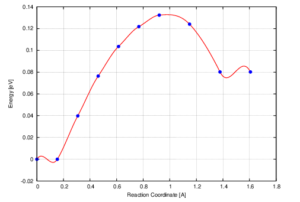
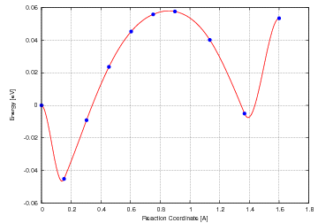

前面一节我们通过粗糙的方法演示了一遍怎么在超算上跑过渡态的NEB计算。一般来说，通过这一步我们可以大体上确定这个基元反应中的路径是不是靠谱的了。不论你得到一个粗糙的NEB能量曲线：

亦或者一个比较精细的：


这都表明，你快要得到这个过渡态结构了。在进行后面操作讲解之前，我们先做2个事情：

1） 由于本人也是老司机了，算过渡态的时候遇到的那些零零碎碎的问题一时也很难记起来，如果你正在算过渡态，并且遇到了问题和错误，可以将计算打包，以及遇到的问题发给我。如果本人有幸可以帮你解决问题，那么，作为交换条件，这个例子就写在后续的教程里面。有下面几点需要注意的：

* i）请使用邮件发送例子（lqcata@gmail.com），尽可能保证计算的文件完整，千万不要删掉某些文件后再打包发给我（CHG，CHGCAR，WAVECAR除外）。如果例子太大，可以上传到百度网盘，然后将链接和你遇到的问题发给我。

* ii）本人最近很忙，可能回复有些慢，请见谅。如果你看到我在QQ群里面瞎BB的话，可以提醒下我去查看邮件。

* iii）只想解决自己问题，不愿意分享自己例子的，请不要发邮件给我。


2）第二件事就是分享一个自己平时常用的脚本，这个脚本主要是将前面的计算步骤保存起来，然后将CONTCAR复制成POSCAR用以下一步的计算。脚本的名字为：`save_calculations.sh`. 

```bash
#!/usr/bin/env bash 

mv POSCAR POSCAR-$1  
mv OUTCAR OUTCAR-$1 
mv OSZICAR OSZICAR-$1
mv vasprun.xml vasprun.xml-$1
mv EIGENVAL EIGENVAL-$1
mv IBZKPT IBZKPT-$1
cp CONTCAR CONTCAR-$1
mv CONTCAR POSCAR
```

脚本演示：

```bash
iciq-lq@ln3:/THFS/home/iciq-lq/LVASPTHW/test$ ls
CONTCAR  DOSCAR  DYNMAT  IBZKPT  INCAR  KPOINTS  OSZICAR  OUTCAR  p4vasp.log  POSCAR  POTCAR  sub12  sub24  vasprun.xml
iciq-lq@ln3:/THFS/home/iciq-lq/LVASPTHW/test$
iciq-lq@ln3:/THFS/home/iciq-lq/LVASPTHW/test$ save_calculations.sh  gamma
iciq-lq@ln3:/THFS/home/iciq-lq/LVASPTHW/test$ ls
DOSCAR  DYNMAT  IBZKPT  INCAR  KPOINTS  OSZICAR-gamma  OUTCAR-gamma  p4vasp.log  POSCAR  POSCAR-gamma  POTCAR  sub12  sub24  vasprun.xml-gamma
```

脚本说明：

* 脚本内容很粗暴直接，大家嫌不好看也可以结合下for循环改进地更加简洁些，本人也懒得改，能实现目的就OK了；
* 效果很简单，就是把之前计算的一些结果重新命名一下，大家可以根据自己的爱好或者习惯，将gamma换成其他的。 


### 提交任务

我们把参数设置地稍微精细一下，然后再跑一遍NEB。

```fortran
iciq-lq@ln3:/THFS/home/iciq-lq/LVASPTHW/ex78$ ls
00  01  02  03  04  05  06  07  08  09  INCAR  job_sub  KPOINTS  NEB.pdb  POTCAR  slurm-995085.out  vasprun.xml
iciq-lq@ln3:/THFS/home/iciq-lq/LVASPTHW/ex78$ for i in 0{1..8} ; do cd $i; save_calculations.sh  gamma ; cd - ; done 


iciq-lq@ln3:/THFS/home/iciq-lq/LVASPTHW/ex78$ ls
00  01  02  03  04  05  06  07  08  09  INCAR  job_sub  KPOINTS  NEB.pdb  POTCAR  slurm-995085.out  vasprun.xml
iciq-lq@ln3:/THFS/home/iciq-lq/LVASPTHW/ex78$
iciq-lq@ln3:/THFS/home/iciq-lq/LVASPTHW/ex78$ ls *
INCAR  job_sub  KPOINTS  NEB.pdb  POTCAR  slurm-995085.out  vasprun.xml

00:
POSCAR

01:
CHG  CHGCAR  CONTCAR  DOSCAR  EIGENVAL  IBZKPT  OSZICAR  OUTCAR  PCDAT  POSCAR  REPORT  WAVECAR  XDATCAR
.
.
.
08:
CHG  CHGCAR  CONTCAR  DOSCAR  EIGENVAL  IBZKPT  OSZICAR  OUTCAR  PCDAT  POSCAR  REPORT  stdout  WAVECAR  XDATCAR

09:
POSCAR
iciq-lq@ln3:/THFS/home/iciq-lq/LVASPTHW/ex78$ for i in 0{1..8}; do cd $i ; save_calculations.sh gamma ; cd - ; done
mv: cannot stat `vasprun.xml': No such file or directory
/THFS/home/iciq-lq/LVASPTHW/ex78
.
.
.
mv: cannot stat `vasprun.xml': No such file or directory
/THFS/home/iciq-lq/LVASPTHW/ex78
iciq-lq@ln3:/THFS/home/iciq-lq/LVASPTHW/ex78$
iciq-lq@ln3:/THFS/home/iciq-lq/LVASPTHW/ex78$ ls *
INCAR  job_sub  KPOINTS  NEB.pdb  POTCAR  slurm-995085.out  vasprun.xml

00:
POSCAR

01:
CHG  CHGCAR  CONTCAR-gamma  DOSCAR  EIGENVAL-gamma  IBZKPT-gamma  OSZICAR-gamma  OUTCAR-gamma  PCDAT  POSCAR  POSCAR-gamma  REPORT  WAVECAR  XDATCAR
.
.
.
08:
CHG  CHGCAR  CONTCAR-gamma  DOSCAR  EIGENVAL-gamma  IBZKPT-gamma  OSZICAR-gamma  OUTCAR-gamma  PCDAT  POSCAR  POSCAR-gamma  REPORT  stdout  WAVECAR  XDATCAR

09:
POSCAR

iciq-lq@ln3:/THFS/home/iciq-lq/LVASPTHW/ex78$ kpoints.sh 3 3 1 
iciq-lq@ln3:/THFS/home/iciq-lq/LVASPTHW/ex78$ yhbatch -p gsc -N 2 -J test job_sub
Submitted batch job 1133307
```

* 这里我们把01到08中的一些输出文件都保存了一下，然后将CONTCAR复制成POSCAR用来进行下一步的计算;
* 运行的时候，会报错mv: cannot stat 'vasprun.xml': No such file or directory`，不用管就行，因为images的文件夹中没有`vasprun.xml`文件，嫌报错烦的可以自己加个if语句修改下脚本。
* 我们将K点增加到331，继续计算。


### 查看计算结果

查看结果的时候，有以下三个主要的方面：

1） 看能量

* 可以使用VTST的nebresults.pl 的小脚本，也可以使用自己写的小脚本（ta.sh）。

```
iciq-lq@ln3:/THFS/home/iciq-lq/LVASPTHW/ex78$ ls
00  01  02  03  04  05  06  07  08  09  exts.dat  INCAR  job_sub  KPOINTS  mep.eps  movie  movie.vasp  neb.dat  nebef.dat  POTCAR  slurm-1133307.out  spline.dat  vaspgr  vasprun.xml
iciq-lq@ln3:/THFS/home/iciq-lq/LVASPTHW/ex78$ nebresults.pl

Unziping the OUTCARs ... done
Do nebbarrier.pl ; nebspline.pl
Do nebef.pl
Do nebmovie.pl
Do nebjmovie.pl
Do nebconverge.pl

Forces and Energy:
   0         0.023782      -321.151800         0.000000
   1         0.007650      -321.196900        -0.045100
   2         0.009671      -321.160900        -0.009100
   3         0.010446      -321.128300         0.023500
   4         0.014498      -321.106600         0.045200
   5         0.019054      -321.096100         0.055700
   6         0.019424      -321.094300         0.057500
   7         0.013325      -321.111700         0.040100
   8         0.005225      -321.156900        -0.005100
   9         0.011589      -321.098500         0.053300

Extremum 1 found at image  0.910082 with energy: -0.046551
Extremum 2 found at image  5.724723 with energy:  0.057913
Extremum 3 found at image  8.102362 with energy: -0.007602
Extremum 4 found at image  8.999187 with energy:  0.053367

iciq-lq@ln3:/THFS/home/iciq-lq/LVASPTHW/ex78$ ta.sh
00       -321.15187450
01       -321.19698136
02       -321.16098546
03       -321.12832705
04       -321.10664059
05       -321.09613563
06       -321.09434359
07       -321.11177677
08       -321.15691232
09       -321.09850728

```

* 看到能量的时候，前面我们粗算的时候，已经知道能量随着路径的变化是怎么样的，这里我们就脑子自动画图，从01到08，看着能量慢慢上升，在05，06左右的时候达到最高点，然后继续下降。

* 注意：我们这是接着前面一节进行的计算， 00 和 09中的能量都是551K点下的能量，因此得到的能量随路径的变化是下面这样子的。如果看到这样的图片，不要慌张，跳过第一个和最后一个点，直接看中间的部分即可。

  

  ```fortran
  iciq-lq@ln3:/THFS/home/iciq-lq/LVASPTHW/ex78$ grep irre */OUTCAR
  00/OUTCAR: Found      9 irreducible k-points:
  01/OUTCAR: Found      5 irreducible k-points:
  02/OUTCAR: Found      5 irreducible k-points:
  03/OUTCAR: Found      4 irreducible k-points:
  04/OUTCAR: Found      4 irreducible k-points:
  05/OUTCAR: Found      4 irreducible k-points:
  06/OUTCAR: Found      4 irreducible k-points:
  07/OUTCAR: Found      4 irreducible k-points:
  08/OUTCAR: Found      5 irreducible k-points:
  09/OUTCAR: Found     13 irreducible k-points:
  ```

  

2） 看计算有没有正常结束。

主要是查看：i) NEB跑了多少步，ii) 自己设置了多少步，iii) 通过OUTCAR中结构收敛的特定关键词。

```
iciq-lq@ln3:/THFS/home/iciq-lq/LVASPTHW/ex78$ ls
00  02  04  06  08  exts.dat  job_sub  mep.eps  movie       neb.dat    POTCAR             spline.dat  vasprun.xml
01  03  05  07  09  INCAR     KPOINTS  mep.png  movie.vasp  nebef.dat  slurm-1133307.out  vaspgr
iciq-lq@ln3:/THFS/home/iciq-lq/LVASPTHW/ex78$ tail 03/OSZICAR -n 5
RMM:   2    -0.318010871323E+03   -0.48063E-06   -0.15546E-06   134   0.370E-03    0.397E-03
RMM:   3    -0.318010871353E+03   -0.29988E-07   -0.12836E-08    21   0.273E-03    0.402E-03
RMM:   4    -0.318010871104E+03    0.24867E-06    0.00000E+00    17   0.260E-03    0.157E-03
RMM:   5    -0.318010871201E+03   -0.96799E-07   -0.11232E-08    18   0.266E-03
  14 F= -.32114179E+03 E0= -.32112833E+03  d E =-.102536E-03
iciq-lq@ln3:/THFS/home/iciq-lq/LVASPTHW/ex78$ grep NSW INCAR
  NSW    = 200
iciq-lq@ln3:/THFS/home/iciq-lq/LVASPTHW/ex78$ grep 'reached re' 03/OUTCAR
 reached required accuracy - stopping structural energy minimisation
iciq-lq@ln3:/THFS/home/iciq-lq/LVASPTHW/ex78$

```

当然你可以写一个小脚本如下来避免每次都重读在终端里面打出来。

```bash
#!/usr/bin/env bash 

tail 03/OSZICAR -n 5
grep NSW INCAR
grep 'reached re' 03/OUTCAR
```

也可以设置下alias来判断：

```bash
alias check='tail 03/OSZICAR -n 5 && grep NSW INCAR && grep 'reached re' 03/OUTCAR '
```

有能力的可以写一些更高级点的，加些if，for语句直接智能判断NEB有没有算完，有没有收敛。

3） 查看NEB中各个IMAGE中的结构。

前面我们讲过了几种办法：

i) 通过vaspkit 结合 vmd实现看动画的效果（Windows用户）

ii）使用ASE 和 p4vasp 批量打开所有的IMAGES中的CONTCAR，挨个查看。

本节我们简单复习一下，就不再啰嗦了。


### 小节

本节，我们主要是在前面计算的基础上，把gamma点的输出结果备份了一下，在此基础上，增加K点（提高精度）继续优化。最近瞎忙了很多事情，让很多人等急了，给大家拜个晚年，祝大伙猪年都学会麻溜滴算过渡态。


