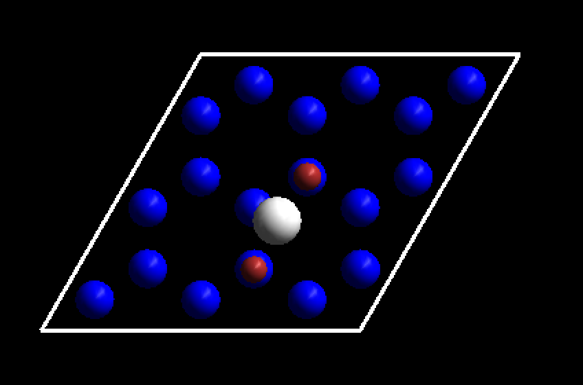

前面几节，我们从gamma点到3x3x1计算过渡态。首先复习一下计算的流程：

1） 我们计算的是金属表面上H原子的扩散；

2） 使用gamma点计算的时候，slab固定住了；

3）gamma点计算结束后，检查结果：

* 看到有一个漂亮的NEB图；
* 能量变化也是稳稳妥妥滴；
* 结构查看也没啥异常情况；

4） 在确认第3)步检查OK之后，将gamma点的计算备份；增大K点至3x3x1继续算。

5）计算结束后，重复第3）步的检查，确认没啥问题。


#### 继续算

前面这么做很啰嗦（大师兄本人也很啰嗦），目的只有一个：用最少的机时获取最好的NEB初始结构。当我们完成这一步之后，就可以再继续下面的操作：

* 备份3x3x1的计算；

* 增大K点至5x5x1；
* 放开表面的原子；（`POSCARtoolkit.py`）
* 继续算，结果如下：

```bash
iciq-lq@ln3:/THFS/home/iciq-lq/LVASPTHW/ex79$ ls
00  02  04  06  08  INCAR    POTCAR    job_sub  movie       neb.dat    slurm-1133307.out  spline.dat  vasprun.xml 01  03  05  07  09  KPOINTS  exts.dat  mep.eps  movie.vasp  nebef.dat  slurm-1133315.out  vaspgr
iciq-lq@ln3:/THFS/home/iciq-lq/LVASPTHW/ex79$ cat KPOINTS
K-POINTS
 0
Gamma
  5 5 1
  0 0 0
iciq-lq@ln3:/THFS/home/iciq-lq/LVASPTHW/ex79$ tail 02/OUTCAR
iciq-lq@ln3:/THFS/home/iciq-lq/LVASPTHW/ex79$ tail 02/OUTCAR
                            User time (sec):     3864.268
                          System time (sec):       15.316
                         Elapsed time (sec):     3905.371

                   Maximum memory used (kb):      466776.
                   Average memory used (kb):           0.

                          Minor page faults:       816554
                          Major page faults:           29
                 Voluntary context switches:        29864
iciq-lq@ln3:/THFS/home/iciq-lq/LVASPTHW/ex79$ tail 02/OSZICAR -n 1
  10 F= -.32111627E+03 E0= -.32109808E+03  d E =-.130617E-03
iciq-lq@ln3:/THFS/home/iciq-lq/LVASPTHW/ex79$ ta.sh
00       -321.15187450
01       -321.13494327
02       -321.09807672
03       -321.06314408
04       -321.03855868
05       -321.02460382
06       -321.01884134
07       -321.02967204
08       -321.06853536
09       -321.09850728
```

从上面可以看到，顶点在06的位置，差不多就是过渡态了。

####  验证过渡态

那么我们算出来的过渡态到底对不对呢? 

上面，我们通过能量分析，06这个Image就是过渡态了；但06就真的是过渡态吗？下面我们需要做2件事情：

1） 查看结构：



为了区分明显，上图中桥式位置两端的Ru原子，用暗红色标记出来。可以看出，06结构中，H原子在桥式的位置上；是我们想要的过渡态。结构这一关也过了。

2）频率分析：对于一个基元反应的过渡态来说，会有一个对应的虚频。因此，我们将06的CONTCAR单独取出来，做一个频率分析：

```bash
iciq-lq@ln3:/THFS/home/iciq-lq/LVASPTHW/ex79$ mkdir freq && cp 06/CONTCAR freq/POSCAR && cd freq &&sed -i '10,27s/T/F/g' POSCAR
iciq-lq@ln3:/THFS/home/iciq-lq/LVASPTHW/ex79/freq$ cp ../INCAR  .
iciq-lq@ln3:/THFS/home/iciq-lq/LVASPTHW/ex79/freq$ vi INCAR
iciq-lq@ln3:/THFS/home/iciq-lq/LVASPTHW/ex79/freq$ kpoints.sh 1 1 1
iciq-lq@ln3:/THFS/home/iciq-lq/LVASPTHW/ex79/freq$ pospot.sh
Generating NEW POTCAR...
************************
Done
************************
NEW POTCAR containes....
Ru H
************************
Elements in POSCAR
************************
   Ru   H
iciq-lq@ln3:/THFS/home/iciq-lq/LVASPTHW/ex79/freq$ qsub
Submitted batch job 1179250
iciq-lq@ln3:/THFS/home/iciq-lq/LVASPTHW/ex79/freq$ ls
CHG     CONTCAR  DYNMAT    IBZKPT  KPOINTS  OUTCAR  POSCAR  REPORT   XDATCAR  slurm-1179250.out CHGCAR  DOSCAR   EIGENVAL  INCAR   OSZICAR  PCDAT   POTCAR  WAVECAR  job_sub  vasprun.xml
iciq-lq@ln3:/THFS/home/iciq-lq/LVASPTHW/ex79/freq$ grep cm-1 OUTCAR
   1 f  =   36.804765 THz   231.251161 2PiTHz 1227.674788 cm-1   152.212329 meV
   2 f  =   30.534675 THz   191.855022 2PiTHz 1018.527097 cm-1   126.281311 meV
   3 f/i=    9.822527 THz    61.716759 2PiTHz  327.644231 cm-1    40.622722 meV
iciq-lq@ln3:/THFS/home/iciq-lq/LVASPTHW/ex79/freq$
```

* 创建freq文件夹，将06的CONTCAR复制到freq中；
* 将表面的Ru原子固定住；
* 复制NEB计算的INCAR过来，修改频率计算相应的参数；
* 使用gamma点算频率；
* 生成POTCAR；
* 提交任务。
* 查看结果，有一个虚频。计算完事！

注意：

* 不会算的看前面频率计算的内容；

* 自己测试下不同K点：2x2x1；3x3x1; 5x5x1计算出来的零点能有什么区别？频率大小有什么区别。

  

#### 小结：

拖拖拉拉，磨磨唧唧，终于把H原子在表面过渡态计算的NEB讲的差不多了。如果你一路沿着教程走过来，最终看到一个虚频对的结果时，会发自内心由衷地一笑：啊！啊！啊！过渡态原来这么简单。为避免这种情况的发生，我先给你脑勺拍一板凳，后面事还多着呢。还是那句话：做任何一个事情，从你认为它简单的那一刻起，你就输了。算过渡态，

1）要把初始结构，末态结构优化好；

2）合理采用粗糙的模型，来检查自己设想的反应路径；

* 粗糙的模型：一方面指的是体系的大小，一方面是计算参数的设置；
* 切忌直接上来硬算，要不然把服务器累个半死，却得不到多少好的结果。

3） 从能量，结构，虚频等多个角度去分析你的结构。

本节计算的文件已经打包上传到百度网盘，由于版权，压缩包里面的POTCAR就不放了，大家自己生成一下。下载链接：链接：https://pan.baidu.com/s/1sfOLxTB5Rdr5Il7vNCOkyA 提取码：m591 
