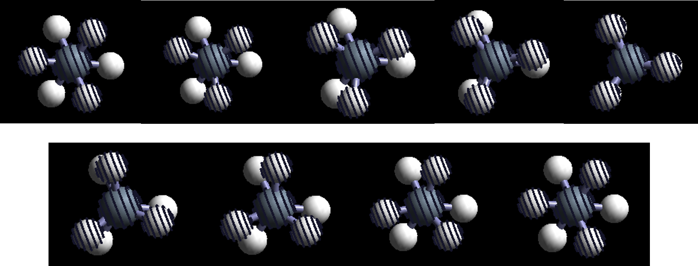
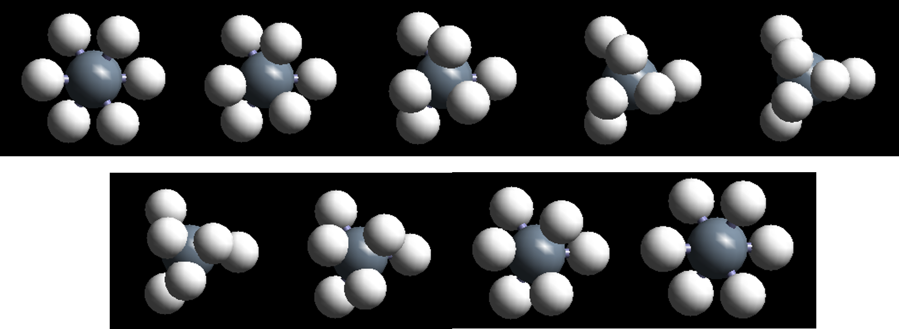

前面一节，我们讲解了对于扩散这一类反应中，nebmake.pl这个命令生成IMAGES时候的一个坑。通过学习，要了解到一些脚本或者程序本身存在一些缺陷，我们在使用的时候，要避免盲目相信，直接把脚本的结构直接拿来用。总之，原则就是尽可能获取一些具有明确物理化学意义的，比较理想的初始构型。本节，讲解一下旋转过程中，nebmake.pl的坑。这里与其说是坑，不如说是nebmake.pl不适用的情况。因为涉及到旋转过程的时候，一般得到的IMAGES的结构都不咋地，需要自己认真检查，微调下结构或者重新搭结构。

这里我们讲一个极端的例子：乙烷分子的旋转

从一个交叉式的构象到另一个交叉式的构象，两个甲基绕C--C键旋转120°。如果每隔15°插一个点， 正常的结果应该如下图所示:

但是，当使用nebmake.pl这个方法产生的IMAGES结构如下图：

可以看到，

1）初始结构中，并没有旋转的效果，H原子走的是直线的路径。

2）IMAGE中，H和C原子的距离非常小，仅仅贴在一起了，显然这样的结构非常不理想。

如果使用这样的结构进行计算，第一个离子步结束后，计算出来原子间的作用力很强，会导致后面计算中分子直接散架，而这些散架的结构通常都不收敛，如果不及时检查结构，及时杀死，它会在服务器上一直就这样算着，而你还在傻傻地啃着西瓜，聊着QQ，等待结果。

解决办法：

知道有这个坑之后，怎么躲就好办多了。

1）对于类似的旋转结构，自己手动搭建；

2）使用其他的高级点的生成IMAGES的方法，例如IDPP。（https://wiki.fysik.dtu.dk/ase/tutorials/neb/idpp.html）

3）自己写脚本实现旋转的过程。

小节：

这两节简单介绍了一下生成NEB计算IMAGES需要注意的地方，不管咋地，原则还是要再啰嗦一遍：尽可能得到具有理想物理化学意义的初始结构。毕竟好的开始是成功的一半。有兴趣的可以算一下这两节例子，加深一下自己的印象。有大佬公众号留言说贴自己的代码教程怒怼IDPP，希望看到的可以联系俺（lqcata@gmail.com）。