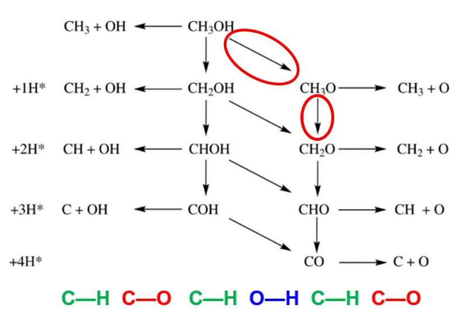

本节主要给大家介绍一下中间体计算的具体流程。（预览版，后面可能会添加一些操作的部分）

计算中间体前的准备：

1）催化剂表面模型的结构以及性质自己多多了解；表面原子排列，谁带正电荷，谁带负电荷，原子间距等等，这些基本的东西自己心里要有数；没事可以整理到表格或者ppt里面，方便以后写文章用；

2） 表面上可能发生的反应路径，各个基元反应，自己列举出来，整理归类方便以后分析。

3）反应路径中各种可能分子的吸附结构先优化完成，通过这些基本分子的吸附能，吸附结构，对体系大体了解一下，一方面参考文献中别人提到的反应路径，另一方面添加自己认为可能的情况。

关键点：

中间体的优化和前面我们讲到的分子或者原子在表面上的优化是一样的。意思就是计算分子吸附的时候，基本的操作同样适用于中间体的优化。可以分布算，先从粗糙的精度出发，然后慢慢提高精度。注意的一点：

对于计算速度的影响：

1） KPOINTS：先把slab固定住，用（1x1x1）的K点对刚刚搭建的中间体结构预优化一下（基本上跑个NSW = 60就差不多了）得到一个理想的初始结构，然后再增加K点密度，放开slab的表层原子，继续优化；

2）EDIFF，EDIFFG：这两个参数主要影响电子步和离子步的步数，当我们用低密度的K点进行计算的时候，电子步很快收敛，离子步收不收敛我们也不在乎，所以在这一步的时候，不用对这两个参数太较真；关键在于增加K点后，我们选取一个什么样的标准，既得到理想的结构和能量，也避免了服务器做无意义的计算；

3）ISPIN：体系需要考虑磁性的话，粗优化的时候，可以先关掉。后面提高精度后，记得加上就可以了。

4）NCORE等并行参数也不要忘记加上，详细参考：

熟练掌握不同精度下这几个参数的使用，可以极大地提高你的计算效率，节省机时。前面说的这些，基本上试用大部分的体系，但还是要靠大家自己多多测试，摸索一下最适合自己体系的方法。

本节主要取表面上：CH3OH --> CH3O --> CH2O 这两步来简单介绍，下图中圈出来的两步；其他的路径照着葫芦画瓢就行了。

 第一步：CH3OH --> CH3O + H 

1）反应产物为表面上的甲氧基（CH3O\*）和氢原子（H\*)， CH3O\* 可以继续进行C--H键断裂，或者C--O键断裂，生成CH3\*+O* 或者CH2O\* + H\*。

注意：这里你应该可以想象到反应网络的复杂性，从一个反应物出发可以有多个不同类型的基元反应，产物作为下一步的反应物，也会有不同类型的反应，导致整个反应网络变得越来越复杂，最后交叉合并，汇总到最基本的分解产物上来。这里我们用的是甲醇，当分子C链增长的时候，基元反应的数目就会急剧增加，增加到我们挨个算不能完成的情况，这也是我们为啥要研究BEP关系的原因。另一个原因就是，成千上万个反应，整天瞎算过渡态，有时候你并不会学到太多新鲜事物，只是重复搬砖的工作，对我们以后的成长不利。

2）H原子的吸附，我们就跳过吧，相信大家经过前面的学习，应该都会了。计算CH3O的结构，我们可以从CH3OH的POSCAR出发，进行下面几点思考：

A) 删除POSCAR中对应H原子的坐标，保存为新的POSCAR，即表面上只有CH3O，提交任务进行优化；

B) CH3OH的结构中，O是在一个top的位置上，但O--H 键断裂之后，O的成键能力增强了，还会继续呆在top位置上么？所以，我们要把OCH3挪到bridge, hcp, fcc 位点上，得到几个不同的结构，提交任务进行优化；

C) 前面我们的结构OCH3是斜着在表面上；会不会有直立的结构？ OCH3是通过O与表面结合，我们是不是可以参考O原子在表面的吸附结构；搭建OCH3直立的吸附结构？

D）前面说的这几点，我们都可以通过前面所说的关键点，用一个粗糙的模型扫描一遍。然后大致分析下结果，然后进行下一步的计算，最终得到稳定的OCH3在表面上的稳定结构。

第二步：CH3O --> CH2O + H

这一步，从甲氧基进行了一步C--H反应，得到了甲醛和H。H的话继续跳过；甲醛的话，这里我们应该也需要跳过；因为甲醛是一个分子，在计算中间体前的准备这一步中，我们应该已经完成。安全起见，我们也列举一下几点需要注意的结构搭建工作：

1） 甲醛分子以C，以O还是C=O双键与表面结合？

2） 以不同部分与表面结合的时候，会在哪个位点上？

3）垂直？斜着，还是平行吸附？

总之，尽可能多思考不同的表面结合方式，采用粗糙的模型快速进行筛选，也要实时思考，粗糙模型会不会对这样的快速筛选产生影响？会不会漏掉什么可能的结构？

未完待续....