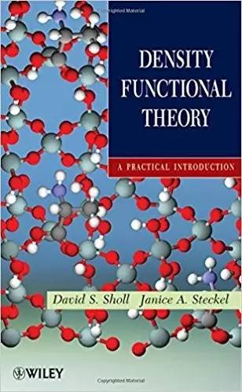
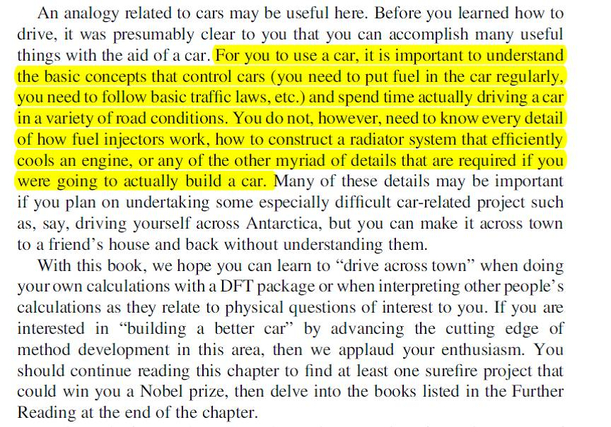
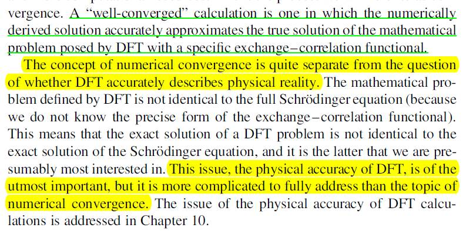

大师兄网站不能登录的这几天时间，经过一番思考，下定决心给大家一个界面更简洁，阅读体验更好，内容更丰富的大师兄网。
虽然感觉时间上压力很大，但得到了很多筒子们的支持和帮助，这给了我继续写下去的动力。当然，最重要的还是老婆的支持。
在这里，向她（他）们表示深深的感谢。

## 为什么写本书?

### 使用人群

- 此书主要针对于0-6个月的VASP初学者,VASP小白,或者刚刚转换计算方向(从VASP计算一个性质到另外一个性质时),以及某一部分计算细节生疏需要复习的科研工作者。直接列出来一堆求解薛定谔方程中的各个公式定理等,肯定会对初学者造成一定的误导,因此本书不讨论过多量子力学的基本原理。

- 很多时候，由于对计算细节的不了解,且无人指导(导师啪啪啪打脸),不少人在计算了一个多月，或者更长时间后发现自己的参数设置错了，但是也不知道该怎么补救，从而走上了重算的这一条极其浪费时间，机时和精力的路。大师兄遇到过很多种类似的情况,周围的朋友遇到这种情况的也不在少数。更有甚者,课题做完了才发现是错的。 出现错误并不可怕,可怕的是我们不知道怎么补救，不长教训,后面还继续犯错。这也是本书的一个出发点,首先保证大家提交的任务准确无误,可以尽最大可能避免遇到前面类似的问题,进而起到间接节约时间的作用。在正确计算的同时,大家可以从头学习密度泛函理论,阅读相关课题的参考文献等。所以，本书旨在为初学者提供一个快速进入计算而又避免过多新手错误的方法。

### 不适宜人群

- 导师是不做计算，让你独辟蹊径，单独挑起组里做计算的大梁；

国内做量化计算的人如雨后春笋般涌现出来，一批又一批，好多高校，学院都有老师开始主动尝试计算这个方向，很多做实验的老师也安排自己的学生"算一下", 但这一部分人之前没有任何的计算功底或者经验，但仍然抱有一颗非常乐观的心态：计算无非就是操作软件的活，花几万块钱买台电脑，美其名曰计算！而到了真正计算的时候，乱七八糟的问题如瓢泼大雨般从天而降，从软件的安装，模型的搭建，计算参数的设置，计算结果的分析等等.....却又不知道如何解决，一来浪费了自己的时间和精力，二来浪费了计算资源（至少很多电费是白交了，服务器白磨损了....）。

### 出发点（一）

本书的一个出发点就是,本人在很多计算的QQ群里面,但是群里面很多问题都非常低级,令人费解,或者说是匪夷所思的,从最基本的建模都做不到,到计算结果不会分析等等。这些人简单而又低级的问题充斥在各个QQ群里。暂且不说这些人的导师有多么地不负责任。很多热心的人却在群里整天忙着应付这些问题,而对于自身,除了得到个活雷锋的标签外,对理论功底的提高,帮助甚微。可以说是花自己的时间替别人指导学生。不论群主给自己的群定位有多高,高级群,中级群,精英群等等,都避免不了这样的问题出现。本书主要通过实例引导大家主动思考去解决这些最基本的常见问题,进而避免因自己的低级问题浪费他人的时间。我说希望的是,对于求助或者应助的人,大家尽可能地讨论一些更高级,更深层次的科研问题,而不是浪费在这些低级的问题上。即使在新的计算中遇到了之前没有碰到过的小细节,自己也知道怎么去动脑子,主动解决。

### 出发点（二）

本人博士已经毕业,目前正在做博士后,早晚有一天会回到国内继续自己的研究生涯,也会有自己的学生,通过这本书把自己学到的东西保存下来,以便后面学生可以借此快速入门，虽然说磕磕碰碰是最好的学习方向，但我更希望自己的学生能从本书中领悟到解决问题的一些基本思维方式。学习计算化学的人,对解决科研问题都有着一种执着的态度,通过构建模型来阐明已知或者预测未知的结果。相对于做计算的科研工作者们,虽然我们没有实验技巧的提高,但我们可以通过训练自己的大脑来弥补。懂得思考的人永远站在社会发展的最前端。

### 出发点（三）  

There are kinds of questions you will find yoursel asking and not knowing where to get quick answers from.

That's what BigBro(a)s are trying to fix.

你会发现自己在问各种各样的问题,但不知道从哪里可以得到快速解答。这正是大师兄（姐）们正在尝试解决的问题:结合最基本的化学常识和软件计算细节,写一本最好的快速基本入门书。

### 如何学习本书（一）

如何学习本书,大师兄在学习程序时,受到[learn_python_the_hard_way](https://learnpythonthehardway.org/)这本书的启发:务实是这本书的一大特色,开始学习语言,乱七八糟的先统统闭嘴,照着代码练习一番,然后再自己思考琢磨,出现问题拿自己的代码和作者代码比较找出原因。
通过系统地学习,随着水平的提高,再逐步解释前面未讲解的内容。这一种学习方法非常适合零基础的菜鸟,因为一开始太多的概念根本不可能一股脑儿全部接受。从简单入手,指导着循序渐进,最后达到精通。打算学Python的(推荐python3),强烈建议此书，当然也有很多其他极好的书籍，这里就不再过多介绍。

### 如何学习本书（二）

对于量化计算,本书也采用这样的思路,手把手先教会大家如何计算,如何避免错误。从最基本的计算开始,通过示例讲解,结合一些脚本的使用,引导大家思考解决自己的问题。因此,在这本书的学习过程里,每一章节会对应一个例子,大家务必手动搭建模型,输入文件(切忌复制粘贴),然后进行计算,得到和大师兄一致的结果。为了引导大家主动浏览官网解决问题,很多都会采用[VASP官网](http://www.vasp.at)的例子,大师兄会重新计算后放到章节里面,供大家对比参照。

* VASP 官网目前国内不能直接打开，大家
- 可以浏览[pdf版本](https://pan.baidu.com/s/1trvvbCKkJHu1ZPGsizW4og)。
- 自行解决被墙的办法。

### 推荐参考书

* [Density functional theory:A practical introduction](https://pan.baidu.com/s/1dFN9stj), by David Sholl.点击本文链接就可以跳转到百度网盘下载，不要从网上随便下载，很多都是阉割版的。
* [Vasp 官网](http://www.vasp.at)
* 其他参考书会在文中慢慢推荐，对新手来说，这本书+VASP手册完全足够了，不要贪多。

### 对读者的话

如果你感觉本书对你有所帮助，欢迎随意转发转载如，果你有自己的科研经验和心得,也欢迎分享给大家!
为保证本书的简洁性，一些与本书无关的东西，QQ群号，公众号，留言联系方式等只在序言里面出现：

* 微信公众号： **BigBroScience** （大师兄科研网）
* 大师兄QQ群：**2674006510**  进群1）看群公告，了解群里的基本要求 2）修改自己的群名片。
* 微信群: 满100人了，所以加大师兄微信（**__BigBroSci__**）后才可应邀加入微信讨论群。
* 咨询邮箱: lqcata@gmail.com

QQ群专注于科研思维的碰撞与科研生活的分享,本书中已经详细解释或者指明的易出错部分,不建议在群中继续咨询,请大家认真学习并主动积极地去思考和练习。此外,论坛或者QQ群里,有很多无知或者stupid的回复,处在迷糊之际的菜鸟由于对自己的不自信,会一股脑儿去相信别人错误的观点,进而一路错下去,这是最可怕的。所以,如果有疑问,可以先酝酿一两天,多多查阅资料，主动思考。然后再大胆提出来,改正就是进步。
---
title: Learn VASP The Hard Way (序言2)
categories: 
- LVASPTHW
tags: 
- 序言
- 如何学习VASP
date: 2017-10-10 16:30:16
---

# 序言2： 如何学习VASP？

写在前头的话，虽然本书会教给你怎么样一步一步从单个原子，到气相分子，再到表面，以及后面的分子吸附，过渡态相关的计算。但为了避免很多小迷弟迷妹们过于依赖本书，偏离了大师兄写书的初衷。先强调一下VASP的学习方法：**老板+1本参考书 + 2个网址**。

### 老板

当然指的是有自己的老板指导喽，大师兄刚读博士的时候，老板并没有直接给我课题组，也没有让我自学或者跟组里的其他人学习VASP，而是花了一个月的时间让我读完此书和亲自指导我练习，这种的传授方式，是国内很多不负责任的导师需要学习的。虽然我老板每天都很忙，所有刚刚加入我们组的博士，都是老师亲手指导出来的。如果你的老板没有时间，至少要给你个师姐或者师兄，这都没有的话，那么老板要喜欢给你出钱让你去交流学习。老板又不教你，又不给师兄师姐带你，又舍不得在你身上花钱，不出意外，你会活得很惨。

###  一本参考书：

Density Functional Theory: A Practical Introduction ([David Sholl](https://www.wiley.com/en-us/search?pq=%7Crelevance%7Cauthor%3ADavid+Sholl))

书的作者简历，有兴趣的可以去搜一搜。这本书对于初学者来说，很容易掌握计算的要领。而对于老手们来说，此书经常翻阅，定会不断提升你的计算水平和对计算的理解。我们举两个例子，请认真阅读里面的内容，并理解。

 第一章开始，为了缓解大家对DFT的恐惧，举了一个理论计算与开车的关系：

（此开车非彼开车，老司机闭嘴，认真看，不许笑！）

你需要做的是如何正确地驾驶汽车，定期维护它，但你并不知道怎么去造一辆车； 类似地，你需要做的是如何正确地理论计算，避免常见的错误，但你不知道VASP程序是怎么写出来的。

例子2：关于收敛的解释：

第三章开始的部分，介绍了收敛在计算中的意义。Numerical Convergence 和Physical reality的联系: DFT计算收敛了不等于薛定谔方程求解了。而体系的性质是由薛定谔方程的解来确定的！所以DFT计算结果的物理或者化学意义才是最终要的。

 

DFT的求解的结果一定等于薛定谔方程的求解结果吗？VASP算出来的结果就一定是对的吗？其中的含义，大家自己去慢慢琢磨。

此外，网上的免费版本里面，很多公式符号不全。大师兄学习的时候深受其害：如图：

图中阉割版的箭头处都是空白，你不知道是正，是负，是乘还是除。所以，为避免这种情况对阅读造成理解上的困难，建议：

* 去wiley官网下载未阉割版（有权限的话），

* 大师兄QQ群文件下载：

  

* 百度网盘链接：https://pan.baidu.com/s/1OZuIfs6gmLN-Ru8UC_Ybcg  提取码：yq0z 

### 一个网址： [VASP官网](https://www.vasp.at/)

 学习VASP，最权威和丰富的资料参考就是官网啦。对于很多新手，手上的教程有一堆，从网上找的，师兄师姐传下来的。但那些都不如官网的例子和说明准确和直接。

1 VASP在线手册: http://cms.mpi.univie.ac.at/vasp/vasp/vasp.html

2 VASP Pdf 手册: http://cms.mpi.univie.ac.at/vasp/vasp.pdf

3 VASP wiki 入口: http://cms.mpi.univie.ac.at/wiki/index.php/The_VASP_Manual

4 VASP官网中实用的教程和参考文档。

老板亲自指导我学习VASP的时候，教程就是官网中的Handonsession 系列。（图中蓝色圈出来的部分）。每天让我重复教程里面的练习，提醒里面的易错部分，算什么性质需要注意什么参数，以及让我主动思考里面各个计算的含义。这一些东西在Learn-VASP-The-Hard-Way本书中都会讲到。在建议大家下载里面的内容，认真练习，学习。

**注意：**

新手也好，老司机也罢，**不再建议**去学习handonsession的例子，因为那是老掉牙的ppt了，最新的VASP官方workshop的ppt见下面链接： 

http://cms.mpi.univie.ac.at/wiki/index.php/NERSC_Berkeley_2016

http://www.nersc.gov/users/training/events/3-day-vasp-workshop/ （另一个参考网址，里面附带了Youtube的workshop视频）

除了VASP官网的这些参考资料外，使用说明书是我们需要经常翻阅的。遇到不会的，不懂的，有疑问的参数，请尽情的翻阅VASP官网吧。这里推荐VASP的Wiki网址。（请务必收藏本网址）

https://cms.mpi.univie.ac.at/wiki/index.php/The_VASP_Manual  

如图：

1：查询参数含义，设置的时候，进行搜索；

2：新手们从这里点击开始；

3：VASP的计算实例，大家可以参考里面的说明计算自己的体系性质；

4：INCAR的参数列表，大家没事多多点击里面的各个参数；查看含义；

5：再下面就是一些理论背景知识了，建议系统学习DFT的相关书籍，Wiki中的内容有限，只能作为参考。

### 第二个网址

VASP的官方论坛。http://cms.mpi.univie.ac.at/vasp-forum/forum.php 

如果你在计算中，遇到什么错误的信息，99%都可以在这里找到答案。

### 总结 

本书的初衷是引导大家去主动学习VASP，而不是教会大家VASP，而本节提到的参考书和官网则是新手们学习VASP最简单有效的途径。当然，还有很多有宝贵的参考书籍供大家阅读。如果你是新手的话，能把本节推荐的书啃完，再结合官网的计算一些示例练习，就足够了。如果你能坚持认认真真练习，主动重复网站的例子，认真思考，那么你的计算水平会得到极大的提升。
