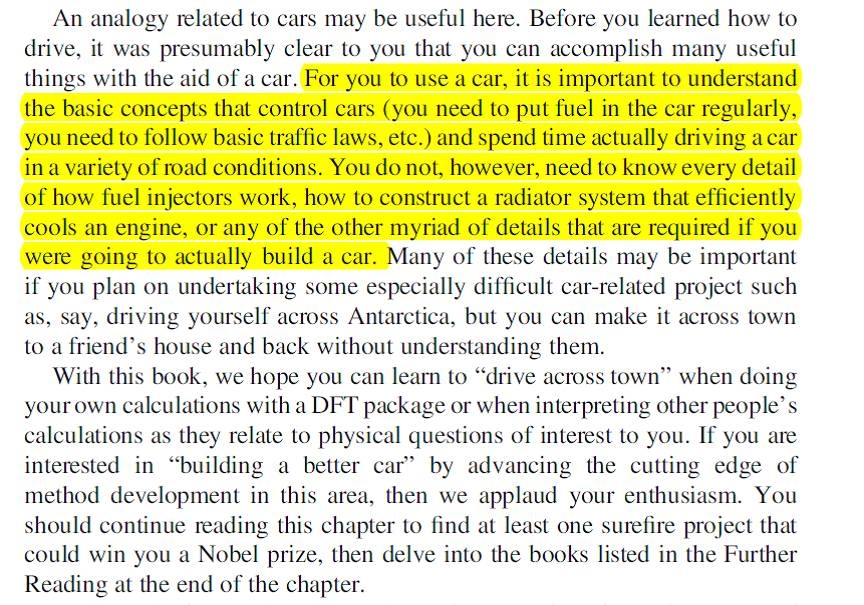
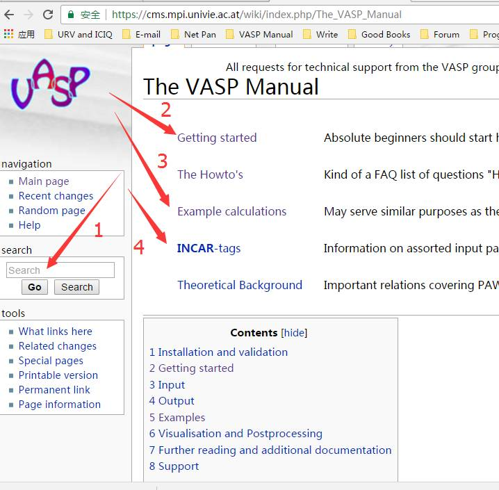

# 序言2： 如何学习VASP？

写在前头的话，虽然本书会教给你怎么样一步一步从单个原子，到气相分子，再到表面，以及后面的分子吸附，过渡态相关的计算。但为了避免很多小迷弟迷妹们过于依赖本书，偏离了大师兄写书的初衷。先强调一下VASP的学习方法：**老板+1本参考书 + 1个网址**。

### 老板

当然指的是有自己的老板指导喽，大师兄刚读博士的时候，老板并没有直接给我课题组，也没有让我自学或者跟组里的其他人学习VASP，而是花了一个月的时间让我读完此书和亲自指导我练习，这种的传授方式，是国内很多不负责任的导师需要学习的。虽然我老板每天都很忙，所有刚刚加入我们组的博士，都是老师亲手指导出来的。如果你的老板没有时间，至少要给你个师姐或者师兄，这都没有的话，那么老板要喜欢给你出钱让你去交流学习。老板又不教你，又不给师兄师姐带你，又舍不得在你身上花钱，不出意外，你会活得很惨。

###  一本参考书：

Density Functional Theory: A Practical Introduction ([David Sholl](https://www.wiley.com/en-us/search?pq=%7Crelevance%7Cauthor%3ADavid+Sholl))

书的作者简历，有兴趣的可以去搜一搜。这本书对于初学者来说，很容易掌握计算的要领。而对于老手们来说，此书经常翻阅，定会不断提升你的计算水平和对计算的理解。我们举两个例子，请认真阅读里面的内容，并理解。

 第一章开始，为了缓解大家对DFT的恐惧，举了一个理论计算与开车的关系：

（此开车非彼开车，老司机闭嘴，认真看，不许笑！）

你需要做的是如何正确地驾驶汽车，定期维护它，但你并不知道怎么去造一辆车； 类似地，你需要做的是如何正确地理论计算，避免常见的错误，但你不知道VASP程序是怎么写出来的。

例子2：关于收敛的解释：

第三章开始的部分，介绍了收敛在计算中的意义。Numerical Convergence 和Physical reality的联系: DFT计算收敛了不等于薛定谔方程求解了。而体系的性质是由薛定谔方程的解来确定的！所以DFT计算结果的物理或者化学意义才是最终要的。

 

DFT的求解的结果一定等于薛定谔方程的求解结果吗？VASP算出来的结果就一定是对的吗？其中的含义，大家自己去慢慢琢磨。

此外，网上的免费版本里面，很多公式符号不全。大师兄学习的时候深受其害：如图：

图中阉割版的箭头处都是空白，你不知道是正，是负，是乘还是除。所以，为避免这种情况对阅读造成理解上的困难，建议：

* 去wiley官网下载未阉割版（有权限的话），

* 大师兄QQ群文件下载：

  

* 百度网盘链接：https://pan.baidu.com/s/1OZuIfs6gmLN-Ru8UC_Ybcg  提取码：yq0z 

### 一个网址： [VASP官网](https://www.vasp.at/)

 学习VASP，最权威和丰富的资料参考就是官网啦。对于很多新手，手上的教程有一堆，从网上找的，师兄师姐传下来的。但那些都不如官网的例子和说明准确和直接。

1 VASP在线手册: http://cms.mpi.univie.ac.at/vasp/vasp/vasp.html

2 VASP Pdf 手册: http://cms.mpi.univie.ac.at/vasp/vasp.pdf

3 VASP wiki 入口: http://cms.mpi.univie.ac.at/wiki/index.php/The_VASP_Manual

4 VASP官网中实用的教程和参考文档。

老板亲自指导我学习VASP的时候，教程就是官网中的Handonsession 系列。（图中蓝色圈出来的部分）。每天让我重复教程里面的练习，提醒里面的易错部分，算什么性质需要注意什么参数，以及让我主动思考里面各个计算的含义。这一些东西在Learn-VASP-The-Hard-Way本书中都会讲到。在建议大家下载里面的内容，认真练习，学习。

**注意：**

新手也好，老司机也罢，**不再建议**去学习handonsession的例子，因为那是老掉牙的ppt了，最新的VASP官方workshop的ppt见下面链接： 

http://cms.mpi.univie.ac.at/wiki/index.php/NERSC_Berkeley_2016

http://www.nersc.gov/users/training/events/3-day-vasp-workshop/ （另一个参考网址，里面附带了Youtube的workshop视频）

除了VASP官网的这些参考资料外，使用说明书是我们需要经常翻阅的。遇到不会的，不懂的，有疑问的参数，请尽情的翻阅VASP官网吧。这里推荐VASP的Wiki网址。（请务必收藏本网址）

https://cms.mpi.univie.ac.at/wiki/index.php/The_VASP_Manual  

如图：

1：查询参数含义，设置的时候，进行搜索；

2：新手们从这里点击开始；

3：VASP的计算实例，大家可以参考里面的说明计算自己的体系性质；

4：INCAR的参数列表，大家没事多多点击里面的各个参数；查看含义；

5：再下面就是一些理论背景知识了，建议系统学习DFT的相关书籍，Wiki中的内容有限，只能作为参考。

### 总结 

本书的初衷是引导大家去主动学习VASP，而不是教会大家VASP，而本节提到的参考书和官网则是新手们学习VASP最简单有效的途径。当然，还有很多有宝贵的参考书籍供大家阅读。如果你是新手的话，能把本节推荐的书啃完，再结合官网的计算一些示例练习，就足够了。如果你能坚持认认真真练习，主动重复网站的例子，认真思考，那么你的计算水平会得到极大的提升。