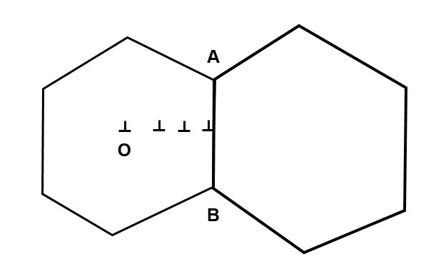

Hall Petch关系是材料学中描述多晶材料最为重要的一个相关关系，它反映了材料强度与晶粒的尺寸的开方成反比。同时材料在极小晶粒尺寸下表现出的反常Hall Petch 关系也一度成为材料学家的研究热点。关于反常Hall Petch关系的研究发现屡现于高水平期刊，本文将不做更多介绍。从Hall Petch关系的第一次报导开始，已经有大量的文章针对各种材料体系（纯金属，金属间化合物，多相合金等等）进行了相关研究。然而，从Hall Petch 关系提出至今，依旧没有出现一个完美简洁的理论可以解释这个现象。研究人员为了解释这个现象已经提出了大量的理论，在接下来的篇幅中，作者将从中提取了几个典型的理论做简要介绍

1951年，Hall（文献1）发表的论文中首次报导了钢中存在的Hall Petch关系:

$\sigma=\sigma_0 + k_{HP}d^{-1/2} $

其中$\sigma$表示流变应力，d表示晶粒尺寸，k是Hall Petch 系数，其对不同材料，温度和应变条件都非常敏感。

与此同时，他也在文章中首次提出了试图解释Hall Petch关系的pile up（位错阻塞）模型。

该理论认为材料的强度来自于外力作用下导致的晶粒内部位错源开动，位错源启动后形成的位错林被晶粒之间的界面（晶界）阻碍后引起了材料的应力强化。简单起见，我们不妨假设两个近似六边形的晶粒以晶界AB接触，左边晶粒的中心O点存在一个位错源，在外加应力的作用下位错源沿着某一滑移面释放出一系列位错。随着第一个发射的位错冲撞到晶界AB上，整个位错列队被禁锢在位错源与晶界之间。由于晶界墙的阻力和新产生位错的弹性应变，整个位错列最后会形成一个稳定分布，假设晶粒的平均尺寸为d，则位错列中位错的数目为：

$n=\frac{(1-v)d\tau_e}{2\mu{b}}$

其中$\tau_e$表示位错的有效剪切应力，它可以表示为：

$\tau_e=\tau-\tau_i$

显然，它实际上是在加载应力中扣除了弹性应力部分。试想如果你要产生一根位错，首先晶体要发生塑性变形，因此塑性变形前的弹性部分并不是我们应该要考虑的部分。既然我们已经知道位错列中位错的数目，如果我们粗略地认为，所有的位错作用到晶界上的应力都是等效的，那么晶界上受到的应力$\tau_p$为

$\tau_p = n\tau_e$

Hall认为，材料屈服发生于位错列冲破晶界的时候，也就是说 $\tau_p$大于临界值$\tau_c$。如果我们取等号，再将前面的n代入，我们就可以得到：

$\tau = \tau_i +\surd{\frac{2\tau_c\mu{b}}{1-v}} \times d^{-1/2}$

该公式看起来非常合理简洁，-1/2次方的关系也出来了。但是如果材料的屈服依靠的是位错像裂纹一般冲破晶界，我们应该在实验中大量发现，但实际上，只有少数几篇文献报导过相关现象。更重要的是，依据该理论计算的屈服强度跟实际数据还是有较大出入。

在pile up模型的基础上，Cotrell（文献2）认为，材料的屈服并非来自于位错林冲破晶界，而是由于位错林在晶界的终端的应力场诱发了邻近晶粒中的位错源(如下图的R处)的开动。这样子需要的 临界应力要小于pile-up模型。

晶粒内部出现位错源固然可行，但是另一方面，晶界本身就是天生的位错源，在晶粒内部没有经受剧烈变形的情况下，晶界上的位错形核位置要远远多于晶粒内部。Li （文献3）于1963年提出了boundary source（晶界位错源）模型。为了方便起见，我们不妨假设晶粒是边长为d的立方体。假设晶粒的每一个面上的台阶密度为m，假设每一个台阶都有一定几率发射位错。进一步简化，我们不妨认为每个台阶都会发射位错，则一个面的总位错数目为$md^2$。每一个晶粒与毗邻晶粒公用一个晶面，则一个晶粒可以认为有三个晶界面属于这个晶粒。所以:

我们可以认为一个晶粒有3$md^2$个位错。这些位错在外加应力作用下继续向晶内扩散，形成位错林。位错林的密度为:
$\rho = 3md^2 / d^3 = 3m/d$
另一方面，晶体材料的位错密度和强度之间可以由著名的Taylor公式来描述:
$\sigma = \sigma_0 + M\alpha\mu{b}\surd\rho$ 
代入前者即得:

$\sigma = \sigma_0 + M\alpha\mu{b}3^{1/2}m^{1/2}d^{-1/2}$ 

我们再一次获得了Hall Petch关系。在原文中也有说明这个方式计算的理论屈服强度与pile up模型基本一致。目前介绍的这两个模型，前者认为位错完全起源于晶粒内部，后者则认为位错完全起源于晶界，两者分别是实际情况下的两个极端。但是殊途同归，两个极端最后得到了相同的结论和近似的屈服强度。不过，这两个模型的局限性也是明显的，实验中Hall Petch曲线的斜率对晶粒结构和化学成分非常敏感，但是上述模型中并未考虑这些实际因素。

值得注意的是，在2002年的一篇文章4中，该文作者成功在MD模拟中发现了晶界处位错的形核和发射过程。

（未完待续）

1 Hall, E. O. The deformation and ageing of mild steel: III discussion of results. Proceedings of the Physical Society. Section B 64.9 (1951): 747.
2  A.H. Cottrell,: The Mechanical Properties of Matter, Wiley, New York (1964) 
3 Li, James CM. Petch relation and grain boundary sources. Transactions of the Metallurgical Society of AIME 227.1 (1963): 239.
4 Van Swygenhoven, H., P. M. Derlet, and A. Hasnaoui. Atomic mechanism for dislocation emission from nanosized grain boundaries. Physical Review B 66.2 (2002): 024101.
本文经ponychen授权发布，版权属于ponychen。