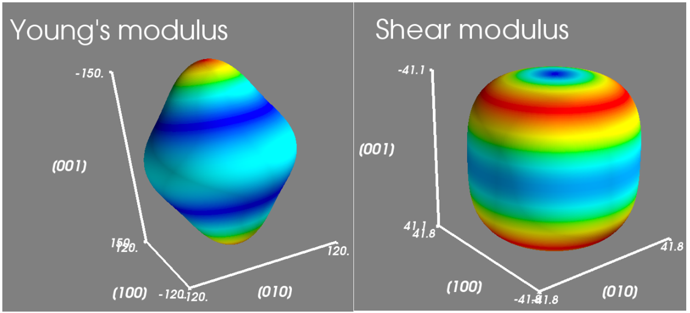
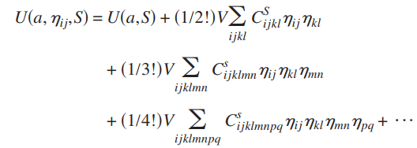
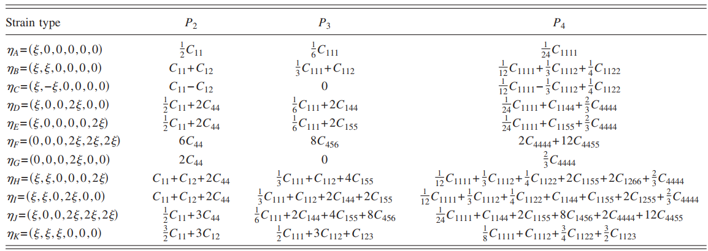

在线弹性理论中，体系被施加一个无穷小的应变，从而体系应变后的能量可以以小应变为自变量泰勒展开，并忽略二阶导以上的高阶项。通过对不同特定的独立的应变模式求解能量应变方程或者应力应变方程，我们可以获得材料所有的二阶弹性常数（SOECs）。SOECs反映了体系的简谐弹性特征。通过SOECs，一方面我们可以获得体系的基于Vogit-Reuss-Hill平均的多晶力学性能，包括杨氏模量，剪切模量，体积模量，泊松比和维氏硬度等，以及在此基础之上的各向异性系数等等特征；另一方面，我们也可以通过SOECs获得单晶力学性能在空间中的具体分布，并将其用图的模式直观的表示出来。

图中我们展示了某种金属的杨氏模量和剪切模量（每个面的平均值）的空间分布图，感兴趣的读者可以猜猜这是哪种布拉维晶型的金属。

在实际负载下，材料承受的往往是有限形变，这时候材料的非简谐弹性将称为不可忽视的因素。很多实验数据有去测量体系的三阶弹性常数（TOECs），甚至四阶弹性常数（FOECs）。注意到TOECs和FOECs相对比SOECs在实验中更加受到实验精度的影响，具体的测量非常困难。如果我们能在理论上对其进行预测，将变得非常有意义。实际上已经有若干文献进行了相关研究，笔者也抱着好奇的态度尝试进行了TOECs和FOECs的计算。原理上来说相对简单，我们只需要将能量对应变进行泰勒展开，将阶次保留到四次，即可同时获得SOECs，TOECs和FOECs。

将所有的应变η设为同一个数值，我们就可以用一个包含四次，三次和二次项的多项式来拟合计算的数据，获得包含各个弹性常数的多元一次方程组。求解这个这个方程组即可获得所有的弹性常数。

不过实际操作起来并没有这么简单。即使是最简单的立方体系，其TOECs也达到了6个，而FOECs更是达到了11个。对于更低对称性的体系，其计算量更是一个天文数字（开玩笑的，天文倒不至于，很大就是了）。一种避让的方法就是，我们可以用应力对应变进行展开，这样相对需要的独立应变数少一些。笔者使用Au作为测试体系，根据文献对体系施加了11种独立应变，如下图。

感兴趣的童鞋可以直接阅读文末给的参考文献。笔者通过测试发现，首先，体系的应变量必须足够大。笔者一开始犯上了计算SOECs的习惯，使用的很小的应变，计算结果简直南辕北辙。后来将应变加到15%后，获得的TOECs相对理想。细想也是，应变很小时，体系还处于线弹性阶段，这时候的非谐弹性非常微弱，极容易被数值误差干扰。将应变加大到非谐区后，数值就非常稳定了。同时，尽管我们使用了大应变条件，但是实际上高阶弹性常数的具体数值依旧会对数值精度的波动非常敏感。

| Au/GPa | C111  | C112 | C123 | C144 | C155 | C456 |
| ------ | ----- | ---- | ---- | ---- | ---- | ---- |
| exp    | -1730 | -922 | -233 | -13  | -648 | -12  |
| mine   | -1207 | -847 | -275 | 7    | -616 | 62   |

同文献一样，笔者使用了非常高精度的k点半径和截断能。随着精度的提高，结果趋于较好的收敛。笔者在此展示了笔者自己算的TOECs与实验的比较，两者相对来说还是比较接近的（相对实验的误差与文献差不多）。总的来说，如果有小伙伴需要计算材料的TOECs或者FOECs，笔者建议一定要对应变，k点，截断能三者都要做仔细地收敛测试。

Wang,Hao, and Mo Li. "Ab initio calculations of second-, third-, andfourth-order elastic constants for single crystals." *PhysicalReview B* 79.22 (2009): 224102.

本文经ponychen授权发布，版权属于ponychen。