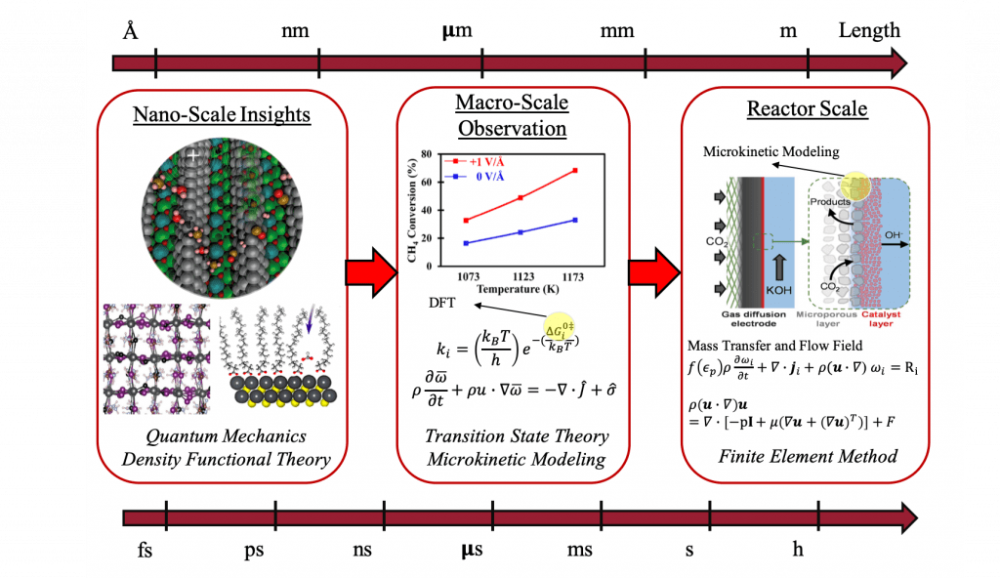

**硕博（后）招聘：美国马萨诸塞大学洛厄尔分校车芳琳课题组**

**（University of Massachusetts Lowell）**

`课题组简介`

车芳琳老师课题组刚刚成立，主要研究催化以及材料科学方面的多尺度理论模拟，在多尺度范围内（从原子到反应器尺度）研究燃料电池，电催化及新型能源、光催化相关的催化剂性质，反应机理，动力学等。研究的相关课题有：轻质烷烃的活化，CO2电催化，多相催化的线性关系以及微观动力学模拟，以及多相催化反应器中的流体动力学模拟。课题组主页：http://sites.uml.edu/fanglin_che/ (或点击左下角阅读原文）

`导师简介`

车老师本科毕业于大连理工大学（2008-2012），博士毕业于华盛顿州立大学（2012-2016），师从J.-S. McEwen教授。分别在加拿大多伦多E. H. Sargent课题组（ 2017-2018）和美国特拉华大学Dionisios G. Vlachos课题组（2018-2019）从事博士后研究。至今以一作（含共一）在Nat. Chem. (1), Nat. communs (2), Angew. Chem. Int., Ed.(1)， ACS Catal.(3), J. Catal.(1), ACS Energy Lett.(1), Adv. Mater(1), Appl. Catal. B (2)等高水平期刊发表文章若干篇。

Googl Scholar：

https://scholar.google.com/citations?hl=zh-CN&user=fiRHcIQAAAAJ

`申请方式`

目前长期招聘硕士，博士，以及博士后。有兴趣的可以将个人简历发送至：**Fanglin_che@uml.edu**