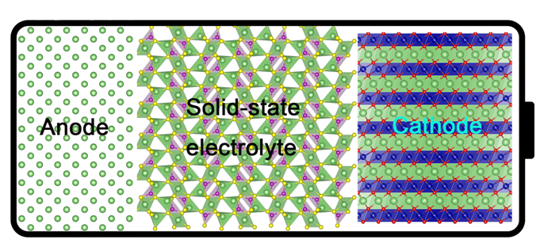

上海交通大学密西根学院朱虹老师课题组诚聘博士后 1~2 名，负责或协助团队进行金属合金体系的腐蚀性能的理论预测和腐蚀机理的研究，将与腐蚀实验团队以及世界各地的材料基因组计算研究团队开展紧密合作 (UC Berkeley, University of Michigan, UC San Diego, Georgia Tech, University of Maryland, etc)，并在现有的高通量计算平台上开发针对腐蚀相关基础参数的高通量计算工作流。诚挚邀请具有理论计算、电化学背景同学的加入。

导师简介：

朱虹 ([hong.zhu@sjtu.edu.cn](mailto:hong.zhu@sjtu.edu.cn)) 助理教授, 材料科学与工程学院，上海交通大学密西根联合学院双聘；上海交通大学材料基因组联合研究中心成员。Google Scholar: <https://scholar.google.com/citations?user=x1BGIfEAAAAJ>

课题组主页: <http://umji.sjtu.edu.cn/~hzhu>。

待遇：

1. 年收入 22w+， 享受相应上海交通大学福利待遇；
1. 根据上海市博士后管理政策办理有关落户事宜；
1. 优秀者可转入专职科研序列。

要求:

1. 拥有材料、化学或相关专业的博士学位
1. 具有理论模拟计算经验或具有丰富的机器学习特别是材料研究领域的经验
1. 能够独立开展研究，在知名期刊上以第一作者发表论文
1. 在同等条件下，优先考虑具有较高编程能力的同学

感兴趣的申请者请发邮件至 [hong.zhu@sjtu.edu.cn](mailto:hong.zhu@sjtu.edu.cn)，并附上简历和可以到站的时间。
